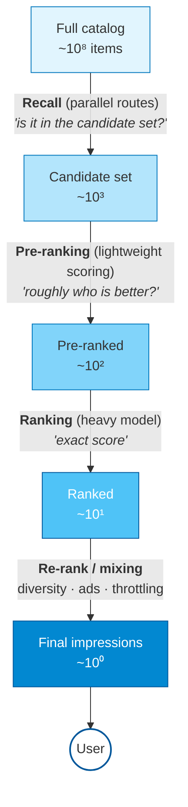
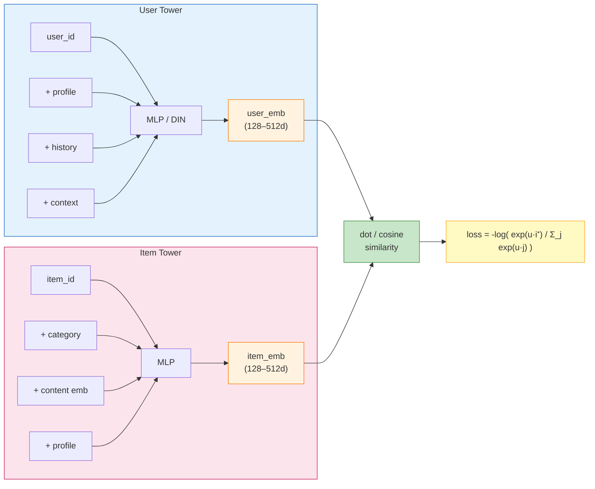
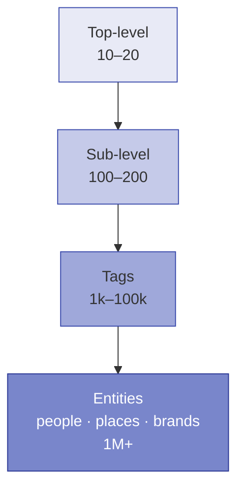
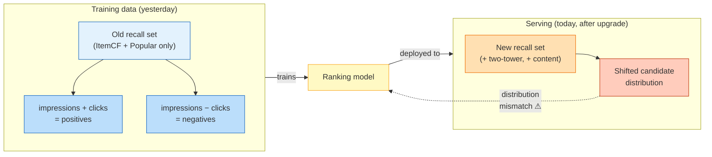

# Recall (Candidate Generation)

> **One-liner**: Recall is the stage that picks **a few hundred candidates** out of a catalog of millions or billions, in **tens of milliseconds**. It controls **"don't miss"**; ranking controls **"get it right"**. **If recall misses, ranking cannot save you.**
>
> This is the **most engineering-heavy** stage in the recommendation pipeline. Many algorithms, sparse data, tight latency budgets, and tight coupling with item understanding, cold start, and ranking.

> **How to read this doc**: 12 sections, ordered from intuition to implementation. §1–§2 are the map; §3–§8 walk through the eight families; §9–§12 cover evaluation, the ranking handoff, this project's state, and further reading.

## Table of contents

- [1. What recall actually has to solve](#1-what-recall-actually-has-to-solve)
- [2. The eight families of recall](#2-the-eight-families-of-recall)
- [3. Collaborative filtering (CF)](#3-collaborative-filtering-cf)
- [4. Vector recall — the two-tower deep dive](#4-vector-recall--the-two-tower-deep-dive)
- [5. ANN vector indexing](#5-ann-vector-indexing)
- [6. Graph recall](#6-graph-recall)
- [7. Inverted recall — tag / category / follow](#7-inverted-recall--tag--category--follow)
- [8. Multi-route fusion](#8-multi-route-fusion)
- [9. Three pitfalls in recall evaluation](#9-three-pitfalls-in-recall-evaluation)
- [10. The recall ↔ ranking consistency problem](#10-the-recall--ranking-consistency-problem)
- [11. recsys-mini recall status and roadmap](#11-recsys-mini-recall-status-and-roadmap)
- [12. Further reading](#12-further-reading)
- [TL;DR](#tldr)

---

## 1. What recall actually has to solve

The simplest possible metaphor:

> You walk into a library with **ten million books**. The librarian cannot open every one of them to figure out which you'd like. He has to use **the card catalogue and your borrowing history** to pull a few hundred from the shelves onto a cart in front of you — then you browse those.
>
> **Recall is that librarian. If he misses a book, no clever advisor downstream can recover it.**

Formally:

```
        item pool                              candidates
     10⁶ – 10⁹  ─────── Recall ──────────  10² – 10⁴
                                                  │
                                                  ▼
                                        ┌────────────────────────┐
                                        │ Hard constraints:       │
                                        │ • per-item scoring < 10 μs│
                                        │ • end-to-end p99 < 50 ms │
                                        │ • Recall@K as high as possible │
                                        └────────────────────────┘
```

### Recall vs. ranking — a funnel



**Each stage has its own responsibility, metric, and model class.**

### The three core KPIs

| KPI | Strict definition | Meaning | recsys-mini baseline (LOO, 6,032 users) |
|---|---|---|---|
| **Recall@K** | `|hit ∩ top_K| / |truth|` | Did the ground-truth item make it into top-K? | RRF Multi @200 = **50.20%** |
| **Coverage@K** | `|⋃ user top_K| / |item_pool|` | Fraction of the catalog that gets surfaced at all (aggregate diversity) | RRF Multi @200 = **69.36%** |
| **Latency** | End-to-end p99 | Online serving time | Currently offline-only — N/A |

> **Key insight**: **Recall only cares whether the item is in the candidate set, not where it ranks within it**. Rank 1 and rank 200 are equivalent at this stage. That is the fundamental break from ranking.

### Why "recall + ranking unified" is not done

Every year, papers try end-to-end. **No production system actually does it.** Reasons:

| Dimension | Why recall can't merge with ranking |
|---|---|
| Compute | Running the ranking model over the entire catalog is computationally impossible |
| Architecture | Recall requires "model + index" separation (offline build, online retrieval). Ranking has no index concept |
| Multi-route | Recall needs **parallel routes** (diversity trade-off); ranking is fundamentally a single scoring step |
| Training data | Recall negatives are **uniformly sampled from the catalog**; ranking negatives are **impressions without clicks** |

> **Separation of duties is an engineering necessity, not a historical accident.**

---

## 2. The eight families of recall

Before each detailed section, here is the full map for side-by-side comparison.

| Family | Representative | Best for | Weakness |
|---|---|---|---|
| **Collaborative filtering (CF)** | UserCF / ItemCF / Swing / SLIM | Dense behavior, established user-item pairs | Fails at cold start |
| **Vector recall (embedding)** | DSSM / YouTube DNN / SASRec | Generalization, sparse data, content fusion | Complex to train, low explainability |
| **Graph recall** | LightGCN / PinSage / GraphSAGE | Long tail, social scenarios | Complex engineering |
| **Inverted recall (tag / category)** | Tag inverted index, category index | Explainable, instant for new items | Low ceiling |
| **Follow / social** | Followed authors, friend interactions | High-affinity traffic | Social-platform-specific |
| **Context / LBS** | Same city, time, network | Scenario-specific recommendations | Context-specific |
| **Popularity / fallback** | Global top-N + time decay | Fallback, new users | Zero personalization |
| **Cold-start specific** | Look-alike, Bandits | New users / new items | Slow convergence — see [`02-cold-start.md`](02-cold-start.md) |

> **In production**, mature platforms run **6–12 parallel recall routes**, each serving a different scenario.

### A map by behavior density

```
                Behavior density
                      │
       sparse ◄──────┴──────► dense
                      │
   ┌──────────────────┴──────────────────┐
   │ Vector recall (two-tower / Item2Vec)│
   │ Graph recall  (LightGCN / PinSage)  │
   │ Content recall (item-understanding emb)│  ← stronger in sparse regime
   ├──────────────────────────────────────┤
   │ CF (ItemCF / UserCF / Swing)         │  ← stronger in dense regime
   ├──────────────────────────────────────┤
   │ Tag inverted index                    │
   │ Follow / social                       │  ← density-independent, structure-dependent
   │ Popularity fallback                   │
   └──────────────────────────────────────┘
```

---

## 3. Collaborative filtering (CF)

> **The oldest and most effective** family. recsys-mini's baseline `ItemCF` belongs here.

### Intuition — CF's two flavors

```
UserCF :  "people with taste similar to yours are watching X"  →  recommend X to you
ItemCF :  "you watched A; A and X are frequently watched together"  →  recommend X
```

Note: **CF does not look at item content at all** (no titles, no posters, no creators). **Only co-occurrence of behavior**.

### Core formula (ItemCF, cosine similarity)

Let `U_i` denote "the set of users who consumed item `i`". Then:

```
                     | U_i ∩ U_j |
   sim(i, j)  =  ─────────────────────
                  √( |U_i| · |U_j| )
```

> **Intuition**: the more users **consumed both i and j**, the more similar they are. The denominator normalizes against item popularity — without it, everything would look similar to the most popular item.

### IUF (Inverse User Frequency) penalty

```
                  Σ_{u ∈ U_i ∩ U_j}  1 / log(1 + |I_u|)
   sim(i, j)  =  ────────────────────────────────────────
                          √( |U_i| · |U_j| )
```

> **Intuition**: a user who watched 1,000 movies should contribute **less** to a similarity computation than a user who watched 10. Otherwise the CF matrix is dominated by a handful of super-active users.

### CF variants

| Algorithm | Idea | Improvement |
|---|---|---|
| **UserCF** | Find similar users, recommend what they watched | Heavy compute, worse for new users |
| **ItemCF** | Find similar items, recommend lookalikes of what you watched | **Industry standard** ⭐ |
| **Swing** | ItemCF + triangle constraint | Suppresses popularity bias |
| **SLIM** | Learn a sparse item-item matrix | Better than heuristic similarity |
| **EASE** | Closed-form SLIM (literally one formula) | Simple, surprisingly strong baseline |

### Swing intuition — why a "triangle constraint" is needed

```
ItemCF problem: "people who buy beer also buy diapers" — could just mean
                "people buy everything" (spurious co-occurrence)

Swing fix: examine pairwise "independence" within the co-occurring user set:
  If two users overlap on (i,j) AND on many other items   →  coincidence    →  downweight
  If two users overlap on (i,j) but almost nothing else   →  strong signal  →  upweight
```

### CF's Achilles' heel (essential to know)

| Problem | Consequence |
|---|---|
| Degrades under sparsity | Real UGC platforms have behavior density < 0.001%; co-occurrence is rare |
| Cold-start failure | A new item has no `U_i`, so `sim` cannot be computed |
| Suppresses the long tail | Popular items get re-recalled over and over |

---

## 4. Vector recall — the two-tower deep dive

> **The de facto standard in modern recall.** From YouTube DNN (2016) to today, the industry has barely moved off it.

### Intuition — two-tower as a "dating market"

```
Left tower (User)  dresses itself  →  outputs user_emb
Right tower (Item) dresses itself  →  outputs item_emb

  Put both in the same "dating venue" (the same vector space)
                ↓
  Larger inner product = better match

⚠ Key rule: neither side may peek at the other's profile while dressing
            (no cross features) — otherwise you cannot pre-list all
            candidates offline → you cannot build an ANN index
```

This is precisely why **DIN** (which attends candidate items to user history) **can only be used in ranking, never in recall** — it requires knowing the candidate at request time, which forces billions of live computations per request.

### Architecture



> **Key constraint**: the two towers must not share features. That separation is what lets the Item Tower run **once, offline, over the whole catalog** to populate the ANN index; the User Tower runs **online, per request**, in milliseconds.

### The critical design — **offline indexing + online retrieval**

```
[Offline batch (T-1)]
   1. Item Tower computes embeddings for the entire catalog → ANN index
   2. User embeddings precomputed in bulk → KV store (fallback)

[Online (T+0)]
   1. User Tower computes user_emb at request time (most-recent behavior + context)
   2. user_emb → ANN retrieval → top-K items
   3. End-to-end < 30 ms (p99)
```

### The core training challenge — where do negatives come from?

Positives are real clicks. **You cannot use "non-clicks"** as negatives directly — too sparse and biased. Four mainstream techniques:

#### A. In-batch negatives (most common) ⭐

```python
# Each batch contains N (user_i, item_i⁺) positives.
# For each user_i, treat the other N-1 items in the batch as negatives.
# Compute sampled-softmax loss.
```

| Pros | Cons |
|---|---|
| Zero extra overhead | **Severe sampling bias**: popular items are perpetually treated as negatives |
| Simple to implement | → model learns to "avoid popular items" → real-world quality drops |

#### B. Sampled softmax + bias correction (Google, RecSys'19) ⭐

```
loss = -log(  exp(u·i⁺) / ( exp(u·i⁺) + Σ_{j∈neg} exp(u·j) / p(j) )  )

  where p(j) = the sampling probability of item j (correlated with popularity)
```

**Core**: use the item-occurrence frequency as a **bias-correction term** so the model does not learn the popularity bias. This is the **standard production technique** for two-tower recall.

#### C. Global negative sampling

```python
# Don't rely on the batch. Maintain a global item popularity distribution.
# Sample negatives proportional to popularity^0.75 (analogous to word2vec).
```

#### D. Hard negative mining

```python
# Use the previous model to score: items predicted high but actually negative
# become the next round's "hard negatives".
```

Substantially boosts ranking precision, but increases training complexity.

### Two-tower variants

| Model | Key improvement |
|---|---|
| **YouTube DNN** (2016) | Foundational two-tower; introduces implicit negatives + sampled softmax |
| **MIND** (2019) | Multi-interest user modeling (K embeddings per user, not 1) |
| **ComiRec** (2020) | Multi-interest + capsule routing |
| **SimCSE for Reco** | Contrastive learning + data augmentation |
| **CL4SRec / CoSeRec** | Sequential contrastive learning |

---

## 5. ANN vector indexing

> Two-tower produces hundreds of millions / billions of embeddings. **Linear scan is out of the question.** You need **Approximate Nearest Neighbor (ANN) search**.

### Intuition — ANN is "navigating to the right shelf"

```
Exact (brute force) :  open every book in the library, compare to your query  →  always right, slow
ANN                 :  go to "floor → category → shelf"                       →  99% right, 100–1000× faster
```

ANN trades a tiny amount of accuracy for **a thousandfold speedup** — that trade-off is the entire engineering point.

### Mainstream ANN algorithms

| Algorithm | Idea | Pros | Cons |
|---|---|---|---|
| **Brute force** | Exhaustive | 100% recall | Slow |
| **LSH** (Locality-Sensitive Hashing) | Hash bucketing | Simple | Low recall |
| **IVF** (Inverted File) | k-means clustering + inverted lists | Fast, memory-efficient | Moderate recall |
| **PQ** (Product Quantization) | Subspace quantization | Very memory-efficient (tens × compression) | Lossy |
| **IVFPQ** | IVF + PQ | Standard for large-scale | Many parameters |
| **HNSW** (Hierarchical Navigable Small World) | Multi-layer graph | **High recall + fast** ⭐ | Memory-heavy |
| **ScaNN** (Google 2020) | IVF + AH quantization | SOTA at the time | Higher engineering bar |

### Choosing one

| Scenario | Recommendation |
|---|---|
| Small scale (< 1M), memory OK | HNSW |
| Medium (1M – 100M) | HNSW or IVFPQ |
| Large (> 100M) | IVFPQ + sharding |
| Extreme memory pressure (mobile) | PQ + INT8 |
| Strict recall (top-1 must hit) | Brute force on GPU |

### Mainstream libraries

| Library | Notes |
|---|---|
| **FAISS** | Meta; most complete; **industry de facto standard** |
| **Milvus** | Distributed vector DB with managed serving |
| **HNSWlib** | Lightweight HNSW (~200 lines of C++) |
| **ScaNN** | Google; IVF + AH quantization |
| **Annoy** | Spotify; lightweight, easy to ship |
| **Vespa / Weaviate** | Full-fledged vector DBs |

### Performance comparison (FAISS, 1M vectors, 128 dim)

| Config | Recall | QPS |
|---|---|---|
| Brute force (CPU) | 100% | ~50 |
| HNSW (M=32) | 95% | ~15,000 |
| IVF1024 + PQ16 | 88% | ~50,000 |

> **A 1000× speed gap is what ANN engineering pays for.**

---

## 6. Graph recall

### Core idea

Model the user-item relationship as a graph; use a GNN to learn node embeddings:

```
   user ─── item ─── user
     \      /  \      /
       item      item
       /          \
   user            user
```

More elaborate versions add:

- **Author nodes** — user-item-author tripartite graph
- **Category nodes** — user-item-category tripartite graph
- **Co-purchase / co-watch edges** — item-item edges

### Classic models

| Model | Idea | Best for |
|---|---|---|
| **DeepWalk / Node2Vec** | Random walks + word2vec | Heuristic baseline |
| **GraphSAGE** | Neighbor sampling + aggregation, inductive | Large-scale, new nodes |
| **PinSage** | GraphSAGE + Pinterest's engineering | The industry OG |
| **LightGCN** | Drop the GNN non-linearity, keep neighbor aggregation | CF's graph form; simple ⭐ |
| **NGCF** | Adds interaction features | LightGCN's "heavy" precursor |

### LightGCN intuition

```
e_u^(l+1) = Σ_{i ∈ N_u} (1 / √(|N_u||N_i|)) · e_i^(l)
e_i^(l+1) = Σ_{u ∈ N_i} (1 / √(|N_i||N_u|)) · e_u^(l)

final emb = Σ_l  α_l · e^(l)        (weighted sum of layers)
```

> **Surprising fact**: dropping the MLP / activations / dropout — keeping only neighbor aggregation — outperforms NGCF. The signal is that in the recommendation setting, **deep non-linearity is actively harmful**.

### Graph recall in production reality

| Pros | Cons |
|---|---|
| Strong academic results | Slow to train (full-graph iteration; large-scale needs distributed) |
| Excellent long-tail extension | Storage-heavy (must retain the full edge set) |
| Naturally incorporates social relations | Incremental updates are hard for new edges |

> **Conclusion**: despite the academic results, **graph recall sees far less production use than two-tower vector recall**.

---

## 7. Inverted recall — tag / category / follow

### Core idea

```
Inverted index:  tag       →  [item_id list]
                 author    →  [item_id list]
                 category  →  [item_id list]

Query:           user interest tag  →  inverted lookup  →  top-N
```

### Strengths

| Strength | Why |
|---|---|
| **New items instant** | Upload → tag → in inverted index → recallable immediately |
| **Fully explainable** | "Because you like food, here's this" |
| **Operationally tunable** | Operators can force-promote a tag |
| **Cold-start friendly** | Users picking interests during onboarding go through the inverted index (see [`02-cold-start.md`](02-cold-start.md)) |
| **Extremely low latency** | KV-lookup latency |

### Weaknesses

| Weakness | Why |
|---|---|
| **Low ceiling** | Bound by the completeness of the tag taxonomy |
| **Missed labels** | A tag that wasn't applied will never recall |
| **Granularity is hard** | Too coarse → no discrimination; too fine → sparse |

### Design point — taxonomy is a product decision

**Not an algorithmic one.** A typical multi-level structure:



Each level serves a purpose:

| Level | Purpose |
|---|---|
| Top-level | User interest distribution |
| Sub-level | Recall unit |
| Tags | Fine-grained recommendation |
| Entities | Vertical scenarios (celebrities / brands) |

### Follow / social recall

```
User's follow list  →  most recent N posts by followed authors  →  direct recall
```

**Key design choices**:

- **Time decay**: only the past 7–30 days
- **Throttling**: max N posts per author
- **Parallel quota**: typically 10–20% of total recall quota

---

## 8. Multi-route fusion

### Why a single route is not enough

| Real-world need | Blind spot of any single recall route |
|---|---|
| Someone I just followed posted something new | Two-tower may not surface it (insufficient freshness) |
| A category I have never engaged with | ItemCF has no idea |
| A global blockbuster | The personalization routes might miss it |
| Time-of-day, location, context | Static profile features cannot perceive it |

> **Multi-route recall = engineering redundancy buys business coverage.**

### Four fusion strategies

#### A. Weighted sum

```
score(i) = Σ_s  w_s · normalize(score_s(i))
```

> **Problem**: each route's score is on a different scale (an ItemCF score of 0.5 is not the same as a Popular score of 0.5), so normalization is nontrivial.

#### B. Reciprocal Rank Fusion (RRF)

```
score(i) = Σ_s  w_s / (k + rank_s(i))         (k typically 60)
```

| Pro | Where in this project |
|---|---|
| Looks only at rank, ignores raw scores → robust to outliers | **recsys-mini's current approach** — see `src/recall/multi_recall.py` |

#### C. Learned fusion

```
features = [rank_s1, rank_s2, ..., score_s1, score_s2, ...]
model    = small LR / GBDT
label    = whether the candidate was clicked
```

| Pros | Cons |
|---|---|
| Lets the data set the weights; adapts per-route | Requires training samples and periodic retraining |

#### D. Quota allocation

```
Recall 200 candidates, quota:
  ItemCF        →  100
  Two-tower     →   80
  Follow        →   10
  Popular       →   10
```

| Pros | Cons |
|---|---|
| **Protects diversity** (no single route can dominate) | Quotas are heuristic; hard to optimize formally |

### Industry best practice

```
Quota allocation (initial selection + dedup)  →  RRF / learned fusion (fine scoring)  →  uniform K output
```

---

## 9. Three pitfalls in recall evaluation

### Pitfall 1 — the meaning of Recall@K vs. NDCG@K at the recall stage

> **Critical insight**: at the recall stage, NDCG is **the internal ranking within the candidate set**, **not the final recommendation order** (ranking will re-rank everything later).

```
recsys-mini baseline:
  ItemCF Recall@200 = 50.15%     ← ★ correct metric
  ItemCF NDCG@200   = 0.1035     ← weak signal — ranking will redo this
```

> **Production rule**: **Recall is evaluated by `Recall@K + Coverage`**; ranking is evaluated by `NDCG / GAUC`. NDCG at the recall stage is informational at best.

### Pitfall 2 — high coverage ≠ good diversity

```
recsys-mini baseline:
  ItemCF  Coverage@200 = 69.89%    (70% of items surfaced)
  Popular Coverage@200 = 22.29%    (only 22%)
```

But coverage is an **aggregate-over-all-users** metric and tells you nothing about **per-user diversity**. It is possible to have:

> 100 users each get 200 wildly different items  →  **coverage is high, per-user diversity is zero**.

**True diversity metrics**:

| Metric | Definition |
|---|---|
| **ILD** (Intra-List Diversity) | Mean pairwise distance within a single list |
| **Entropy** | Entropy of the category distribution a user is shown |

### Pitfall 3 — K changes what the metric means

```
HitRate@10   =  binary hit on a single list  →  mostly head-of-list signal
Recall@10    =  hit ratio  →  in LOO with truth=1, equivalent to HitRate@10
Recall@200   =  50.15%  →  wide-mouth metric; ranking still has room
```

> **When comparing models, K must be held constant.** Changing K is one of the classic ways to fake an improvement.

### Offline-to-online gap

| Offline | Online |
|---|---|
| "Did the ground-truth item make it into the candidate set?" | "Did the user actually click?" |
| Assumes ranking is stable | Ranking has variance too |
| Ignores exploration value | Real businesses also care about long-term retention |
| Uses historical behavior as truth | Historical behavior is itself shaped by past recommendations (exposure bias) |

> **+5% offline recall does not necessarily mean +5% online.** That is the norm, not a bug.

---

## 10. The recall ↔ ranking consistency problem

### The classic Sample Selection Bias (SSB) trap

Ranking model training looks like:

```
Positives : impressions + clicks       (from the old recall set)
Negatives : impressions − clicks       (from the old recall set)
```

But **at serving time, candidates come from the current recall**. If:

- Recall is upgraded (e.g. added two-tower)  →  **candidate distribution shifts**
- Training data still reflects the old recall distribution  →  **the model fails on the new distribution**

Visually:



**Solutions**:

| Solution | How |
|---|---|
| **Retrain ranking** | Whenever recall changes meaningfully, retrain ranking |
| **Add global negatives** | Mix "non-impressed, randomly sampled" items into training |
| **Recall route as a feature** | Tell the model "which route brought this candidate" so it can adapt |

> recsys-mini hasn't hit this trap because recall hasn't been upgraded yet. The moment two-tower is added, you must address it.

### Filter (recall side) vs. score (ranking side)

**Division of responsibility**:

| Stage | Goal |
|---|---|
| Recall | Maximize recall@K (miss vs. don't miss) |
| Ranking | Maximize precision (order within the recalled set) |

**Anti-patterns** (common mistakes):

- Recall doing "hard filtering" (drop quality < 0.5) → ranking never gets a chance → recall drops
- Ranking re-doing "recall scoring" (combine route scores) → duplicate work

> **Best practice**: **wide-mouth recall + strict ranking + safety-net re-rank**.

---

## 11. recsys-mini recall status and roadmap

### Snapshot

```
src/recall/
├── base.py              ── unified interface (BaseRecaller)
├── itemcf.py            ── ItemCF + IUF
├── popular.py           ── global popularity fallback
└── multi_recall.py      ── RRF fusion
```

### Current baseline (LOO split, 6,032 users)

| Recall | Recall@10 | Recall@50 | Recall@200 | Coverage@200 |
|---|---|---|---|---|
| ItemCF | 5.29% | 20.08% | **50.15%** | 69.89% |
| Popular | 4.74% | 15.48% | 36.97% | 22.29% |
| **RRF Multi** | **6.08%** | **19.50%** | **50.20%** | **69.36%** |

**Observations**:

1. ItemCF is near the LOO + ML-1M ceiling (~50%); Popular is materially below.
2. RRF fusion **adds almost nothing** (50.15% → 50.20%) — both routes are too similar (both popularity-skewed).
3. The Recall@10 gap is more visible (6.08 vs. 5.29), meaning fusion **helps at the head and saturates over the wide tail**.

### Roadmap (ROI-ranked)

| Priority | Path | Expected gain | Effort |
|---|---|---|---|
| ⭐⭐⭐ | **Add two-tower recall** (DSSM + FAISS) | Main route upgrade; Recall@200 → 60%+ | 3–5 days |
| ⭐⭐⭐ | **Add content recall** (title NLP embedding; see [`03-item-understanding.md`](03-item-understanding.md)) | Solves the cold-item problem | 1–2 days |
| ⭐⭐ | **Recall route as ranking feature** | Lifts ranking quality without changing recall | 0.5 day |
| ⭐⭐ | **Learned fusion replacing RRF** | Advance past RRF's plateau | 1 day |
| ⭐⭐ | **Swing replacing ItemCF** | Suppress popularity bias | 1 day |
| ⭐ | **Quota allocation** | Diversity boost | 0.3 day |
| ⭐ | **Item2Vec / SASRec** | Sequential recall | 2–3 days |

### Key technical decisions

**Q1: For the two-tower, what embedding dimension?**

| Dimension | Trade-off |
|---|---|
| 32 | Enough; most memory-efficient; most interpretable |
| 64–128 | Industry standard |
| 256+ | Diminishing returns, memory doubles |

> **Recommendation**: **64-dim for recsys-mini** (the dataset is small; 128 risks overfitting).

**Q2: PyTorch or TensorFlow?**

- Current deps are only LightGBM; adding PyTorch is lighter than TF
- **Recommendation**: PyTorch + a simple `nn.Module`

**Q3: FAISS or HNSWlib?**

- FAISS is more complex to install but more complete
- HNSWlib is a subset, lighter
- The dataset has only ~4k items — brute force would even work
- **Recommendation**: for the engineering experience, build **both `FAISS Flat` and `FAISS HNSW`**

---

## 12. Further reading

### Classic papers

| Paper | Venue | Why it matters |
|---|---|---|
| **YouTube DNN** | RecSys'16 | Foundational two-tower; implicit negatives + sampled softmax |
| **Sampling-Bias-Corrected** | RecSys'19 | Google's negative-sampling correction; the standard for two-tower recall |
| **MIND** | CIKM'19 | Multi-interest modeling (K user embeddings) |
| **PinSage** | KDD'18 | Industry GNN-recommendation OG |
| **LightGCN** | SIGIR'20 | Minimalist GCN that outperforms more complex variants |
| **EASE** | WWW'19 | Closed-form collaborative filtering (one formula) |
| **SASRec** | ICDM'18 | Foundational Transformer for sequential recall |
| **Swing** | Alibaba practice talks | ItemCF improvement that fights popularity bias |

### Engineering posts

- **FAISS official wiki** — best practical tutorial on ANN
- **HNSWlib source** — ~200 lines of C++; read it
- **Netflix Tech Blog** — multiple posts on embedding-based recall design
- **Spotify R&D** — Discover Weekly recall evolution
- **Pinterest Engineering** — PinSage / SearchSage in production
- **ByteDance / Kuaishou** — public talks on "recall evolution"

### Related docs

- [`01-data-source-analysis.md`](01-data-source-analysis.md) — ceiling imposed by the dataset
- [`02-cold-start.md`](02-cold-start.md) — cold-start-specific recall routes
- [`03-item-understanding.md`](03-item-understanding.md) — the item-side input for two-tower

---

## TL;DR

> **Recall = a set of parallel candidate generators + a fusion strategy + an ANN index.**
>
> It controls "don't miss"; ranking controls "get it right". If recall misses, ranking — no matter how good — cannot save you.
>
> The engineering content lives in three places: **orchestrating 6–12 parallel routes** (quotas, dedup, timeout fallback), **tuning the ANN algorithm** (index choice, build, incremental updates, recall vs. QPS), and **maintaining recall ↔ ranking consistency** (training-data distribution, SSB, recall-route-as-feature).
>
> For **recsys-mini**: `ItemCF + Popular` is already near the MovieLens-1M ceiling. **The next real lift requires two-tower + content recall.**
