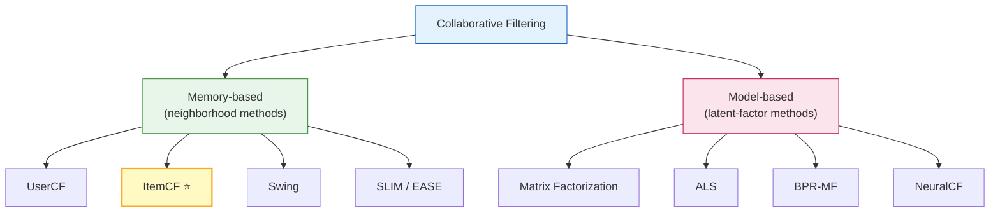
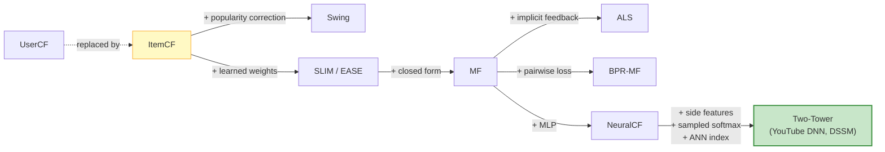

# Collaborative Filtering

> **One-liner**: Collaborative Filtering (CF) is a family of recall algorithms that infers preference **purely from co-occurrence of user-item interactions** — no content features, no embeddings, no NLP. It is the **oldest, simplest, and still most cost-effective recall route** for any domain with non-trivial behavior density. recsys-mini's baseline `ItemCFRecaller` belongs here.
>
> **How to read this doc**: §1–§2 establish the problem and notation; §3–§5 formalize the two CF flavors (UserCF / ItemCF) with the corrections that make them production-grade; §6 enumerates the broader CF family (Swing, SLIM, EASE, MF, ALS, BPR); §7 walks through the recsys-mini implementation; §8–§10 cover failure modes, decision criteria, and the production checklist. For the broader recall context see [`04-recall.md`](04-recall.md) §3.

## Table of contents

- [1. Position in the recall stack](#1-position-in-the-recall-stack)
- [2. Notation and formal setup](#2-notation-and-formal-setup)
- [3. The CF family — taxonomy](#3-the-cf-family--taxonomy)
- [4. UserCF — neighborhood over users](#4-usercf--neighborhood-over-users)
- [5. ItemCF — neighborhood over items](#5-itemcf--neighborhood-over-items)
- [6. Engineering corrections that matter in production](#6-engineering-corrections-that-matter-in-production)
- [7. Beyond memory-based CF — model-based variants](#7-beyond-memory-based-cf--model-based-variants)
- [8. The recsys-mini ItemCF implementation](#8-the-recsys-mini-itemcf-implementation)
- [9. Failure modes and known limits](#9-failure-modes-and-known-limits)
- [10. When to use CF and when not to](#10-when-to-use-cf-and-when-not-to)
- [11. Production checklist](#11-production-checklist)
- [12. References](#12-references)
- [TL;DR](#tldr)

---

## 1. Position in the recall stack

CF is one of the eight recall families enumerated in [`04-recall.md`](04-recall.md) §2. Its defining property is **the input it refuses to use**:

| Signal type | CF uses it? |
|---|---|
| User-item interaction graph (clicks, plays, ratings, purchases) | **Yes — exclusively** |
| Item content (titles, descriptions, images, audio) | No |
| User profile (demographics, declared interests) | No |
| Item / user embeddings learned by other models | No |
| Context (time, location, device) | No |

The consequence is twofold:

1. **CF is plug-and-play across domains**: the same code that recommends movies recommends e-commerce SKUs or short videos, because the only assumption is "there exists an interaction table".
2. **CF degenerates wherever the interaction graph is thin**: the cold-start regime (§9), the long tail (§9), and any time-shifted distribution (new arrivals, trending content) all break CF.

In the recall funnel CF typically holds **20–40% of the candidate quota** as a personalized-but-robust route, alongside two-tower vector recall (the de facto modern primary route), inverted-tag recall, and a popularity fallback.

---

## 2. Notation and formal setup

Throughout this doc:

| Symbol | Meaning |
|---|---|
| `U` | Set of all users; `\|U\| = M` |
| `I` | Set of all items; `\|I\| = N` |
| `R` | The interaction matrix `R ∈ ℝ^{M×N}`. `R[u,i]` is 0 if user `u` has never interacted with item `i`, and otherwise carries the interaction signal (binary, rating, dwell time, etc.) |
| `U_i ⊆ U` | Users who interacted with item `i` |
| `I_u ⊆ I` | Items user `u` interacted with |
| `r_{u,i}` | The (possibly weighted) interaction value of `(u, i)` |
| `sim(·, ·)` | A similarity function in `[-1, 1]` or `[0, 1]` |
| `N_k(·)` | The set of top-`k` nearest neighbors |

The two **structural assumptions** of all CF methods:

> **A1 (homophily)**: users who agreed on items in the past will agree on items in the future.
>
> **A2 (item coherence)**: items that have been consumed together by many users carry latent similarity, regardless of what they are about.

Every CF algorithm is a different way of operationalizing A1 or A2.

---

## 3. The CF family — taxonomy

CF splits cleanly into **memory-based** (neighborhood) methods and **model-based** (matrix factorization / latent) methods:



| Class | Idea | Strength | Weakness |
|---|---|---|---|
| **Memory-based** | Pre-compute a sparse similarity table; recall = table lookup | Trivial to ship, fully explainable, easy to debug | O(N²) similarity build; popularity bias unless corrected |
| **Model-based** | Learn low-rank latent factors that reconstruct the interaction matrix | Generalizes better in sparse regimes; smaller online footprint | Less explainable; needs training; converges to two-tower as embeddings grow |

> **Historical note**: the memory-based / model-based split is the original CF dichotomy from Sarwar et al. (2001). Modern two-tower recall is essentially **model-based CF with deep encoders and side features**, which is why the field still calls embedding recall "neural CF" in older literature.

---

## 4. UserCF — neighborhood over users

> **Intuition**: "find people whose taste matches yours, then recommend what they consumed and you haven't."

### Similarity

Pearson correlation on the co-rated subset, or cosine on the binary interaction matrix:

```
                   |I_u ∩ I_v|
sim(u, v)  =  ─────────────────────
               √( |I_u| · |I_v| )
```

For explicit ratings, the mean-centered Pearson variant removes per-user rating bias:

```
                Σ_{i∈I_u ∩ I_v} (r_{u,i} − r̄_u)(r_{v,i} − r̄_v)
sim(u, v) = ────────────────────────────────────────────────────
              √Σ(r_{u,i} − r̄_u)²  ·  √Σ(r_{v,i} − r̄_v)²
```

### Prediction

For a candidate item `j ∉ I_u`:

```
                Σ_{v ∈ N_k(u)}  sim(u, v) · r_{v,j}
ŝ(u, j)  =  ──────────────────────────────────────
                  Σ_{v ∈ N_k(u)}  |sim(u, v)|
```

### Why UserCF is rarely used in production

| Reason | Detail |
|---|---|
| **User population is much larger than item population** | M >> N in nearly every real platform (M ≈ 10⁸ vs N ≈ 10⁷); a user-user matrix is two orders of magnitude larger to build and maintain |
| **User interest is volatile** | The user-user similarity table goes stale fast (a user's profile shifts daily); the item-item table is comparatively stationary |
| **User explanation is weaker** | "Because someone like you watched X" is a less compelling reason than "because you watched A and A is similar to X" |
| **Cold-start asymmetry** | New users have empty `I_u`, so they have no neighbors; new items have empty `U_i`, but in ItemCF this is reframed as "we just can't recommend this item until at least one similar item exists" |

> **Production reality**: UserCF survives mainly in **social platforms** ("friend-of-friend recommendations") and **niche communities** where item count is large and unstable. The dominant memory-based CF in production is ItemCF.

---

## 5. ItemCF — neighborhood over items

> **Intuition**: "for each item you have consumed, surface other items that have historically been co-consumed; aggregate the scores."

Originally formalized by Sarwar et al. (2001) and adopted at Amazon in the early 2000s under the marketing line "customers who bought this also bought…". It has remained an industry mainstay for **25 years**.

### 5.1 Baseline similarity — cosine on the user-item matrix

Treat each item `i` as a binary vector over users. Then:

```
                  |U_i ∩ U_j|
sim(i, j)  =  ────────────────────
                √( |U_i| · |U_j| )
```

This is the **cosine similarity** of the columns of the (binarized) interaction matrix `R`. Geometrically: each item is a point in `ℝ^M`; similarity is the cosine of the angle between two such points.

### 5.2 Why cosine and not raw co-occurrence

A naive count `|U_i ∩ U_j|` overweights popular items: any item co-occurs frequently with the most popular item simply because that item co-occurs with everything. The denominator `√(|U_i| · |U_j|)` normalizes against the **L2 norm** of each item vector, suppressing this popularity bias.

| Without normalization | With cosine normalization |
|---|---|
| Top neighbors of every item ≈ the top-N popular items | Top neighbors reflect actual co-consumption patterns |
| Coverage collapses | Coverage stays diverse |

### 5.3 Prediction

For a candidate item `j ∉ I_u`:

```
ŝ(u, j)  =  Σ_{i ∈ I_u}  sim(i, j) · w_{u, i}
```

`w_{u, i}` is an interaction weight (1 for binary signals, possibly with **time decay** `exp(−α · Δt)` to favor recent behavior).

### 5.4 Why ItemCF dominates UserCF in production

| Property | UserCF | ItemCF |
|---|---|---|
| Number of nodes to model | M (typically 10⁸) | N (typically 10⁶–10⁷) |
| Stability of the similarity table | Volatile (user taste shifts) | Stable (item-item structure is slow-moving) |
| Pre-computation cost (sparse) | O(\|R\|² / N) | O(\|R\|² / M) |
| Online lookup cost | O(k · top_k_items) | O(\|I_u\| · top_k_neighbors) |
| Explanation | "Users like you watched X" | "You watched A; A is similar to X" |
| Cold-start failure mode | Empty `I_u` for new users | Empty `U_i` for new items |

ItemCF wins on **maintenance cost**, **stability**, and **explanation strength**, which is why it is the canonical memory-based CF in production.

---

## 6. Engineering corrections that matter in production

A textbook ItemCF off the shelf will underperform — sometimes badly — without the corrections below. These are the changes that move the algorithm from "academic baseline" to "production-grade primary route".

### 6.1 IUF — Inverse User Frequency

**Problem**: a power user with `|I_u| = 1000` contributes `1000 × 999 ≈ 10⁶` co-occurrence signals; a casual user with `|I_u| = 5` contributes 20. The similarity matrix is then dominated by power users, whose interactions are often **less informative** (broad browsing, batch downloads, bots).

**Fix** (Breese, Heckerman, Kadie, UAI'98):

```
                  Σ_{u ∈ U_i ∩ U_j}  1 / log(1 + |I_u|)
sim(i, j)  =  ─────────────────────────────────────────
                      √( |U_i| · |U_j| )
```

Each user `u` contributes weight `1 / log(1 + |I_u|)` to every co-occurrence pair they touch. The logarithm avoids over-penalizing moderate users while strongly damping the heavy tail.

| User type | `|I_u|` | IUF weight |
|---|---|---|
| Light | 5 | ≈ 0.558 |
| Median | 50 | ≈ 0.254 |
| Heavy | 500 | ≈ 0.161 |
| Bot-like | 5000 | ≈ 0.117 |

### 6.2 Per-item top-K truncation

**Problem**: the full similarity table is `O(N²)`. For `N = 10⁶` items, that is `10¹²` cells — impossible to store.

**Fix**: keep only the top-K (typically 50–200) most similar neighbors per item. In recsys-mini, `sim_topk = 100`:

```python
scored.sort(key=lambda x: x[1], reverse=True)
item_sim[a] = scored[: self.sim_topk]
```

Memory drops from `O(N²)` to `O(N · K)`. Recall is barely affected: items beyond rank 100 carry almost no signal anyway.

### 6.3 Recent-history truncation

**Problem**: a user with three years of history makes the recall step `O(|I_u| · K)` per query — both slow and biased toward stale tastes.

**Fix**: keep only the most recent `H` interactions per user (recsys-mini uses `H = 50`). This:

- Caps online latency at `O(H · K) = O(5000)` operations
- Implicitly **time-decays** without an explicit `exp(−α · Δt)`
- Reflects recency-of-intent (the user's recent watches are more predictive than ratings from three years ago)

### 6.4 Within-session deduplication

**Problem**: a user who replays the same song 50 times will inflate the song's self-co-occurrence and pollute pairwise similarities.

**Fix**: deduplicate `I_u` before computing the double loop. In recsys-mini:

```python
uniq = list(dict.fromkeys(items))  # deduplicate, preserve order
for a in uniq:
    for b in uniq:
        if a == b: continue
        co[a][b] += iuf
```

### 6.5 Already-seen filtering

A self-evident but critical step: do not recommend items the user has already interacted with. This must be applied **per user** at recall time, not at training time.

### 6.6 Score normalization for fusion

When CF is combined with other recall routes via weighted sum or learning-to-fuse, raw CF scores (sums of similarities) are not on a comparable scale. Min-max normalize to `[0, 1]` per query:

```python
max_s = out[0][1] if out[0][1] > 0 else 1.0
return [(int(i), float(s) / max_s) for i, s in out]
```

> RRF fusion (used in recsys-mini's `MultiRecaller`) operates on **ranks** and is robust to scale mismatches, so normalization is less critical when RRF is the only fusion strategy. But it costs nothing and future-proofs the route against learned fusion.

### 6.7 Optional — time decay in the prediction

A textbook extension that often pays for itself:

```
ŝ(u, j)  =  Σ_{i ∈ I_u}  sim(i, j) · exp(−α · (t_now − t_{u,i}))
```

with `α` tuned so that interactions one week old keep 50% of their weight. Not currently implemented in recsys-mini; flagged as a TODO in `src/recall/itemcf.py`.

---

## 7. Beyond memory-based CF — model-based variants

When the interaction matrix is dense enough to support latent-factor learning, model-based variants outperform memory-based CF on both recall and coverage.

### 7.1 Swing (Alibaba)

A targeted fix to ItemCF's "spurious co-occurrence" problem. Two users `u, v` who both interacted with items `i` and `j` provide a Swing signal:

```
                                   1
sim_swing(i, j)  =  Σ_{u, v ∈ U_i ∩ U_j}  ─────────────────────────
                                   α + |I_u ∩ I_v|
```

The denominator `α + |I_u ∩ I_v|` **downweights co-occurrence supported by users with many other shared items**. The intuition: if two users overlap on hundreds of items, their evidence for any specific pair `(i, j)` is weak (they buy everything); if they overlap on almost nothing **except** `(i, j)`, the signal is strong.

| Property | Swing improvement over ItemCF |
|---|---|
| Popularity bias | Substantially reduced |
| Long-tail coverage | Substantially improved |
| Build cost | `O(\|R\|² / M)` becomes `O(\|R\|³ / M)` in the worst case — needs sampling |

### 7.2 SLIM — Sparse Linear Methods

Learn the item-item similarity matrix `W ∈ ℝ^{N×N}` directly by regression:

```
min_W  ‖R − R · W‖_F²  +  β · ‖W‖_F²  +  λ · ‖W‖_1
s.t.   diag(W) = 0,  W ≥ 0
```

Each column of `W` is a sparse regression of item `j` against all other items, predicting consumption from co-consumption. The constraint `diag(W) = 0` prevents trivial self-similarity; `W ≥ 0` keeps similarities interpretable.

| Pro | Con |
|---|---|
| Learned similarity beats heuristic cosine | `O(N²)` training problem; needs column-wise parallelism |
| Sparse solution → tiny serving footprint | Requires a hyperparameter search (`β`, `λ`) |

### 7.3 EASE — Embarrassingly Shallow Autoencoder (Steck, WWW'19)

A closed-form simplification of SLIM:

```
W  =  − P · (diag(P))⁻¹  +  I
where  P  =  (RᵀR + λI)⁻¹
```

Three lines of NumPy. **One** hyperparameter (`λ`). Outperforms many deep models on the standard ML-20M / Netflix benchmarks. The dominant baseline in any new offline CF study.

| Pro | Con |
|---|---|
| Closed form — no iterative training | `O(N³)` matrix inverse; impractical above `N ≈ 100k` items |
| Single hyperparameter | Cannot incorporate side features |

### 7.4 Matrix Factorization (MF)

Approximate `R ≈ P · Qᵀ` where `P ∈ ℝ^{M×d}` is the user-factor matrix and `Q ∈ ℝ^{N×d}` is the item-factor matrix:

```
min_{P, Q}  Σ_{(u, i) ∈ Ω}  (r_{u,i} − p_u · q_iᵀ)²  +  λ(‖P‖² + ‖Q‖²)
```

This is the **conceptual ancestor of two-tower recall**: `p_u` is the user embedding, `q_i` is the item embedding, the inner product is the score. The difference is that MF embeddings are learned by reconstruction loss over explicit interactions; two-tower embeddings are learned by contrastive loss with negative sampling and arbitrary side features.

### 7.5 ALS — Alternating Least Squares (implicit feedback)

Hu, Koren, Volinsky (ICDM'08) — the canonical MF for **implicit** feedback (clicks, plays):

```
min_{P, Q}  Σ_{u,i}  c_{u,i} · (p_{u,i} − p_u · q_iᵀ)²  +  λ(‖P‖² + ‖Q‖²)
where  c_{u,i} = 1 + α · r_{u,i}      (confidence weighting)
       p_{u,i} = 1 if r_{u,i} > 0, else 0
```

Alternates between solving for `P` with `Q` fixed and vice versa. Each step is a regularized least-squares problem with a closed form. **Embarrassingly parallel**, ships in Spark MLlib and `implicit` library. Production-tested at Spotify, Netflix, Tencent.

### 7.6 BPR-MF — Bayesian Personalized Ranking

Rendle et al. (UAI'09). Reframes the task as a **pairwise ranking** problem:

```
max  Σ_{(u, i, j)}  ln σ(p_u · q_iᵀ − p_u · q_jᵀ)  −  λ(‖p_u‖² + ‖q_i‖² + ‖q_j‖²)
where  i ∈ I_u,  j ∉ I_u
```

Optimizes the probability that the observed item `i` ranks above an unobserved item `j`. Pairwise loss matches the recall objective (which only cares about relative order, not absolute score) more directly than pointwise MF.

### 7.7 The bridge to modern recall



> **Conceptual takeaway**: two-tower recall is **CF with deep encoders and side features**. The mental model "CF is obsolete, embeddings won" is wrong. The correct framing is that CF is the **algorithmic skeleton** the entire modern recall stack inherits from.

---

## 8. The recsys-mini ItemCF implementation

The implementation lives in `src/recall/itemcf.py` and implements the corrections enumerated in §6 (1–6). Walkthrough by responsibility:

### 8.1 Class state

```37:40:src/recall/itemcf.py
        # item -> List[(neighbor_item, sim)]  按 sim 倒排, 截断 sim_topk
        self._item_sim: dict[int, List[Tuple[int, float]]] = {}
        # user -> 最近 N 个 (item_id, ts)
        self._user_history: dict[int, List[Tuple[int, pd.Timestamp]]] = {}
```

Two compact dictionaries:

- `_item_sim` — the item-item similarity index, top-K per item
- `_user_history` — each user's most recent `H` interactions

### 8.2 Fit — four-pass training

```42:82:src/recall/itemcf.py
    def fit(self, train_df: pd.DataFrame) -> None:
        df = train_df.sort_values("ts")

        # 1) 构 user -> [items], item -> count
        user_items = df.groupby("user_id")["item_id"].apply(list).to_dict()
        item_count: dict[int, int] = df.groupby("item_id").size().to_dict()

        # 2) 共现统计 (带 IUF)
        co: dict[int, dict[int, float]] = defaultdict(lambda: defaultdict(float))
        for u, items in tqdm(user_items.items(), desc="ItemCF 共现统计"):
            n = len(items)
            iuf = 1.0 / math.log(1 + n) if self.use_iuf else 1.0
            uniq = list(dict.fromkeys(items))  # 去重保持顺序
            for a in uniq:
                for b in uniq:
                    if a == b:
                        continue
                    co[a][b] += iuf

        # 3) 归一化为余弦相似
        item_sim: dict[int, List[Tuple[int, float]]] = {}
        for a, neighbors in tqdm(co.items(), desc="ItemCF 归一化"):
            ca = item_count[a]
            scored = []
            for b, c in neighbors.items():
                cb = item_count[b]
                sim = c / math.sqrt(ca * cb)
                scored.append((b, sim))
            scored.sort(key=lambda x: x[1], reverse=True)
            item_sim[a] = scored[: self.sim_topk]
        self._item_sim = item_sim

        # 4) 用户最近历史 (推理时用)
        history = (
            df.groupby("user_id")
            .apply(lambda x: list(zip(x["item_id"].tolist(), x["ts"].tolist())))
            .to_dict()
        )
        self._user_history = {
            u: items[-self.user_history_len :] for u, items in history.items()
        }
```

| Step | Responsibility | Complexity |
|---|---|---|
| 1 | Build the inverted index `u → I_u` and item popularity `\|U_i\|` | `O(\|R\|)` |
| 2 | Build the IUF-weighted co-occurrence matrix `co[i][j]` | `O(Σ_u \|I_u\|²)` — dominant cost |
| 3 | Cosine-normalize, sort, truncate to top-K neighbors | `O(N · \|co\| · log K)` |
| 4 | Cache the most recent `H` interactions per user | `O(\|R\|)` |

### 8.3 Recall — online scoring

```84:101:src/recall/itemcf.py
    def recall(self, user_id: int, k: int) -> List[Tuple[int, float]]:
        hist = self._user_history.get(user_id)
        if not hist:
            return []
        seen = {i for i, _ in hist}
        scores: dict[int, float] = defaultdict(float)
        # 简单等权; 后续可加时间衰减
        for item_id, _ts in hist:
            for neighbor, sim in self._item_sim.get(item_id, ()):
                if neighbor in seen:
                    continue
                scores[neighbor] += sim
        if not scores:
            return []
        out = sorted(scores.items(), key=lambda x: x[1], reverse=True)[:k]
        # 归一化到 [0, 1]
        max_s = out[0][1] if out[0][1] > 0 else 1.0
        return [(int(i), float(s) / max_s) for i, s in out]
```

Each query is bounded by `O(H · K + |candidates| · log k)` — for `H = 50`, `K = 100`, that's a few thousand operations per user, comfortably sub-millisecond per query.

### 8.4 What is **not** in the current implementation

| Correction | Status | Notes |
|---|---|---|
| IUF | ✅ Implemented | `use_iuf=True` by default |
| Cosine normalization | ✅ Implemented | |
| Per-item top-K truncation | ✅ Implemented | `sim_topk=100` |
| Recent-history truncation | ✅ Implemented | `user_history_len=50` |
| Within-session dedup | ✅ Implemented | `dict.fromkeys` |
| Already-seen filtering | ✅ Implemented | `if neighbor in seen` |
| Score normalization for fusion | ✅ Implemented | min-max to `[0, 1]` |
| Time decay in prediction | ⏳ TODO | flagged in source |
| Position decay in fit | ⏳ TODO | would move algorithm toward Swing |
| Swing similarity | ⏳ Future | listed in `04-recall.md` roadmap |

---

## 9. Failure modes and known limits

### 9.1 Cold-start failure

| Cold case | CF behavior |
|---|---|
| New item — `U_i = ∅` | `sim(i, ·) = 0/0` undefined → never appears in any neighbor list → permanently unrecallable |
| New user — `I_u = ∅` | No history to query → no candidates → must fall back to popularity / content recall |
| New domain — `\|R\|` small | Co-occurrence statistics are dominated by noise |

This is the **structural reason** every production recall stack pairs CF with at least one content-aware route (two-tower with item content features, inverted tag index, content-embedding recall). See [`02-cold-start.md`](02-cold-start.md) for the full treatment.

### 9.2 Popularity bias

Even with cosine normalization and IUF, the most popular items tend to dominate top-K neighbor lists because they co-occur with almost everything. Mitigation:

- **Swing** (preferred upgrade path) — explicit triangle-constraint penalty on broad overlap
- **Log-popularity damping** — divide similarities by `log(1 + |U_j|)` post-hoc
- **Quota allocation in fusion** — cap the fraction of any recall route that can be popularity-derived

### 9.3 Long-tail suppression

Items in the long tail have small `|U_i|`, so they appear in few co-occurrence pairs and rarely make it past the top-K cutoff. Result: a 50/50 split where head items are over-recalled and tail items are never recalled.

Mitigation: **content recall** as a parallel route (item titles → NLP embedding → ANN). recsys-mini's roadmap (see [`04-recall.md`](04-recall.md) §11) lists this as priority ⭐⭐⭐.

### 9.4 Concept drift / trend lag

The item-item similarity table is built from historical co-occurrence. New trends — a movie that suddenly spikes in popularity — are not reflected until the table is rebuilt. Production systems rebuild **daily**; for fast-moving domains (news, short video) **hourly incremental updates** are required.

### 9.5 Sample selection bias (SSB)

CF is trained on the items that historical recall surfaced, which is a biased sample of the full catalog. Mitigation is a recall-stack concern rather than a CF-specific one — see [`04-recall.md`](04-recall.md) §10.

---

## 10. When to use CF and when not to

### Use CF when

- You have at least a few months of interaction history and an **interaction density above ~0.001%**
- You need **explainable** recommendations ("because you watched A")
- You want a **cheap-to-maintain** baseline that runs without GPUs
- You need a **route that complements** two-tower (CF is popularity-skewed and recency-shallow; two-tower is generalization-strong and recency-shallow in a different way — they make different mistakes)

### Do not use CF as the only recall when

- The platform is **new** (system cold start — no behavior to mine)
- The **catalog turns over fast** (news, short-form video where 80% of items are < 24h old)
- You need **personalization for first-session users** (user cold start — CF cannot help)
- The **interaction graph is hyper-sparse** (UGC platforms with density << 0.001%)

### CF's place in a modern recall stack

```
┌──────────────────────────────────────────────────────────────┐
│  Modern multi-route recall (typical production layout)        │
│                                                               │
│   Two-tower recall      30–40%  ── personalized, generalizing │
│   ItemCF / Swing        15–25%  ── personalized, popular-skew │
│   Inverted tag recall   10–15%  ── explainable, instant cold  │
│   Content recall         5–15%  ── new items, sparse regimes  │
│   Follow / social       10–20%  ── high-affinity traffic      │
│   Popularity fallback    5–10%  ── safety net                 │
│                                                               │
│         ↓                                                     │
│   Quota allocation + dedup + RRF / learned fusion             │
│         ↓                                                     │
│   200–500 candidates → ranking                                │
└──────────────────────────────────────────────────────────────┘
```

---

## 11. Production checklist

A CF route is ready to ship when it satisfies all of the following:

| Checkpoint | Question |
|---|---|
| **Build correctness** | Are IUF, cosine normalization, top-K truncation, and dedup all applied? |
| **Build cost** | Is the `O(Σ \|I_u\|²)` step within nightly batch budget? If not, sample power users. |
| **Online latency** | Is `O(H · K)` per query under 10 ms at p99? |
| **Memory footprint** | Is `_item_sim` size `O(N · K)` within the serving box's RAM? |
| **Already-seen filter** | Are seen items excluded **per user, online** (not pre-baked into the model)? |
| **Fusion compatibility** | Are scores normalized so they combine sensibly with other routes? |
| **Fallback** | If `_user_history.get(user_id)` returns `None`, does the multi-route layer fall back to popularity / cold-start recall? |
| **Refresh cadence** | Is the item-item table rebuilt daily? For high-velocity domains, hourly incremental? |
| **Already-seen scope** | Does "already seen" include impressions or only clicks? Both have known biases; document the choice. |
| **Observability** | Are recall, coverage, and per-route quota tracked daily? |

---

## 12. References

### Foundational papers

| Paper | Venue | Why it matters |
|---|---|---|
| Resnick et al., *GroupLens* | CSCW'94 | First major UserCF system |
| Breese, Heckerman, Kadie, *Empirical Analysis of Predictive Algorithms for CF* | UAI'98 | IUF correction; the formal study that established neighborhood-based CF |
| Sarwar et al., *Item-Based CF Recommendation Algorithms* | WWW'01 | Foundational ItemCF paper |
| Linden, Smith, York, *Amazon.com Recommendations: Item-to-Item CF* | IEEE Internet Computing'03 | The industrial validation of ItemCF |
| Koren, *Collaborative Filtering with Temporal Dynamics* | KDD'09 | Time-decay extensions; the foundation for session- and recency-aware CF |
| Hu, Koren, Volinsky, *CF for Implicit Feedback Datasets* | ICDM'08 | ALS for implicit feedback (the de facto industrial MF) |
| Rendle et al., *BPR: Bayesian Personalized Ranking from Implicit Feedback* | UAI'09 | Pairwise loss for personalized ranking |
| Ning, Karypis, *SLIM: Sparse Linear Methods for Top-N Recommendation* | ICDM'11 | Learned item-item similarity |
| Steck, *Embarrassingly Shallow Autoencoders for Sparse Data* | WWW'19 | EASE; closed-form CF that beats deep models |
| Yang et al., *Swing: a real-time item-based recommendation algorithm* | Alibaba practice talks | Production fix for ItemCF's popularity bias |
| He et al., *Neural Collaborative Filtering* | WWW'17 | The bridge from MF to deep recall (largely deprecated, but historically important) |

### Engineering posts

- **Amazon's *Item-to-Item CF* (2003 IEEE Internet Computing)** — the original engineering paper; still readable
- **Netflix Tech Blog** — multiple posts on MF / ALS evolution
- **Spotify *Discover Weekly*** — public talks on the role of ItemCF and ALS in their stack
- **Alibaba Swing engineering posts** — production deployment of triangle-constrained ItemCF

### Related docs

- [`04-recall.md`](04-recall.md) — broader recall context; §3 introduces CF in the multi-route picture
- [`02-cold-start.md`](02-cold-start.md) — what to do when CF cannot help
- [`01-data-source-analysis.md`](01-data-source-analysis.md) — the data-density ceiling that bounds CF performance
- `src/recall/itemcf.py` — the implementation walked through in §8

---

## TL;DR

> Collaborative Filtering is the family of recall algorithms that learns from **co-occurrence of interactions alone** — no content, no embeddings. **ItemCF is the canonical production member**, with three quarters of a century of empirical validation; its dominance over UserCF comes from item-side stability, lower maintenance cost, and stronger explanations.
>
> A production-grade ItemCF is **textbook cosine similarity plus six engineering corrections**: IUF reweighting, top-K neighbor truncation, recent-history truncation, within-session dedup, already-seen filtering, and per-query score normalization. recsys-mini implements all six in 100 lines of Python (`src/recall/itemcf.py`); time decay and Swing are the two clear-ROI upgrades on the roadmap.
>
> **CF degenerates wherever the interaction graph is thin** — cold start, hyper-sparse UGC, fast-turning catalogs. The role of CF in a modern recall stack is to hold the **personalized-but-stable middle ground** alongside two-tower (generalization), content recall (cold items), tag inverted recall (explainability), and popularity (safety net). Treating CF as obsolete is a mistake; treating it as sufficient is a worse one.
