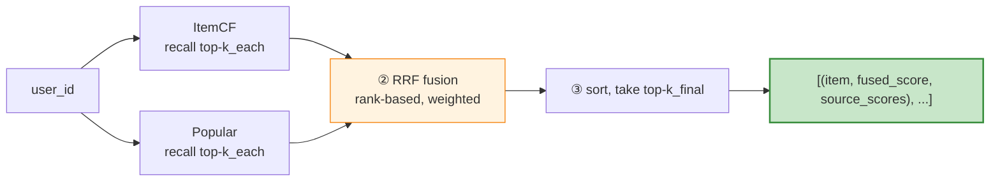
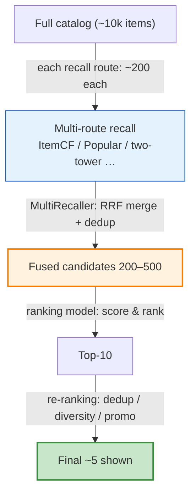

# Multi-Route Recall Fusion

> **One-liner**: Multi-route recall fusion combines the candidate lists produced by several independent recall routes (ItemCF, popularity, two-tower, …) into a **single ranked candidate set** for the downstream ranker. No single recall route covers every scenario, so production systems run many in parallel and **fuse** their outputs. recsys-mini's `MultiRecaller` does this in 44 lines using **Reciprocal Rank Fusion (RRF)**.
>
> **How to read this doc**: §1–§2 establish why fusion is needed and the overall flow; §3 states the core problem (per-route scores are not comparable); §4–§5 formalize RRF and its weighted variant; §6 walks through the recsys-mini implementation; §7 compares fusion strategies; §8 covers results and the route's place in the stack. For the broader recall context see [`04-recall.md`](04-recall.md) §5; for the two routes being fused see [`05-collaborative-filtering.md`](05-collaborative-filtering.md) and [`06-popular-recall.md`](06-popular-recall.md).

## Table of contents

- [1. Why fuse multiple recall routes](#1-why-fuse-multiple-recall-routes)
- [2. The fusion pipeline](#2-the-fusion-pipeline)
- [3. The core problem — per-route scores are not comparable](#3-the-core-problem--per-route-scores-are-not-comparable)
- [4. Reciprocal Rank Fusion (RRF)](#4-reciprocal-rank-fusion-rrf)
- [5. Weighted RRF](#5-weighted-rrf)
- [6. The recsys-mini implementation](#6-the-recsys-mini-implementation)
- [7. Fusion strategies compared](#7-fusion-strategies-compared)
- [8. Results and position in the stack](#8-results-and-position-in-the-stack)
- [9. Production checklist](#9-production-checklist)
- [10. References](#10-references)
- [TL;DR](#tldr)

---

## 1. Why fuse multiple recall routes

Every recall route is a specialist with a blind spot. None can stand alone:

| User need | What ItemCF alone does | Who covers it |
|---|---|---|
| New user, no history | Empty `I_u` → returns `[]` | Popularity (fallback) |
| "Show me what's trending" | Personalized recall may miss new spikes | Popularity |
| A freshly added cold item | No co-occurrence yet → never recalled | Content recall |
| Content from a followed creator | ItemCF ignores the follow graph | Social / follow recall |

> **Core insight**: no single recall family covers all intents (see the eight families in [`04-recall.md`](04-recall.md) §2). The production answer is to run several specialists in parallel and merge their answers. recsys-mini currently ships 2 routes — ItemCF + popularity — behind one fusion layer.

This raises the two questions the fusion layer must answer:

1. **How do we merge several ranked lists?** (§2)
2. **The routes score on incomparable scales — on what basis do we merge?** (§3–§4)

---

## 2. The fusion pipeline

`MultiRecaller.recall` is a three-step pipeline:



| Step | Responsibility | Code |
|---|---|---|
| **① Per-route recall** | Each route returns its own top-`k_each` list | `per_source[name] = r.recall(user_id, k_each)` |
| **② Fuse** | Convert each list to rank-based scores and accumulate (weighted) | `fused[item_id] += w / (rrf_k + rank)` |
| **③ Sort & truncate** | Sort by fused score, keep top-`k_final` | `sorted(...)[:k_final]` |

Two distinct parameters:

- **`k_each`** — how many candidates **each route** returns (the "raw material"). Typically `≥ k_final`.
- **`k_final`** — how many candidates survive **after fusion** (handed to the ranker).

> The fusion layer **produces no candidates of its own** — all the recall work happens inside each route's `recall()`. The fuser only collects, merges, and ranks.

---

## 3. The core problem — per-route scores are not comparable

The naive merge is "sum each item's per-route scores". It breaks immediately, because **the routes do not score on the same scale**:

| Route | Score for *Goodfellas* | Native range |
|---|---|---|
| ItemCF | **1.50** (summed similarity) | `[0, ∞)` unbounded |
| Popularity | **0.85** (normalized count) | `[0, 1]` |
| Two-tower (future) | **0.70** (vector cosine) | `[-1, 1]` |
| Content recall (future) | **4.20** (5-point tag match) | `[0, 5]` |

A raw sum lets the largest-scale route dominate:

```
movie         ItemCF   pop    tower   content   raw sum
──────────────────────────────────────────────────────
Goodfellas    1.50  +  0.85  +  0.70  +  4.20  =  7.25
Casino        0.00  +  0.95  +  0.90  +  5.00  =  6.85
Avatar        0.00  +  1.00  +  0.30  +  2.00  =  3.30
                                              ↑
              content recall's 0–5 scale alone steers the result
```

### Does normalization fix it?

Min-max normalizing each route to `[0, 1]` removes the scale mismatch but leaves two issues:

**Issue 1 — it assumes similar score distributions.** Normalization aligns the maximum, not the shape:

```
Route A (steep)            Route B (flat)
  rank 1  1.00               rank 1  1.00
  rank 2  0.95  ← near #1     rank 2  0.98
  rank 3  0.30  ← cliff       rank 3  0.96
```

A's `0.95` means "almost as good as #1"; B's `0.98` is unremarkable (everything in B is above 0.9). The same normalized number carries very different meaning — yet a sum treats them as equal. ItemCF distributions are typically steep; cosine-based distributions are typically flat. They are **not** similar.

**Issue 2 — it is sensitive to outliers.** A single inflated score (spam / bug) pollutes the whole scale:

```
before:              after ÷ max(=1000):
  monster  1000        monster  1.00
  good A     50        good A   0.050   ← 50/48/45 were well-separated;
  good B     48        good B   0.048      now squashed near 0.05
  good C     45        good C   0.045
```

> Both issues share a root cause: normalization aligns the maximum but not the distribution, and cannot defend against outliers. The clean escape is to **discard scores entirely and use ranks** — which is exactly what RRF does.

---

## 4. Reciprocal Rank Fusion (RRF)

> **Idea**: ignore the score a route assigns; use only the **rank** it assigns.

Ranks are a naturally aligned scale — A's "rank 2" is directly comparable to B's "rank 2", regardless of whether A scored 1.50 or 150.

### Formula

$$
\text{score}(i) = \sum_{\text{route } s}  w_s \cdot \frac{1}{\text{rrf\_k} + \text{rank}_s(i)}
$$

| Symbol | Meaning |
|---|---|
| `rank_s(i)` | The rank of item `i` in route `s` (top item = 1) |
| `rrf_k` | A smoothing constant; recsys-mini default **60** |
| `w_s` | Route weight (§5) |

An item's fused score is the **weighted sum of its per-route rank scores**. Higher rank → larger `1/(60+rank)`; recalled by more routes → more terms added.

### Why the smoothing constant `rrf_k = 60`

It flattens the gap between top ranks:

```
without rrf_k (1/rank):     with rrf_k=60 (1/(60+rank)):
  rank 1 = 1.000              rank 1 = 0.01639
  rank 2 = 0.500  ← 2× gap    rank 2 = 0.01613  ← nearly equal
  rank 3 = 0.333              rank 3 = 0.01587
```

Without it, a single route's #1 is worth 2× its #2 — too much power to one route's top pick. With `rrf_k = 60`, top ranks are flattened, so **"recalled by many routes"** outweighs **"ranked #1 by one route"** — the multi-route goal. The value 60 comes from the original RRF paper (Cormack et al., SIGIR 2009) and rarely needs tuning.

### Worked example (reusing §3's three movies)

Translate §3's scores into per-route ranks (`—` = not recalled by that route; equal weights `w=1`):

| movie | ItemCF | pop | tower | content |
|---|---|---|---|---|
| Goodfellas | rank 1 | rank 3 | rank 2 | rank 2 |
| Casino | — | rank 2 | rank 1 | rank 1 |
| Avatar | — | rank 1 | rank 3 | rank 3 |

Apply `1/(60+rank)` and sum across routes:

| movie | ItemCF | pop | tower | content | **RRF** |
|---|---|---|---|---|---|
| **Goodfellas** | .01639 | .01587 | .01613 | .01613 | **0.06452** 🥇 |
| Casino | — | .01613 | .01639 | .01639 | 0.04892 |
| Avatar | — | .01639 | .01587 | .01587 | 0.04814 |

Compare with §3's raw sum:

| movie | raw sum | RRF |
|---|---|---|
| Goodfellas | 7.25 (narrow lead) | **0.06452 (clear lead)** |
| Casino | 6.85 (propped up by content's 5.0) | 0.04892 |
| Avatar | 3.30 | 0.04814 |

Under a raw sum, *Casino* nearly ties *Goodfellas* purely because content recall handed it a large 5.0. Under RRF, *Goodfellas* wins clearly — it is the **only movie recalled by all four routes**, while *Casino* is absent from ItemCF. RRF stops caring how large a score is and only asks **how many routes liked it, and at what rank**.

> RRF's four properties: **scale-immune, outlier-immune, trivial to implement, and zero-tuning** (`rrf_k=60` is universal).

---

## 5. Weighted RRF

Routes differ in quality. ItemCF is personalized and should carry more weight; popularity is a non-personalized fallback and should carry less. Multiply each route's rank score by a weight `w_s`:

```
fused(i) = 1.0 × [rank score in ItemCF]  +  0.3 × [rank score in Popular]
           └── primary, high weight ──┘       └── fallback, low weight ──┘
```

recsys-mini's weights live in `conf/config.yaml`:

```yaml
recall:
  weights:
    itemcf: 1.0      # personalized primary, highest weight
    popular: 0.3     # fallback backfill, low weight
```

| Weight setting | Effect |
|---|---|
| `popular` high (e.g. 1.0) | Candidate pool dominated by head items → personalization diluted → "same-for-everyone" |
| `popular` low (e.g. 0.3) | Popularity only backfills when personalization underdelivers → safety net without crowding out |

> `0.3` is the "backfill but don't crowd out" balance point. For the empirical `1 + 0.3 > 1` fusion gain, see [`06-popular-recall.md`](06-popular-recall.md#8-when-to-use-popularity-recall-and-how-to-weight-it).

---

## 6. The recsys-mini implementation

The implementation is in `src/recall/multi_recall.py` — 44 lines.

### 6.1 Constructor — the route roster and the weight table

```15:18:src/recall/multi_recall.py
class MultiRecaller:
    def __init__(self, recallers: Dict[str, BaseRecaller], weights: Dict[str, float]):
        self.recallers = recallers
        self.weights = weights
```

| Param | Type | Holds | Example |
|---|---|---|---|
| `recallers` | `{name: recaller}` | The routes to fuse | `{"itemcf": ItemCFRecaller(...), "popular": PopularRecaller(...)}` |
| `weights` | `{name: weight}` | Each route's say | `{"itemcf": 1.0, "popular": 0.3}` |

> The two dicts share keys. Every route implements the same `BaseRecaller` interface (`src/recall/base.py`: `fit` + `recall(user_id, k)`), so the fuser is agnostic to how each route picks candidates — **adding a route requires zero changes to the fusion code**.

### 6.2 recall — the three-step fusion

```20:38:src/recall/multi_recall.py
    def recall(
        self, user_id: int, k_each: int, k_final: int, rrf_k: int = 60
    ) -> List[Tuple[int, float, Dict[str, float]]]:
        """返回 [(item_id, fused_score, source_scores), ...]"""
        per_source: Dict[str, List[Tuple[int, float]]] = {}
        for name, r in self.recallers.items():
            per_source[name] = r.recall(user_id, k_each)

        # RRF 融合: score(i) = sum_s weight_s * 1/(rrf_k + rank_s(i))
        fused: Dict[int, float] = defaultdict(float)
        sources: Dict[int, Dict[str, float]] = defaultdict(dict)
        for name, items in per_source.items():
            w = self.weights.get(name, 1.0)
            for rank, (item_id, score) in enumerate(items, start=1):
                fused[item_id] += w / (rrf_k + rank)
                sources[item_id][name] = score

        out = sorted(fused.items(), key=lambda x: x[1], reverse=True)[:k_final]
        return [(int(i), float(s), sources[i]) for i, s in out]
```

| Detail | Explanation |
|---|---|
| `self.weights.get(name, 1.0)` | Routes not in `weights` default to weight **1.0** |
| `enumerate(items, start=1)` | `rank` starts at **1** (top item = 1), matching the formula |
| `fused[item_id] += ...` | An item recalled by multiple routes accumulates multiple terms → rises naturally |
| `sources[item_id][name] = score` | Records which routes recalled the item and their raw scores — **purely for explainability/debugging**, not used in `fused` |

> **Key point**: the raw per-route `score` is stored only in `sources`; it **does not enter the fusion**. Fusion uses `rank` only — this is exactly how RRF sidesteps the incomparable-scores problem (§3).

The return triple is `(item_id, fused_score, source_scores)`:

```python
[
    (AmericaOnceUponATime, 0.0312, {"itemcf": 1.0}),                 # recalled only by itemcf
    (Avatar,               0.0291, {"itemcf": 0.45, "popular": 1.0}),# recalled by both → higher
    ...
]
```

> The `{route: raw_score}` detail is useful at ranking time — "which routes recalled this item" becomes a ranking feature (see [`04-recall.md`](04-recall.md) §11).

### 6.3 recall_batch — fuse for a set of users

```40:43:src/recall/multi_recall.py
    def recall_batch(
        self, user_ids, k_each: int, k_final: int
    ) -> Dict[int, List[Tuple[int, float, Dict[str, float]]]]:
        return {u: self.recall(u, k_each, k_final) for u in user_ids}
```

A loop over `recall`, returning `{user_id: fused results}`. Used mainly for offline evaluation.

### 6.4 How it is wired up

In `scripts/03_train_recall.py`, the trained routes are handed to the fuser:

```45:48:scripts/03_train_recall.py
    multi = MultiRecaller(
        recallers={"itemcf": itemcf, "popular": pop},
        weights=cfg["recall"]["weights"],
    )
```

and called like this (both `k_each` and `k_final` set to 200):

```76:78:scripts/03_train_recall.py
    for u in eval_users:
        items = multi.recall(u, k_each=topk, k_final=topk)
        fused[u] = [(i, s) for i, s, _ in items]
```

| Param | Value here | Meaning |
|---|---|---|
| `u` | current user id | which user (`user_id`) |
| `k_each` | `topk` = 200 | how many **each route** returns (raw material) |
| `k_final` | `topk` = 200 | how many survive **after fusion** (to the next stage) |
| `rrf_k` | default `60` | RRF smoothing constant |

`topk = max(cfg["eval"]["topk_list"]) = max([10, 50, 200]) = 200`. Recalling the largest K once lets the evaluator slice `Recall@10/@50/@200` from the same 200. The `_` in `[(i, s) for i, s, _ in items]` discards the `sources` detail — evaluation only needs `(item, fused_score)`.

---

## 7. Fusion strategies compared

RRF is not the only option. From simple to advanced:

| Strategy | How | Pros | Cons | recsys-mini |
|---|---|---|---|---|
| **Weighted sum** | Normalize per-route scores, weight, add | Intuitive | Requires comparable scores (§3); outlier-sensitive | Not used |
| **RRF** | Ranks only, `Σ w/(60+rank)` | **Scale-immune, outlier-immune, zero-tuning, minimal code** | Discards score magnitude (keeps only order) | ✅ **Current** |
| **Learning to fuse** | Treat per-route scores/ranks as features, train a small model (LR / GBDT) | Highest ceiling; learns the optimal combination | Needs training data; overfitting risk | Roadmap ⭐⭐ |

> **Why recsys-mini starts with RRF**: zero tuning, scale-agnostic, a few lines of code — the highest-ROI default. Once routes multiply and click logs accumulate, upgrade to learned fusion to break past RRF's ceiling (see [`04-recall.md`](04-recall.md) §11 roadmap).

---

## 8. Results and position in the stack

### Measured results (MovieLens-1M / LOO split)

| Method | Recall@10 | Recall@50 | Recall@200 | Coverage@200 |
|---|---|---|---|---|
| ItemCF only | 5.29% | 20.08% | 50.15% | 69.89% |
| Popular only | 4.74% | 15.48% | 36.97% | 22.29% |
| **RRF fusion** | **6.08%** | 19.50% | **50.20%** | 69.36% |

How to read it:

- **`Recall@10` rises 5.29% → 6.08%** (+0.79pt) — popularity backfills the "conformist" interests ItemCF misses at the head.
- **`Recall@200` and `Coverage` barely move** — the low popularity weight (0.3) does not disturb ItemCF's dominant structure.
- **`1 + 0.3 > 1`**: a low-weight fallback lifts head recall without degrading deep metrics. Full breakdown in [`06-popular-recall.md`](06-popular-recall.md#8-when-to-use-popularity-recall-and-how-to-weight-it).

### Position in the recommender



The fusion layer is **the last stage of recall**, sitting between multi-route recall and ranking. Its quality bounds the candidate pool: if a relevant item is missing here, no downstream ranker can recover it.

> ⚠️ **The SSB rule**: any change to the recall routes (even a weight tweak) shifts the candidate distribution, so the **ranking model must be retrained** — otherwise it scores against a stale distribution and quality drops. See [`04-recall.md`](04-recall.md) §10.

---

## 9. Production checklist

| Checkpoint | Question |
|---|---|
| **Interface uniformity** | Does every route implement the same `recall(user_id, k)` so the fuser stays route-agnostic? |
| **`k_each` ≥ `k_final`** | Does each route recall enough to give fusion real choice? |
| **Fusion strategy** | Is RRF (rank-based) used unless scores are provably comparable? |
| **`rrf_k`** | Left at the default 60 unless there is evidence to change it? |
| **Weights** | Are route weights tuned on a validation set (primary high, fallback low)? |
| **Dedup** | Are items recalled by multiple routes merged (accumulated), not duplicated? |
| **Fallback** | If all personalized routes return empty, does popularity still fill the pool? |
| **Source attribution** | Is "which routes recalled this item" carried through as a ranking feature? |
| **SSB discipline** | Is the ranker retrained whenever routes or weights change? |
| **Observability** | Are per-route contribution, overlap, and fused recall/coverage tracked? |

---

## 10. References

| Source | Why it matters |
|---|---|
| Cormack, Clarke, Büttcher, *Reciprocal Rank Fusion Outperforms Condorcet and Individual Rank Learning Methods* | SIGIR'09 — the origin of RRF and the `k=60` default |
| Fox & Shaw, *Combination of Multiple Searches* | TREC'94 — CombSUM / CombMNZ, the score-based fusion baselines RRF improves on |
| Liu, *Learning to Rank for Information Retrieval* | The learned-fusion direction (§7) |

### Related docs

- [`04-recall.md`](04-recall.md) — broader recall context; §5 introduces multi-route fusion, §10 covers SSB, §11 the roadmap
- [`05-collaborative-filtering.md`](05-collaborative-filtering.md) — ItemCF, one of the fused routes
- [`06-popular-recall.md`](06-popular-recall.md) — popularity, the other fused route, and the `1 + 0.3 > 1` analysis
- `src/recall/multi_recall.py` — the implementation walked through in §6
- `src/recall/base.py` — the `BaseRecaller` interface every route implements

---

## TL;DR

> Multi-route recall fusion merges the candidate lists of several specialist recall routes into one ranked set. recsys-mini's `MultiRecaller` (44 lines) runs each route's `recall(user_id, k_each)`, fuses with RRF, and returns the top-`k_final` as `(item_id, fused_score, source_scores)`.
>
> The central problem is that **per-route scores are not comparable** (different scales, distributions, and outliers). RRF solves it by **using ranks only**: `score(i) = Σ wₛ / (60 + rankₛ(i))` — scale-immune, outlier-immune, zero-tuning, a few lines of code. Route weights (ItemCF 1.0 / Popular 0.3) give the personalized route more say while keeping popularity as a low-weight fallback.
>
> Fusion is **the last stage of recall** and bounds candidate quality. RRF lifts `Recall@10` from 5.29% to 6.08% (`1 + 0.3 > 1`). The higher-ceiling alternative is **learned fusion** (roadmap). Remember the **SSB rule**: change the recall, retrain the ranker.
