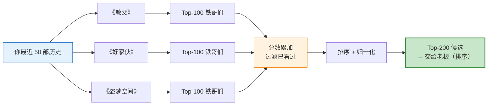
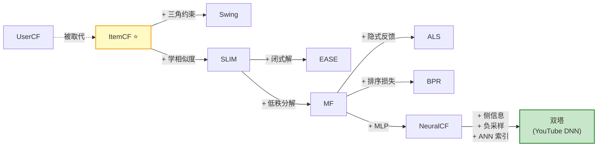

# 05 协同过滤（通俗易懂版）

> **本文档定位**：[`05-collaborative-filtering.md`](../en/05-collaborative-filtering.md) 的中文通俗辅读版，用「**老牌录像带出租店**」这个统一比喻，由浅入深把协同过滤讲清楚。
>
> **适合谁读**：
> - 第一次听说"协同过滤"四个字
> - 在 [`04-recall_CN.md`](04-recall_CN.md) 里看到 ItemCF 想再深挖
> - 想用 20 分钟搞懂"为啥 25 年前的算法今天还在用"
>
> **正式工程参考请看英文版**。本文档不在 git 仓库内（见 `.gitignore` 中 `*_CN.md` 规则），是本地学习材料。

## 目录

- [一句话理解](#一句话理解)
- [Level 1：老挑片员的工作 — 什么是协同过滤](#level-1老挑片员的工作--什么是协同过滤)
  - [协同过滤的核心信念（两句话）](#协同过滤的核心信念两句话)
- [Level 2：两个流派 — UserCF 和 ItemCF](#level-2两个流派--usercf-和-itemcf)
  - [流派 A — UserCF（找像你的人）](#流派-a--usercf找像你的人)
  - [流派 B — ItemCF（找像你看过的电影）](#流派-b--itemcf找像你看过的电影)
  - [为啥工业界都选 ItemCF？](#为啥工业界都选-itemcf)
- [Level 3：怎么算"两部电影像不像"](#level-3怎么算两部电影像不像)
  - [朴素版（先看一眼有多 naive）](#朴素版先看一眼有多-naive)
  - [升级 1：跟自己的人气比较一下](#升级-1跟自己的人气比较一下)
  - [这一步过滤掉了什么？](#这一步过滤掉了什么)
- [Level 4：两个工程坑 — IUF + 余弦校准](#level-4两个工程坑--iuf--余弦校准)
  - [坑 1：超级影迷会污染所有相似度（IUF 修正）](#坑-1超级影迷会污染所有相似度iuf-修正)
  - [坑 2：同一个客户反复借同一部片的"假共现"（Repeat-Interaction Bias）](#坑-2同一个客户反复借同一部片的假共现repeat-interaction-bias)
  - [升级后的完整公式](#升级后的完整公式)
- [Level 5：老挑片员怎么给你打分](#level-5老挑片员怎么给你打分)
  - [Step 1：翻你最近的租赁记录](#step-1翻你最近的租赁记录)
  - [Step 2：每部都翻出"铁哥们榜"，分数累加](#step-2每部都翻出铁哥们榜分数累加)
  - [Step 3：排序、归一化，交给下一棒——"老板"（排序模型）](#step-3排序归一化交给下一棒老板排序模型)
  - [把整个流程画成一张图](#把整个流程画成一张图)
- [Level 6：升级版的亲戚们](#level-6升级版的亲戚们)
  - [6.1 Swing — 「带三角约束的 ItemCF」（阿里出品，2017+）](#61-swing--带三角约束的-itemcf阿里出品2017)
  - [6.2 SLIM / EASE — 「让机器自己学相似度」](#62-slim--ease--让机器自己学相似度)
  - [6.3 ALS — 「矩阵分解的工业标准」](#63-als--矩阵分解的工业标准)
  - [6.4 BPR — 「按"排在前面"训练」](#64-bpr--按排在前面训练)
  - [6.5 一图看清楚 CF 家族的演化](#65-一图看清楚-cf-家族的演化)
- [Level 7：CF 的命门 — 它干不了什么](#level-7cf-的命门--它干不了什么)
  - [命门 1：新片冷启动 — 「这片刚上架，账本上啥都没有」](#命门-1新片冷启动--这片刚上架账本上啥都没有)
  - [命门 2：新用户冷启动 — 「这位是头回进店」](#命门-2新用户冷启动--这位是头回进店)
  - [命门 3：长尾被压制 — 「冷门片永远进不了榜」](#命门-3长尾被压制--冷门片永远进不了榜)
  - [命门 4：跟不上趋势 — 「网红新片火了仨小时」](#命门-4跟不上趋势--网红新片火了仨小时)
  - [命门一览](#命门一览)
- [Level 8：何时该用 / 不该用](#level-8何时该用--不该用)
  - [该用 CF 的场景](#该用-cf-的场景)
  - [不该用 CF 作为唯一召回的场景](#不该用-cf-作为唯一召回的场景)
- [Level 9：recsys-mini 代码逐段走读](#level-9recsys-mini-代码逐段走读)
  - [9.1 全文鸟瞰 — 102 行干完哪些事](#91-全文鸟瞰--102-行干完哪些事)
  - [9.2 头部 — 文件 docstring + import](#92-头部--文件-docstring--import)
  - [9.3 类定义 + 三个超参（__init__）](#93-类定义--三个超参__init__)
  - [9.4 fit Step 1 — 按时间排序 + 翻两份索引](#94-fit-step-1--按时间排序--翻两份索引)
  - [9.5 fit Step 2 — IUF 加权共现统计（最贵的一步）](#95-fit-step-2--iuf-加权共现统计最贵的一步)
  - [9.6 fit Step 3 — 余弦归一 + Top-K 截断（出版"铁哥们榜"）](#96-fit-step-3--余弦归一--top-k-截断出版铁哥们榜)
  - [9.7 fit Step 4 — 缓存每个用户最近 N 条历史](#97-fit-step-4--缓存每个用户最近-n-条历史)
  - [9.8 recall — 在线推荐 6 步](#98-recall--在线推荐-6-步)
  - [9.9 一次端到端走读 — 用具体数字演示](#99-一次端到端走读--用具体数字演示)
  - [9.10 复杂度速查表](#910-复杂度速查表)
  - [9.11 已实现 vs 还可以做](#911-已实现-vs-还可以做)
  - [9.12 实测效果](#912-实测效果)
- [Level 10：CF 在现代推荐系统里的位置](#level-10cf-在现代推荐系统里的位置)
  - [在多路召回里的典型配比](#在多路召回里的典型配比)
- [TL;DR — 三句话](#tldr--三句话)
- [对照表 — 比喻 ↔ 英文版章节](#对照表--比喻--英文版章节)

---

## 一句话理解

> **协同过滤（Collaborative Filtering, CF）= 老挑片员的一本账。**
>
> 她不看电影内容、不看导演、不看海报，只记录一件事：「**哪些电影经常被同一批人租走**」。
>
> 然后她说：「你刚还的《教父》，租它的人有 800 个也租了《好家伙》—— 你大概率也会喜欢。」
>
> **就这么简单。但这个算法支撑了亚马逊整个 2000 年代的"猜你喜欢"，今天还在抖音、淘宝、Netflix 的召回里活蹦乱跳。**

---

## Level 1：老挑片员的工作 — 什么是协同过滤

想象你走进一家**开了 20 年的录像带出租店**。

老挑片员没读过书，不懂"叙事结构"、"导演风格"、"电影流派"。她只有一本**手写台账**，记着每个客户租过啥。

```
客户          租过的片
─────────────────────────────────────
小王    《教父》、《好家伙》、《赌城风云》
小李    《教父》、《泰坦尼克号》、《盗梦空间》
小张    《好家伙》、《赌城风云》、《华尔街之狼》
...
```

20 年下来，她**心里有一个隐形的规律**：

> 「**租《教父》的人，十个有八个回头也租了《好家伙》**。」
>
> 「但租《教父》的人，**很少**回头租《喜羊羊》。」

每次你走进店里说"再给我推一部"，她不用问你为啥喜欢《教父》，**直接掏出账本算一算**就行。

### 协同过滤的核心信念（两句话）

| 信念 | 通俗说法 |
|---|---|
| **同好相吸** | "**跟你口味像的人，过去喜欢啥，你也会喜欢**" |
| **物以类聚** | "**总被同一批人租的两部片，必然有相似之处**" |

**注意一件重要的事**：老挑片员**根本不需要懂电影**。她只需要一本账。

这就是"协同"两个字的含义——**靠几十万客户用脚投票，集体协作出来的"相似度"**。

---

## Level 2：两个流派 — UserCF 和 ItemCF

老挑片员有两种思考方式，对应 CF 的两个流派：

### 流派 A — UserCF（找像你的人）

```
你 → 找出 100 个跟你品味最像的客户 → 看他们租过啥 → 推给你
```

通俗讲：

> 「**老挑片员啊，我跟谁口味最像？**」
> 「跟你最像的是小赵——你俩重合度 80%。小赵最近租了《信条》。要不你也试试？」

### 流派 B — ItemCF（找像你看过的电影）

```
你 → 列出你最近租过的电影 → 每部都找它的"铁哥们" → 把铁哥们推给你
```

通俗讲：

> 「**老挑片员啊，我刚看完《教父》，再来一部？**」
> 「你历史上租过《教父》《好家伙》《盗梦空间》——它们仨的铁哥们里，**《美国往事》**重复出现，肯定差不了。」

### 为啥工业界都选 ItemCF？

| 对比 | UserCF（找像你的人）                                                | ItemCF（找像你看的电影）                                   |
|---|--------------------------------------------------------------|---------------------------------------------------|
| **要维护的对象** | 1 亿个用户的相似关系                                                  | 1000 万个电影的相似关系                                    |
| **更新频率** | 用户口味天天变 → 每天都要重算                                             | 电影关系一年都不咋变 → 一周算一次都行                              |
| **推荐解释** | "跟你像的人都看了 X"——**锚定在陌生人身上**，用户既不认识那些人、又难以验证"凭啥说像我"，还容易触发隐私抗拒感 | "因为你看过 A，A 跟 X 像"——**锚定在你自己的历史上**，立刻可验证、可决策       |
| **冷启动**（CF 家族通病，都得靠别的召回路补盲） | 新用户瘫（无历史可查，无邻居可找）；                | 新物品**慢热**——靠老用户的评分逐步激活，先攒共现才进得了"铁哥们榜" |

**所以工业界 95% 的"协同过滤"指的就是 ItemCF**——包括亚马逊、淘宝、Netflix、recsys-mini。

> 后面的内容只讲 ItemCF。

---

## Level 3：怎么算"两部电影像不像"

老挑片员的核心技能就是**给每两部电影算一个"亲密度分数"**。

最朴素的想法：

```
《教父》和《好家伙》的亲密度  =  同时租过两部的客户数
```

**好像有道理？但有大坑。** 我们一步步来填。

### 朴素版（先看一眼有多 naive）

```
《教父》     800 个客户租过
《好家伙》   600 个客户租过
两者都租过   480 个客户

朴素亲密度  =  480
```

数字看起来很大，问题是——**没参照系**。

### 升级 1：跟自己的人气比较一下

如果《阿凡达》全店租了 5000 次，《教父》租了 800 次，那么《阿凡达》和**任何片**的"两者都租过"数字都会很大——纯粹因为《阿凡达》太红了。

老挑片员的解法是**除以一个"人气分母"**：

```
                 同时租过两部的人数
亲密度  =  ─────────────────────────────────────
            √( 租过《教父》的人 × 租过《好家伙》的人 )
```

> **人话**：「**别光看绝对人数，看『两个一起出现』的概率比『各自单独出现』的概率高多少**。」

这就是经典的**余弦相似度**，写代码就一行：

```python
sim = c / math.sqrt(ca * cb)
```

### 这一步过滤掉了什么？

```
不加分母：
  《阿凡达》的"铁哥们"前 10 名 ≈ 全店最热门的 10 部片
  （因为啥片都跟它"经常一起出现"）

加了分母：
  《阿凡达》的"铁哥们"前 10 名 = 真正调性接近的科幻大片
```

这是**协同过滤能不能用**的关键一步。

---

## Level 4：两个工程坑 — IUF + 余弦校准

光会算余弦还不够。老挑片员 20 年下来还填了**两个大坑**。

### 坑 1：超级影迷会污染所有相似度（IUF 修正）

店里有个客户**老张**，一年租了 1000 部片。任意两部片只要老张同时租过，就给"亲密度"加一分。

> **小贴士：C(n, 2) 怎么算**
>
> C 是 Combination（组合）的首字母，**读作 "n 选 2"**，意思是「从 n 个东西里挑 2 个，有多少种挑法」。
>
> **公式**：`C(n, 2) = n × (n−1) / 2`
>
> **三步推导**：
>
> 1. 第一部电影从 n 部里挑 → **n** 种选法
> 2. 第二部从剩下 n−1 部里挑 → **n × (n−1)** 种有序组合
> 3. 但 `(教父, 好家伙)` 和 `(好家伙, 教父)` 对 ItemCF 是**同一对**（顺序不重要），所以再除以 2 → **`n × (n−1) / 2`**

代回老张和老王：

```
老张一个人贡献了多少"相似信号"对？
  C(1000, 2) = 1000 × 999 / 2 = 499,500 对！
  
普通客户老王一年租了 10 部：
  C(10, 2)   = 10 × 9 / 2     = 45 对
```

**一个老张顶 11,100 个老王**（499,500 / 45 ≈ 11,100）。这显然不对——老张那 1000 部片大多是随便点的，并没有强烈偏好。

> **关键洞察**：C(n, 2) 是 n 的**二次函数**——用户租片数翻 10 倍，贡献的共现信号翻 **100 倍**。这就是为什么必须用 IUF 给活跃用户**对数级**打折——否则一两个机器人能把整张相似度矩阵带跑偏。

老挑片员的解法：**「话多的人，每句话都打折」**。每个客户的"发言权"按下面公式衰减：

```
发言权  =  1 / log(1 + 他租过的片数)
```

| 客户类型 | 租过几部 | 发言权 |
|---|---|---|
| 蜻蜓点水的小新 | 5 | ≈ 0.558 |
| 普通客户老王 | 50 | ≈ 0.254 |
| 重度影迷小赵 | 500 | ≈ 0.161 |
| 机器人或老张 | 5000 | ≈ 0.117 |

> 这就是 **IUF（Inverse User Frequency）**——「逆用户频率」。
>
> **人话**：「**对什么都点赞的人，他的点赞其实没啥含金量**。」

> **一句话精确定义**：IUF 衡量的是「**用户每次共现行为，对物品间相似度的影响程度**」——**越活跃的用户，单次影响越小**。
>
> 注意它修饰的**不是某个单一 item 的权重**，而是「**这个用户贡献的每一票共现信号**」的可信度——所以越是"啥都看"的重度用户，他每一票的份量越轻。

### 坑 2：同一个客户反复借同一部片的"假共现"（Repeat-Interaction Bias）

小李是《教父》死忠粉，一年里**反反复复**借了 20 次《教父》、15 次《好家伙》。

如果不去重，按朴素的双层共现统计算：

```
co[《教父》][《好家伙》]  +=  20 × 15  =  300 次！
```

但其实小李只该表达**「我喜欢《教父》和《好家伙》」这一个信号**——不是 300 个。否则光小李一个铁粉，就能把这两部片的亲密度抬到天上去，让算法误以为「凡是喜欢《教父》的客户都肯定喜欢《好家伙》」。

**老挑片员的解法**：**「同一个人的同一部片只算一次」**——不管你借了 20 次还是 200 次，对算法来说都只算一票。代码就一句：

```python
uniq = list(dict.fromkeys(items))  # 去重保持顺序
```

### 升级后的完整公式

```
                  Σ_{u 同时租过 i 和 j}  1 / log(1 + |I_u|)
sim(i, j)  =  ─────────────────────────────────────────
                       √( |U_i| · |U_j| )
```

- 分子：所有"同时租过两片"的客户**按发言权加权求和**
- 分母：两部片各自人气的几何平均（余弦归一化）

公式看着唬人，**翻译人话就两句**：

> 1. 「**他俩一起出现的次数多，但都很红，要打折**。」
> 2. 「**贡献这次共现的人话越多，他的票要越打折**。」

---

## Level 5：老挑片员怎么给你打分

相似度算完了，怎么给你推荐？老挑片员的流程**三步走**：

### Step 1：翻你最近的租赁记录

老挑片员**不看你 5 年前租过啥**——人会变嘛。她只看你**最近的 50 部**（recsys-mini 的 `user_history_len=50`）。

```
你最近租过：《教父》、《好家伙》、《盗梦空间》
```

### Step 2：每部都翻出"铁哥们榜"，分数累加

每部电影老挑片员心里都有一份**Top-100 铁哥们榜**（`sim_topk=100`），分数是亲密度：

```
《教父》的铁哥们榜（Top-100）：
  《美国往事》  0.79
  《教父 2》    0.78
  《好家伙》    0.75  ← 你已经看过，跳过
  ...

《好家伙》的铁哥们榜（Top-100）：
  《美国往事》  0.71  ← 又出现一次！
  《赌城风云》  0.68
  《教父》      0.75  ← 你已经看过，跳过
  ...

《盗梦空间》的铁哥们榜（Top-100）：
  《星际穿越》  0.74
  《信条》      0.68
  ...
```

把所有铁哥们的分数**累加**：

```
最终候选榜：
  《美国往事》  =  0.79 + 0.71            =  1.50  ← 第 1 名
  《教父 2》    =  0.78                   =  0.78
  《星际穿越》  =  0.74                   =  0.74
  《赌城风云》  =  0.68                   =  0.68
  《信条》      =  0.68                   =  0.68
  ...
```

**多次"投票"的胜出**——《美国往事》同时是《教父》和《好家伙》的铁哥们，自然冒头。这就是 ItemCF 的**群众智慧**。

### Step 3：排序、归一化，交给下一棒——"老板"（排序模型）

```python
out = sorted(scores.items(), key=lambda x: x[1], reverse=True)[:k]
# 归一化到 [0, 1]
max_s = out[0][1] if out[0][1] > 0 else 1.0
return [(int(i), float(s) / max_s) for i, s in out]
```

老挑片员的活到这就结束了——把候选按分数排个序取 Top-k，再把分数压到 `[0, 1]` 区间，**送到柜台后面给老板**。

#### 老挑片员交给谁？— 录像带店里的"权力金字塔"

```
全店货架（10,000 部电影）
       ↓     ← 老挑片员 + 店里其它挑片员（多路召回）：每人独立粗筛 200 部
   合并去重 ≈ 300 部候选
       ↓     ← 老板（排序模型）：综合所有挑片员意见，给候选精确打分
    10 部精排
       ↓     ← 老板娘（重排）：最终拍板上架——去重、加多样性、塞本月主推
     5 部最终摆到你眼前的"今日推荐"货架
```

| 阶段 | 录像带店角色 | 资历 | 它干啥 | 在乎啥 |
|---|---|---|---|---|
| **召回** | 老挑片员 + 其它挑片员们 | 店里的"小工" | **粗筛**：从 1 万部里挑出 200 部潜在感兴趣的 | "**别漏掉你真正想看的**" |
| **排序** | 老板 | 店里最懂电影的二号人物 | **精挑**：用更专业的模型综合用户口味 + 电影属性 + 当下场景，给候选精确打分 | "**这 200 部里到底哪 10 部最该推**" |
| **重排** | **老板娘** | 店里的最终权威 | **拍板上架**：去重、加多样性、塞本月主推、控广告位 | "**别让 10 部都是同一种风格**" |

> 详见 [`04-recall_CN.md`](04-recall_CN.md#1-召回在整个系统里的位置漏斗) 的漏斗图（那边用"婚介所→媒人→你妈"的比喻，本质是同一件事）。**ItemCF 只负责老挑片员那一路**——它从来不直接决定"最终给你看哪 5 部"，那是后面老板和老板娘的活。

#### 为啥要把分数归一化到 `[0, 1]`？

因为**店里不止老挑片员一个人**——还有好几位挑片员，每位都有自己的招牌推荐逻辑，**打分标准完全不一样**。

**店里 4 位挑片员对《好家伙》各自的打分**

| 挑片员 | 招牌推荐逻辑 | 给《好家伙》的分 | 原始分数尺度 |
|---|---|---|---|
| **老挑片员**（ItemCF）| "你看过《教父》《盗梦空间》，《好家伙》是它俩共同的铁哥们" | **1.50**（亲密度累加）| `[0, ∞)` 上不封顶 |
| **热门榜小哥**（PopularRecaller）| "本月《好家伙》全店租了 480 次，热度排第 5" | **0.85**（480 / 最热的 560 ≈ 0.85）| `[0, 1]` |
| **资深选片员**（双塔召回，未来）| "我看你的电影口味画像和《好家伙》的气质画像，气质相近" | **0.7**（两个画像向量的余弦距离）| `[-1, 1]` |
| **标签整理员**（内容召回，未来）| "《好家伙》货架标签是 [黑帮+犯罪+剧情]，跟你过去借的电影标签匹配度高" | **4.2**（标签匹配 5 分制）| `[0, 5]` |

→ 4 位挑片员都觉得《好家伙》不错，但**他们给的分数完全没法比较**：1.50、0.85、0.7、4.2——单位都不一样，**直接加在一起毫无意义**。

**不归一化会发生什么 —— 老板按原始分数融合的悲剧**

老板想把 4 位挑片员推的候选都拿过来，最朴素的方式就是分数相加。不归一化的结果：

```
电影           老挑片员   热门榜   选片员   标签员    总分
─────────────────────────────────────────────────────
《好家伙》     1.50  +  0.85  +  0.70  +  4.20  =  7.25
《老炮儿》     0.00  +  0.95  +  0.90  +  5.00  =  6.85
《阿凡达》     0.00  +  1.00  +  0.30  +  2.00  =  3.30
─────────────────────────────────────────────────────
                                              ↑
                          标签整理员的分数尺度大 → 一个人就把结果带走了
```

**问题暴露**：**标签整理员的分数尺度（0–5）天然比其他同事大 3–5 倍**，融合时她一个人就能左右最终结果。老挑片员辛辛苦苦算出来的"亲密度 1.50"，跟标签整理员随手给的"4.2"放一起，**根本说不上话**。

**归一化以后 —— 每位挑片员把自己最高的那部当 1.0**

每位挑片员**先把自己的候选除以自己榜单里的最大分数**，全部压到 `[0, 1]` 再交给老板：

```
电影           老挑片员   热门榜   选片员   标签员    总分
─────────────────────────────────────────────────────
《好家伙》     1.00  +  0.85  +  0.78  +  0.84  =  3.47   ← 第 1 名
《老炮儿》     0.00  +  0.95  +  1.00  +  1.00  =  2.95
《阿凡达》     0.00  +  1.00  +  0.33  +  0.40  =  1.73
─────────────────────────────────────────────────────
                                              ↑
                      《好家伙》凭借"4 位挑片员同时看好"自然胜出
```

→ **大家话语权对等**，《好家伙》因为**被四路同时推荐**自然冒头，而不是被某位"嗓门大"的挑片员单方面带跑。

**一句话总结**

> 老挑片员**这一行代码**：
>
> ```python
> return [(int(i), float(s) / max_s) for i, s in out]
> ```
>
> 不是为了让"亲密度看起来漂亮"，而是为了让老板融合时**跟店里其他挑片员的意见公平对齐**——这是召回器的**接口约定**，所有挑片员（召回路）都得遵守。

### 把整个流程画成一张图



---

## Level 6：升级版的亲戚们

ItemCF 是协同过滤的"经典款"。25 年过去，学术界和工业界又造了好几个"升级款亲戚"，下面讲最重要的几位。

### 6.1 Swing — 「带三角约束的 ItemCF」（阿里出品，2017+）

#### 问题：ItemCF 的"假亲密"

> **场景**：店里有两位重度客户**老王**和**小李**——他俩都租过《教父》和《好家伙》。
>
> 按 ItemCF 的逻辑：这两位用户的"同时租过"给 (《教父》，《好家伙》) 这对贡献了 **2 票共现信号**。
>
> **但仔细一查老挑片员的账本**：老王和小李是店里两位"**啥都租**"型客户，**他俩共同租过的电影多达 200 部**——黑帮片、爱情片、动画片、纪录片，啥都有。他俩"也都租过《教父》和《好家伙》"这件事，其实**没什么含金量**——因为**他俩本来就什么都共同租过**。

这就是 ItemCF 的**「虚假共现 / Spurious Co-occurrence」** 问题——共现是真的，但**不能代表两部电影真的有关系**。

#### Swing 的修正：「三角约束」

> **核心思想**：**「贡献共现信号的两位客户，如果他们俩本来就啥都共同租过，那他们对这一对 (i, j) 的支持要打折」**。
>
> **反过来**——「两个除了 (i, j) 几乎啥都没共同租过的客户」如果偏偏一起租了 (i, j)，那这次共现的**含金量极高**。

数学上就是给每对共现客户加个"独立性"分母：

```
                                  1
sim_swing(i, j)  =  Σ_{u, v}  ─────────────────────
                              α + |I_u ∩ I_v|

  (u, v 是所有同时租过 i 和 j 的客户对)
```

| 符号 | 含义 |
|---|---|
| `\|I_u ∩ I_v\|` | 客户 u 和 v **共同租过的电影总数** |
| `α` | 平滑系数（通常 1 ~ 10），避免分母为 0 |

**直觉对照表**：

| 一对客户共同租过 | 分母 `α + \|I_u ∩ I_v\|` | 这次共现的"票"有多重 |
|---|---|---|
| 仅 2 部（就是 i 和 j 本身）| `1 + 2 = 3` | **0.33（满票，强信号）** |
| 20 部 | `1 + 20 = 21` | 0.048（中等） |
| 200 部（老王 + 小李那种）| `1 + 200 = 201` | **0.005（几乎不算数）** |

#### 一个具体例子 — Swing 和 ItemCF 算出来差多少

假设 (《教父》，《好家伙》) 这对电影有 3 对客户都共同租过，每对的"共同租片总数"不同：

```
客户对             共同租过多少部     ItemCF 的票       Swing 的票
────────────────────────────────────────────────────────────────
张三 & 李四            3 部              1.0          1/(1+3)   = 0.25
王五 & 赵六           20 部              1.0          1/(1+20)  = 0.048
老王 & 小李          200 部              1.0          1/(1+200) = 0.005
────────────────────────────────────────────────────────────────
                                       ─────         ─────
ItemCF 累加亲密度                      3.000
Swing  累加亲密度                                    0.303
```

**ItemCF** 觉得这对电影亲密度 = 3.0，**Swing** 直接打到 0.303——**差了 10 倍**。

为啥差这么多？因为：
- 前两对客户（张三/李四、王五/赵六）相对"专一"，他们的共现是**真信号**——Swing 给他们的票分别保留了 0.25 和 0.048
- 最后一对（老王/小李）啥都共同租过，他们对 (《教父》，《好家伙》) 的"支持"**几乎是噪声**——Swing 把他们的票压到 0.005

→ ItemCF 把噪声和真信号**等权累加**，Swing 把它们**按可信度加权**。

#### 何时该上 Swing？四个判断维度

| 场景特征 | Swing 比 ItemCF 强多少 | 为啥 |
|---|---|---|
| **重度用户 vs 轻度用户差异大**（基尼系数高）| ⭐⭐⭐ | "啥都租的人"会把共现拉偏，Swing 自动打压 |
| **物品库长尾极重**（前 5% 物品占 80% 行为）| ⭐⭐⭐ | 长尾片靠少数"专一"客户共现，Swing 把信号放大 |
| **电商多类目场景**（如淘宝）| ⭐⭐ | 跨类目共现（同时买电子产品+婴儿用品）天然是噪声，Swing 自动过滤 |
| **行为稀疏**（如新闻媒体）| ⭐ | 共现本来就少，Swing 的"放大稀有信号"作用有限 |

> **recsys-mini 的判断**：路线图里把"Swing 替换 ItemCF"列为 ⭐⭐ 优先级，**但实际收益可能有限**——因为：
> - ML-1M 用户分布相对均匀（最低 20 条/用户，没有"啥都租"的极端用户）
> - 数据量只有 100 万行为，三角约束的统计噪声大
>
> 真正想看 Swing 威力，建议直接换用 **KuaiRand / Tenrec** 这类工业级数据集（亿级行为 + 长尾重度）。

### 6.2 SLIM / EASE — 「让机器自己学相似度」

老挑片员的相似度公式是**人手设计**的（cosine + IUF）。学者们想：**能不能直接让模型学一个最优的相似度矩阵 W？**

```
W  ∈ ℝ^{N×N}    # N 是物品数

目标：用 W 让 R · W 尽量接近 R
       （用其它物品预测当前物品被消费的概率）
约束：W 对角线为 0（不能用自己预测自己）
      W ≥ 0     （相似度不能是负的）
```

**EASE 是 SLIM 的"白嫖版"**——一个闭式解，三行 NumPy：

```python
P = np.linalg.inv(R.T @ R + lam * np.eye(N))
W = -P / np.diag(P)
np.fill_diagonal(W, 0)
```

**只有一个超参 λ**，居然能在 ML-20M 上吊打很多深度模型。

| 优点 | 缺点 |
|---|---|
| 闭式解，无需训练 | `O(N³)` 矩阵求逆，N > 10 万就炸 |
| 单一超参 | 不支持物品侧特征 |

### 6.3 ALS — 「矩阵分解的工业标准」

把整张交互矩阵 `R` 近似分解成两块**低秩矩阵**：

```
R  ≈  P · Qᵀ

P ∈ ℝ^{M×d}    # 每个用户一个 d 维向量
Q ∈ ℝ^{N×d}    # 每个物品一个 d 维向量
```

**这其实就是双塔的祖先**——`p_u · q_iᵀ` 就是用户和物品的"内积匹配度"。

ALS 算法的特点是**交替优化**——固定 Q 解 P，固定 P 解 Q，每一步都有闭式解。Spotify、Netflix 都用过。

### 6.4 BPR — 「按"排在前面"训练」

普通 MF 训练目标是"还原 R 矩阵的具体数字"。但召回**不在乎绝对分数**——只在乎**相对顺序**。

BPR 直接以"正样本排在负样本前面"为优化目标：

```
最大化  P(p_u · q_iᵀ  >  p_u · q_jᵀ)
            其中 i 是用户看过的，j 是没看过的
```

> 这思路被后来的**双塔 + sampled softmax** 全面继承。

### 6.5 一图看清楚 CF 家族的演化



> **重要洞见**：**双塔召回本质上就是"加了深度编码器和侧信息的协同过滤"**。
>
> 不要把 CF 当过时算法——它是**整个现代召回栈的算法骨架**。

---

## Level 7：CF 的命门 — 它干不了什么

老挑片员再聪明，也有四件事她干不了。

### 命门 1：新片冷启动 — 「这片刚上架，账本上啥都没有」

```
《某部 2024 年新片》
  租过的人数 = 0
  → 不会出现在任何"铁哥们榜"里
  → 永远不会被推荐
```

> **结构性问题**：CF 的输入是交互数据，没交互就没办法。

**解药**：上**内容召回**（用片名 / 简介做 NLP 向量），或上**双塔**（带物品侧特征）。详见 [`02-cold-start_CN.md`](02-cold-start_CN.md)。

### 命门 2：新用户冷启动 — 「这位是头回进店」

```
新客户小白第一次进店
  → 历史 = []
  → 老挑片员没东西可查
  → 啥都推不出来
```

**解药**：兜底用**热门召回**（PopularRecaller）+ **冷启动问卷**。

### 命门 3：长尾被压制 — 「冷门片永远进不了榜」

```
冷门片《XYZ》
  租过的人就 10 个 → 跟别的片共现次数都很低
  → 算出来的亲密度都很小
  → 进不了任何片的 Top-100 铁哥们榜
  → 永远召不出来
```

> 老挑片员的小本本只记 Top-100，第 101 名就**永久消失**了。

**解药**：上**内容召回**做并行补盲。

### 命门 4：跟不上趋势 — 「网红新片火了仨小时」

```
某网红片今天突然爆火
  → ItemCF 的相似度表是昨晚算的
  → 这片在表里还没有任何"铁哥们"
  → 召回不到
```

**解药**：**实时增量更新**相似度表（工业界常做小时级），或并行跑**热门召回**（PopularRecaller 天然实时）。

### 命门一览

| 命门 | 表现 | 解药 |
|---|---|---|
| 新物品 | 召不出来 | 内容召回 / 双塔 |
| 新用户 | 推不出来 | 热门兜底 / 喜好问卷 |
| 长尾压制 | 冷门片永远不出现 | 内容召回 / Swing |
| 趋势滞后 | 网红片来不及收录 | 增量更新 / 实时热门 |

**这就是为什么生产系统从来不只靠 CF**——CF 是稳定的"中坚力量"，但不能独当一面。

---

## Level 8：何时该用 / 不该用

### 该用 CF 的场景

| 场景 | 为啥适合 |
|---|---|
| 平台已经积累了几个月行为数据 | 共现矩阵足够稠密 |
| 物品库相对稳定（电影、书、电商 SKU） | 相似度表不用频繁重算 |
| 想要**可解释**的推荐 | "因为你看过 A，A 跟 X 像" |
| 想要**便宜的兜底**（不用 GPU） | 一台 CPU 服务器就能跑 |
| 想给双塔**补盲** | CF 和双塔犯的错不一样，互补性强 |

### 不该用 CF 作为**唯一**召回的场景

| 场景 | 为啥不行 |
|---|---|
| **全新平台**（系统冷启动） | 没行为可挖 |
| **物品库高速翻新**（新闻、短视频） | 80% 物品是 24 小时内的新东西 |
| **首次进入的用户**（用户冷启动） | 没历史可查 |
| **超稀疏 UGC**（行为密度 < 0.001%） | 共现统计全是噪声 |

---

## Level 9：recsys-mini 代码逐段走读

代码在 `src/recall/itemcf.py`，**整整 102 行**，把前面 8 个 Level 讲的工程修正全部实现了。这一节我们**从第 1 行读到第 102 行**，每一块都对应到前面的某个概念上。

### 9.1 全文鸟瞰 — 102 行干完哪些事

```
第  1–11 行  文件 docstring                        ← 写给读代码的人
第 12–22 行  import                                ← 依赖：math + pandas + tqdm
第 25–26 行  class 定义 + name = "itemcf"          ← 召回器的身份证
第 28–40 行  __init__：3 个超参 + 2 个"小本本"      ← Level 4–5 的工程参数化
第 42–82 行  fit：训练 4 步走                       ← 老挑片员 20 年攒账本
   ├─ 第 43 行          按时间排序
   ├─ 第 45–47 行  Step 1: 翻两份索引出来
   ├─ 第 49–59 行  Step 2: IUF 加权共现统计         ← Level 3, 4.1
   ├─ 第 61–72 行  Step 3: 余弦归一 + Top-K 截断    ← Level 3, 6.1
   └─ 第 74–82 行  Step 4: 缓存用户最近 N 条历史
第 84–101 行 recall：在线推荐 6 步                  ← Level 5 全实现
```

> 接下来按这个顺序逐块拆解。

### 9.2 头部 — 文件 docstring + import

```1:11:src/recall/itemcf.py
"""ItemCF: 基于 item-item 共现的协同过滤召回

相似度公式 (带 IUF 热门用户惩罚):
    sim(i, j) = sum_{u in U_i ∩ U_j}  1 / log(1 + |I_u|)
                ────────────────────────────────────────
                         sqrt(|U_i| * |U_j|)

预测打分:
    score(u, j) = sum_{i in history(u)}  sim(i, j) * w_i
其中 w_i 用最近性衰减或简单等权.
"""
```

**docstring 把整个算法压缩成两个公式**——这就是 Level 3 + Level 4 的完整数学描述。读源码先看 docstring，是个好习惯。

```12:22:src/recall/itemcf.py
from __future__ import annotations

import math
from collections import defaultdict
from typing import List, Tuple

import numpy as np
import pandas as pd
from tqdm import tqdm

from .base import BaseRecaller
```

| 依赖 | 用来干啥 |
|---|---|
| `math.log` / `math.sqrt` | 算 IUF 和余弦归一化 |
| `defaultdict` | 共现矩阵 `co[a][b] += ...`，**省去手动初始化** |
| `pandas` | 处理 train_df（按用户/物品分组） |
| `tqdm` | 训练过程进度条（大数据集时很有用） |
| `BaseRecaller` | 召回器统一接口（[Level 8 提过](#level-8何时该用--不该用)，所有召回路都实现 `fit` + `recall`） |

### 9.3 类定义 + 三个超参（__init__）

```25:40:src/recall/itemcf.py
class ItemCFRecaller(BaseRecaller):
    name = "itemcf"

    def __init__(
        self,
        sim_topk: int = 100,
        user_history_len: int = 50,
        use_iuf: bool = True,
    ):
        self.sim_topk = sim_topk
        self.user_history_len = user_history_len
        self.use_iuf = use_iuf
        # item -> List[(neighbor_item, sim)]  按 sim 倒排, 截断 sim_topk
        self._item_sim: dict[int, List[Tuple[int, float]]] = {}
        # user -> 最近 N 个 (item_id, ts)
        self._user_history: dict[int, List[Tuple[int, pd.Timestamp]]] = {}
```

#### 三个超参分别在管什么

| 超参 | 默认值 | 在管什么 | 调大会怎样 | 调小会怎样 |
|---|---|---|---|---|
| `sim_topk` | 100 | **每部电影记几个铁哥们** | 内存膨胀，召回多样性变好 | 召回偏窄，全是热门 |
| `user_history_len` | 50 | **看用户最近几条历史** | 旧兴趣权重升高，推荐变"老气" | 只看最新行为，可能太短视 |
| `use_iuf` | True | **要不要给活跃用户打折** | （True）抑制噪声，更稳 | （False）训练快，但易被刷分 |

#### 两个"小本本"（实例属性）

| 属性 | 类型 | 装的是 |
|---|---|---|
| `_item_sim` | `dict[item, List[(neighbor, sim)]]` | **电影-电影亲密度榜**（fit 阶段灌满） |
| `_user_history` | `dict[user, List[(item, ts)]]` | **用户最近 N 条租赁记录**（fit 阶段灌满） |

> **关键设计**：所有重活都在 `fit` 时算好存进这两个 dict，`recall` 时只查表。**离线训练慢一点没关系，在线响应必须毫秒级**——这是召回的铁律。

### 9.4 fit Step 1 — 按时间排序 + 翻两份索引

```42:47:src/recall/itemcf.py
    def fit(self, train_df: pd.DataFrame) -> None:
        df = train_df.sort_values("ts")

        # 1) 构 user -> [items], item -> count
        user_items = df.groupby("user_id")["item_id"].apply(list).to_dict()
        item_count: dict[int, int] = df.groupby("item_id").size().to_dict()
```

#### 为啥第一步是排序？

```python
df = train_df.sort_values("ts")
```

后面 Step 4 要取**用户最近的 N 条**——只有先按时间戳排好序，Step 4 里 `items[-N:]` 才是"最近 N 条"而不是"任意 N 条"。**排序放在最前面统一处理**，避免后面再排两遍。

#### 两份索引各装啥？

| 变量 | 形状 | 装的是 | 举例 |
|---|---|---|---|
| `user_items` | `{user_id: [item_id, ...]}` | 每个用户按时间序的租赁清单 | `{42: [1193, 661, 914, ...]}` |
| `item_count` | `{item_id: count}` | 每部片**被多少条交互覆盖**（≈ `\|U_i\|`） | `{1193: 2269, 661: 525, ...}` |

老挑片员把账本**两种方式索引了一遍**：一种按客户找他租过啥，一种按电影找它的人气数字。Step 2、3 各用一份。

### 9.5 fit Step 2 — IUF 加权共现统计（最贵的一步）

```49:59:src/recall/itemcf.py
        # 2) 共现统计 (带 IUF)
        co: dict[int, dict[int, float]] = defaultdict(lambda: defaultdict(float))
        for u, items in tqdm(user_items.items(), desc="ItemCF 共现统计"):
            n = len(items)
            iuf = 1.0 / math.log(1 + n) if self.use_iuf else 1.0
            uniq = list(dict.fromkeys(items))  # 去重保持顺序
            for a in uniq:
                for b in uniq:
                    if a == b:
                        continue
                    co[a][b] += iuf
```

这一段是 **Level 4 工程修正**的全部代码体现。逐行解释：

#### Line 50 — 嵌套 `defaultdict`

```python
co: dict[int, dict[int, float]] = defaultdict(lambda: defaultdict(float))
```

`co[a][b]` 直接 `+=` 就行，**不用手动判断 a/b 是否第一次出现**。这是 Python 写稀疏矩阵的标准技巧。

#### Lines 51–53 — 每个用户先算自己的 IUF 权重

```python
for u, items in tqdm(user_items.items(), desc="ItemCF 共现统计"):
    n = len(items)
    iuf = 1.0 / math.log(1 + n) if self.use_iuf else 1.0
```

| 这个用户租了几部 | `n` | `iuf` |
|---|---|---|
| 5 部（新客） | 5 | 0.558 |
| 50 部（普通） | 50 | 0.254 |
| 500 部（重度） | 500 | 0.161 |
| 5000 部（机器人） | 5000 | 0.117 |

→ **话多的人打折**，对应 [Level 4 坑 1](#坑-1超级影迷会污染所有相似度iuf-修正)。

#### Line 54 — 同会话去重

```python
uniq = list(dict.fromkeys(items))  # 去重保持顺序
```

`dict.fromkeys` 是 Python 3.7+ **保序去重**的最快写法。这一行解决了 [Level 4 坑 2](#坑-2同一个客户反复借同一部片的假共现)——同一个客户反复借同一部片只算一次。

#### Lines 55–59 — 双层 for 灌共现矩阵

```python
for a in uniq:
    for b in uniq:
        if a == b:
            continue
        co[a][b] += iuf
```

| 这段做什么 | 解释 |
|---|---|
| 双层遍历 `uniq × uniq` | 这个用户租过的所有电影**两两配对**累加共现 |
| `if a == b: continue` | 不算自己跟自己的"共现"（对角线为 0） |
| `co[a][b] += iuf` | 每对都加上**这个用户的发言权**（不是简单 +1） |
| 同时 `co[a][b]` 和 `co[b][a]` 都会被加 | 构造的是**对称矩阵**，节省后面查询时的对称操作 |

> **一句话精确理解**：该用户去重后的 item 集合，**两两配对**，每一对都累加上「**该用户的 IUF 权重**」作为一次共现贡献；**跑完所有用户后**，`co[a][b]` 就是「**所有同时看过 a 和 b 的用户的 IUF 之和**」。
>
> 注意两点：① 用 `+=` 是为了**跨用户累加**——`co[a][b]` 是全体相关用户叠加的结果，不是单个用户的；② 同一用户内每个无序对 {a, b} 只贡献一次 IUF（因为 `uniq` 已去重），但会同时写入 `co[a][b]` 和 `co[b][a]` 两个对称位置。

**复杂度警告**：这是整个 fit 里**最贵的一步**——`O(Σ_u |I_u|²)`。在 ML-1M（最重度用户 2314 部）上，这一步就是几亿次操作；到了亿级行为的真实数据，必须用 Spark 或 Faiss 替代。

### 9.6 fit Step 3 — 余弦归一 + Top-K 截断（出版"铁哥们榜"）

```61:72:src/recall/itemcf.py
        # 3) 归一化为余弦相似
        item_sim: dict[int, List[Tuple[int, float]]] = {}
        for a, neighbors in tqdm(co.items(), desc="ItemCF 归一化"):
            ca = item_count[a]
            scored = []
            for b, c in neighbors.items():
                cb = item_count[b]
                sim = c / math.sqrt(ca * cb)
                scored.append((b, sim))
            scored.sort(key=lambda x: x[1], reverse=True)
            item_sim[a] = scored[: self.sim_topk]
        self._item_sim = item_sim
```

#### 逐行翻译

| 行号 | 在干啥 | 对应 Level |
|---|---|---|
| `ca = item_count[a]` | 取电影 a 的人气 `\|U_a\|` | Level 3 余弦分母 |
| `cb = item_count[b]` | 取电影 b 的人气 `\|U_b\|` | Level 3 余弦分母 |
| `sim = c / math.sqrt(ca * cb)` | **余弦归一化** | Level 3 升级 1 |
| `scored.sort(..., reverse=True)` | 按 sim 从大到小排 | Level 5 Step 2 |
| `scored[: self.sim_topk]` | **只留前 100 个** | Level 6 工程修正 |

#### 这一步为啥能省 100 倍内存？

```
不截断：              截断到 Top-100：
  M² 个 sim 值          M × 100 个 sim 值
  (M=10000 → 10^8)      (M=10000 → 10^6)
  约 800 MB             约 8 MB
```

→ **100 倍空间节省，召回质量几乎不损失**。第 101 名以后的邻居本来就是噪声，扔掉反而干净。

### 9.7 fit Step 4 — 缓存每个用户最近 N 条历史

```74:82:src/recall/itemcf.py
        # 4) 用户最近历史 (推理时用)
        history = (
            df.groupby("user_id")
            .apply(lambda x: list(zip(x["item_id"].tolist(), x["ts"].tolist())))
            .to_dict()
        )
        self._user_history = {
            u: items[-self.user_history_len :] for u, items in history.items()
        }
```

#### 这一段在做啥

1. `groupby("user_id").apply(...)` — 把每个用户的所有 `(item_id, ts)` 配对捞出来
2. `items[-self.user_history_len:]` — **由于 df 在最开始已经按 ts 排序，所以 `[-50:]` 就是最近 50 条**

#### 为啥要带 `ts`？

```python
list(zip(x["item_id"].tolist(), x["ts"].tolist()))
```

把时间戳也存进去——**为了将来加时间衰减预留接口**。当前 `recall` 里只用了 `item_id`，`ts` 被 `_ts` 忽略掉（见 Line 91），但未来想加 `exp(-α·Δt)` 就直接能用。

> 这是个**未来友好的设计**——预留扩展点的成本几乎为零，将来回报巨大。

### 9.8 recall — 在线推荐 6 步

这是用户每次刷新都会调用的函数，要**毫秒级**返回结果。

```84:101:src/recall/itemcf.py
    def recall(self, user_id: int, k: int) -> List[Tuple[int, float]]:
        hist = self._user_history.get(user_id)
        if not hist:
            return []
        seen = {i for i, _ in hist}
        scores: dict[int, float] = defaultdict(float)
        # 简单等权; 后续可加时间衰减
        for item_id, _ts in hist:
            for neighbor, sim in self._item_sim.get(item_id, ()):
                if neighbor in seen:
                    continue
                scores[neighbor] += sim
        if not scores:
            return []
        out = sorted(scores.items(), key=lambda x: x[1], reverse=True)[:k]
        # 归一化到 [0, 1]
        max_s = out[0][1] if out[0][1] > 0 else 1.0
        return [(int(i), float(s) / max_s) for i, s in out]
```

#### 拆成 6 步看

| 步 | 代码 | 在干啥 | 注释 |
|---|---|---|---|
| ① | `hist = self._user_history.get(user_id)` | 查"这个用户的最近历史" | 字典查询 O(1) |
| ② | `if not hist: return []` | 新用户兜底 | **冷启动直接返回空，交给其它召回路** |
| ③ | `seen = {i for i, _ in hist}` | 集合记下"已经看过的" | 集合查询 O(1)，配合 Step ④ |
| ④ | 双层 for + `if neighbor in seen: continue` + `scores[neighbor] += sim` | **核心打分循环** | 每段历史查 Top-100 邻居，累加亲密度，跳过已看过的 |
| ⑤ | `out = sorted(...)[:k]` | 排序取 Top-k | Python `sorted` 是 Timsort, O(n log n) |
| ⑥ | `max_s = out[0][1]` + `s / max_s` | min-max 归一化到 [0, 1] | **为多路融合做准备** |

#### Step ④ 是热点路径，再展开一次

```python
for item_id, _ts in hist:                          # 50 次循环
    for neighbor, sim in self._item_sim.get(item_id, ()):   # 每次 100 次
        if neighbor in seen:                       # 集合查询 O(1)
            continue
        scores[neighbor] += sim                    # defaultdict 累加 O(1)
```

总操作次数 = `50 × 100 = 5000 次` → **百微秒级完成**，毫秒延迟绰绰有余。

#### `self._item_sim.get(item_id, ())` 里的小细节

用 `()`（空 tuple）作 default 而不是 `[]`——**tuple 创建更便宜**，对于"key 不存在"这条 fallback 路径性能更友好。

### 9.9 一次端到端走读 — 用具体数字演示

假设你是 `user_id=42`，最近租过 3 部片（实际是 50 部，简化演示）：

#### 输入数据

```python
_user_history[42] = [(《教父》, t1), (《好家伙》, t2), (《盗梦空间》, t3)]

# 假设训练时算出的 Top-100 铁哥们榜（只列前 5）：
_item_sim[《教父》] = [
    (《美国往事》, 0.79),
    (《教父 2》,   0.78),
    (《好家伙》,   0.75),  # ← 你看过
    (《华尔街之狼》, 0.55),
    (《赌城风云》, 0.52),
    ...
]
_item_sim[《好家伙》] = [
    (《美国往事》, 0.71),  # ← 又出现一次
    (《赌城风云》, 0.68),
    (《教父》,     0.75),  # ← 你看过
    (《华尔街之狼》, 0.66),
    ...
]
_item_sim[《盗梦空间》] = [
    (《星际穿越》, 0.74),
    (《信条》,     0.68),
    (《禁闭岛》,   0.55),
    ...
]
```

#### 走一遍 recall

| 步 | 状态 |
|---|---|
| ① 查历史 | `hist = [(《教父》, t1), (《好家伙》, t2), (《盗梦空间》, t3)]` |
| ② 不空 | 通过 |
| ③ 建 `seen` | `seen = {《教父》, 《好家伙》, 《盗梦空间》}` |
| ④ 累加（《教父》） | 《美国往事》=0.79, 《教父 2》=0.78, 《好家伙》跳过， 《华尔街之狼》=0.55, 《赌城风云》=0.52 |
| ④ 累加（《好家伙》） | 《美国往事》=0.79+0.71=**1.50**, 《赌城风云》=0.52+0.68=1.20, 《教父》跳过， 《华尔街之狼》=0.55+0.66=1.21 |
| ④ 累加（《盗梦空间》） | 《星际穿越》=0.74, 《信条》=0.68, 《禁闭岛》=0.55 |
| ⑤ 排序 + 取 Top-5 | [《美国往事》=1.50, 《华尔街之狼》=1.21, 《赌城风云》=1.20, 《教父 2》=0.78, 《星际穿越》=0.74] |
| ⑥ 归一化 | 全部除以 1.50：[《美国往事》=1.00, 《华尔街之狼》=0.81, 《赌城风云》=0.80, 《教父 2》=0.52, 《星际穿越》=0.49] |

**返回值**：

```python
[
    (《美国往事》,   1.00),
    (《华尔街之狼》, 0.81),
    (《赌城风云》,   0.80),
    (《教父 2》,     0.52),
    (《星际穿越》,   0.49),
]
```

> **注意**：《美国往事》之所以登顶，是因为它**同时**是《教父》和《好家伙》的铁哥们——**多次投票胜出**，这就是 ItemCF 的"群众智慧"。

### 9.10 复杂度速查表

#### 训练阶段（离线，跑一次）

| 步 | 操作 | 复杂度 | ML-1M 实测耗时 |
|---|---|---|---|
| Step 1 | 建两份索引 | `O(\|R\|)` | < 1 s |
| Step 2 | 共现统计（最贵） | `O(Σ_u \|I_u\|²)` | ≈ 30 s |
| Step 3 | 余弦归一 + Top-K | `O(\|co\| · log K)` | ≈ 10 s |
| Step 4 | 用户历史缓存 | `O(\|R\|)` | < 1 s |
| **合计** | — | — | **< 1 min** |

#### 推理阶段（在线，每次请求）

| 操作 | 复杂度 | 实测 |
|---|---|---|
| 查 `_user_history[u]` | `O(1)` | < 1 μs |
| 双层 for（H × K） | `O(H · K) = O(5000)` | ≈ 50 μs |
| 排序 + 取 Top-k | `O(\|candidates\| · log k)` | ≈ 100 μs |
| **单次 recall 总耗时** | — | **< 200 μs** |

> **p99 < 1 ms** —— 召回阶段绝对的高性能选手。

### 9.11 已实现 vs 还可以做

| 工程优化 | 状态 | 在代码哪里 |
|---|---|---|
| IUF | ✅ | Line 53 `iuf = 1.0 / math.log(1 + n)` |
| 余弦归一化 | ✅ | Line 68 `sim = c / math.sqrt(ca * cb)` |
| Top-K 邻居截断 | ✅ | Line 71 `scored[: self.sim_topk]` |
| 最近历史截断 | ✅ | Line 81 `items[-self.user_history_len :]` |
| 同会话去重 | ✅ | Line 54 `dict.fromkeys(items)` |
| 已看过过滤 | ✅ | Line 93 `if neighbor in seen` |
| 分数归一化 | ✅ | Lines 100–101 min-max |
| 推理时时间衰减 | TODO | Line 91 的 `_ts` 当前被忽略，加一行 `weight = exp(-α * (now-ts))` 即可 |
| 训练时位置衰减 | TODO | Line 59 改成 `co[a][b] += iuf * pos_decay(idx_a, idx_b)`，就接近 Swing |
| Swing 升级 | 路线图 ⭐⭐ | 整段 Step 2 重写，见 `04-recall_CN.md` 路线图 |

### 9.12 实测效果

recsys-mini 在 MovieLens-1M / LOO 切分上的成绩：

| 召回方法 | Recall@10 | Recall@50 | Recall@200 | Coverage@200 |
|---|---|---|---|---|
| **ItemCF** | 5.29% | 20.08% | **50.15%** | 69.89% |
| Popular（兜底） | 4.74% | 15.48% | 36.97% | 22.29% |
| RRF 多路融合 | 6.08% | 19.50% | 50.20% | 69.36% |

> **观察**：ItemCF 已经接近 ML-1M 在 LOO 切分上的天花板（≈ 50%）。下一个**显著提升**必须靠**双塔 + 内容召回**（详见 `04-recall_CN.md` §8）。

---

## Level 10：CF 在现代推荐系统里的位置

很多人有个误解："**深度学习时代 CF 过时了**"。**完全错的。**

真相是：**现代召回栈本质就是 CF 的延伸**。

```
1994 年   UserCF                找像你的人
   ↓
2001 年   ItemCF                找像你看的物品          ★ 亚马逊采用
   ↓
2003 年   SVD / MF              把相似度学成向量内积
   ↓
2008 年   ALS / BPR             学得更好（隐式反馈、排序损失）
   ↓
2016 年   双塔 (YouTube DNN)    在 MF 上加深度编码器 + 侧信息 + 负采样
   ↓
今天      双塔 + ANN 索引       工业界召回标配
```

**关键演化逻辑**：

> 每一步都在解决前一步的具体缺陷——但**核心思想从来没变过**：
>
> **「从历史交互里学习『谁和谁该被一起推荐』」**。

### 在多路召回里的典型配比

```
┌──────────────────────────────────────────────────────────┐
│  典型大厂多路召回配比                                       │
│                                                          │
│   双塔召回         30–40%   ── 个性化主力，泛化好           │
│   ItemCF / Swing  15–25%   ── 个性化稳定派，热门倾向        │
│   标签倒排         10–15%   ── 解释性强，新物品秒上线        │
│   内容召回          5–15%   ── 救冷门片，救稀疏域           │
│   关注 / 社交      10–20%   ── 高粘性流量                  │
│   热门兜底          5–10%   ── 保险栓                      │
│                                                          │
│         ↓                                                │
│   配额分配 + 去重 + RRF / 学习式融合                       │
│         ↓                                                │
│   200–500 候选 → 排序模型                                  │
└──────────────────────────────────────────────────────────┘
```

> **CF 不会被淘汰，因为它和双塔犯的错不一样**——CF 偏热门、稳定；双塔擅泛化、对新物品友好。互补性是工业界保留 CF 的**唯一理由**，也是**充分理由**。

---

## TL;DR — 三句话

1. **协同过滤 = 老挑片员的账本。**
   不看物品内容，只统计"谁和谁经常被同一批人租走"。25 年了还在用，因为**简单、稳定、可解释**。

2. **工业界的 CF 指的就是 ItemCF + 6 个工程修正**——IUF 加权、余弦归一、Top-K 截断、最近历史截断、同会话去重、已看过过滤。recsys-mini 100 行代码全实现了。**Swing 和时间衰减**是清晰的下一步升级。

3. **CF 会在四种场景失败**——新物品、新用户、长尾、趋势更新。所以**生产系统从来不只靠 CF**，而是把 CF 当"稳定中坚"，跟双塔、内容召回、热门兜底**并行**用。**把 CF 当过时是错的，把 CF 当够用是更错的。**

---

## 对照表 — 比喻 ↔ 英文版章节

读完通俗版想跳到英文正式版？这张表帮你快速对应：

| 本文比喻 | 英文版术语 | 在英文版的位置 |
|---|---|---|
| 老挑片员的账本 | Collaborative filtering definition | §1 |
| 客户、电影、租赁记录 | Users, items, interaction matrix R | §2 |
| 找像你的人 | UserCF | §4 |
| 找像你看的电影 | ItemCF | §5 |
| 两部电影的亲密度 | sim(i, j) cosine similarity | §5.1 |
| 除以人气分母 | Cosine normalization | §5.2 |
| 话多的人打折 | IUF (Inverse User Frequency) | §6.1 |
| Top-100 铁哥们榜 | Per-item top-K truncation | §6.2 |
| 只看最近 50 部 | Recent-history truncation | §6.3 |
| 同会话去重 | Within-session deduplication | §6.4 |
| 累加 → 排序 → 归一化 | Online recall scoring | §5.3, §6.6 |
| 升级版亲戚 | Beyond memory-based CF | §7 |
| Swing 三角约束 | Swing (Alibaba) | §7.1 |
| 让机器学相似度 | SLIM / EASE | §7.2–7.3 |
| 矩阵分解 / ALS / BPR | MF / ALS / BPR | §7.4–7.6 |
| CF 是双塔的祖先 | The bridge to modern recall | §7.7 |
| 四个命门 | Failure modes and known limits | §9 |
| 何时该 / 不该用 | When to use CF | §10 |
| recsys-mini 代码走读 | The recsys-mini ItemCF implementation | §8 |
| 多路召回里的配比 | CF's place in a modern recall stack | §10 |

---

> 想看严格的数学符号、所有 CF 变体的损失函数、生产 checklist 和经典论文清单 → 直接看 [`05-collaborative-filtering.md`](../en/05-collaborative-filtering.md)。
