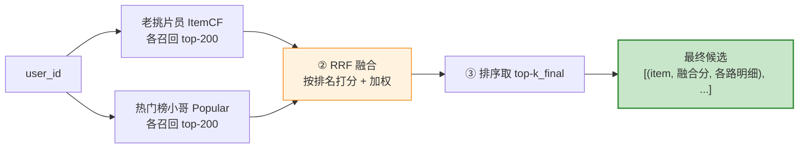
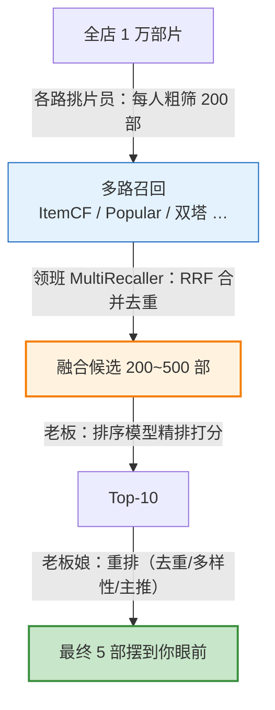

# 07 多路召回融合（通俗易懂版）

> **本文档定位**：多路召回融合（Multi-Route Recall Fusion）的中文通俗辅读版，延续 [`05-collaborative-filtering_CN.md`](05-collaborative-filtering_CN.md)、[`06-popular-recall_CN.md`](06-popular-recall_CN.md) 的「**录像带出租店**」比喻——这次的主角是店里的「**领班**」，他不亲自挑片，只负责把好几个挑片员各自交上来的名单**合并成一份最终候选**。
>
> **适合谁读**：
> - 已经认识了「老挑片员」（[ItemCF](05-collaborative-filtering_CN.md)）和「热门榜小哥」（[Popular](06-popular-recall_CN.md)），想知道**他俩的名单怎么合起来**
> - 听过 "RRF" 但不知道它凭什么能把"打分标准不一样"的几路召回融到一起
> - 想把 `src/recall/multi_recall.py` 这 44 行代码彻底吃透
>
> **配套代码**：`src/recall/multi_recall.py`（全文仅 44 行）。
> **正式工程参考**：多路召回的整体定位见 [`04-recall.md`](../en/04-recall.md) §5。本文档不在 git 仓库内（见 `.gitignore` 中 `*_CN.md` 规则），是本地学习材料。

## 目录

- [一句话理解](#一句话理解)
- [Level 1：为什么要好几个挑片员 — 单路召回的盲区](#level-1为什么要好几个挑片员--单路召回的盲区)
- [Level 2：领班的工作流程 — 三步走](#level-2领班的工作流程--三步走)
- [Level 3：融合的真正难题 — 各路分数没法比](#level-3融合的真正难题--各路分数没法比)
  - [看一眼各路的"打分尺度"有多乱](#看一眼各路的打分尺度有多乱)
  - [直接相加会发生什么](#直接相加会发生什么)
  - [归一化能救吗？只能缓解，还剩两个坑](#归一化能救吗只能缓解还剩两个坑)
- [Level 4：RRF 登场 — 只看排名，不看分数](#level-4rrf-登场--只看排名不看分数)
  - [RRF 公式](#rrf-公式)
  - [排名怎么折算成分数（rrf_k=60）](#排名怎么折算成分数rrf_k60)
  - [rrf_k=60 这个"60"是干嘛的](#rrf_k60-这个60是干嘛的)
  - [用 RRF 重新融合 Level 3 的例子（完整手算）](#用-rrf-重新融合-level-3-的例子完整手算)
- [Level 5：加权 RRF — 给资深挑片员更大话语权](#level-5加权-rrf--给资深挑片员更大话语权)
- [Level 6：recsys-mini 代码逐行走读](#level-6recsys-mini-代码逐行走读)
  - [6.1 构造函数 — 收下"挑片员名册"和"权重表"](#61-构造函数--收下挑片员名册和权重表)
  - [6.2 recall — 三步融合（核心）](#62-recall--三步融合核心)
  - [6.3 recall_batch — 批量给一群用户融合](#63-recall_batch--批量给一群用户融合)
  - [6.4 它是怎么被装配起来的](#64-它是怎么被装配起来的)
- [Level 7：三种融合策略对比](#level-7三种融合策略对比)
- [Level 8：实测效果 + 在系统里的位置](#level-8实测效果--在系统里的位置)
  - [实测对比（MovieLens-1M / LOO 切分）](#实测对比movielens-1m--loo-切分)
  - [在整个推荐系统里的位置](#在整个推荐系统里的位置)
- [TL;DR — 三句话](#tldr--三句话)

> **阅读地图**：想知道"为什么需要它"看 [Level 1–2](#level-1为什么要好几个挑片员--单路召回的盲区)；想吃透 RRF 原理看 [Level 3–5](#level-3融合的真正难题--各路分数没法比)；想读代码和工业对比看 [Level 6–8](#level-6recsys-mini-代码逐行走读)。赶时间直接跳 [TL;DR](#tldr--三句话)。

---

## 一句话理解

> **多路召回融合 = 录像带店的「领班」。**
>
> 店里有好几个挑片员——老挑片员（ItemCF）懂你的口味，热门榜小哥（Popular）管大众爆款，将来还会有看气质的（双塔）、看标签的（内容召回）……**每人独立挑出一份候选名单**。
>
> 但他们各挑各的，名单会**重复、会冲突、打分标准还各不相同**。于是需要一个领班：**把所有名单收上来，按一套统一的规则合并、排序，产出一份最终候选**，再交给后面的老板（排序模型）。
>
> **领班自己从不挑片——他只做"合并裁决"。而 recsys-mini 用的裁决规则叫 RRF：只看每个挑片员把你排第几名，不看他打了多少分。**

---

## Level 1：为什么要好几个挑片员 — 单路召回的盲区

为什么不能只靠老挑片员一个人？因为**每个挑片员都有自己的盲区**，谁都没法独当一面：

| 你的真实需求 | 单靠老挑片员（ItemCF）会怎样 | 谁能补上 |
|---|---|---|
| 我是新客，没租过任何片 | 没历史可查 → **交白卷** | 热门榜小哥（兜底） |
| 给我来点这个月最火的 | 个性化召回可能漏掉新晋爆款 | 热门榜小哥 |
| 这部刚上架的冷门片我想看 | 还没人租过它 → 算不出相似度 | 内容召回（看标题/简介） |
| 我关注的导演出新片了 | ItemCF 不看"关注关系" | 社交/关注召回 |

> **核心洞察**：没有任何**单一**召回路能覆盖所有场景。每路召回都是一个"偏科生"——擅长某类需求，对其它需求束手无策。所以工业界的做法是 **"多请几个偏科生，各管一摊，再把他们的答案合并"**。

这就引出两个问题，正是领班要解决的：

1. **怎么把多份名单合并？**（Level 2）
2. **各路打分标准不一样，凭什么合并？**（Level 3–4）

> 召回家族一共有 8 路（口碑老媒人、热门兜底、标签速配……），详见 [`04-recall_CN.md`](04-recall_CN.md#3-8-大召回家族--8-种红娘流派)。recsys-mini 目前上线了其中 2 路：ItemCF + Popular。

---

## Level 2：领班的工作流程 — 三步走

领班拿到一个用户后，干的事可以拆成清清楚楚的三步：



| 步 | 干啥 | 对应代码 |
|---|---|---|
| **① 各路独立召回** | 让每个挑片员各交一份 top-`k_each` 名单 | `per_source[name] = r.recall(user_id, k_each)` |
| **② 融合打分** | 用 RRF 把所有名单按"排名"折算成统一分数，并加权累加 | `fused[item_id] += w / (rrf_k + rank)` |
| **③ 排序截断** | 按融合分从高到低排，取前 `k_final` 个 | `sorted(...)[:k_final]` |

注意两个参数的区别：

- **`k_each`**：**每一路各**召回多少（比如每路 200）——给融合提供足够的"原料"。
- **`k_final`**：融合后**最终**保留多少（比如 200）——交给排序模型的候选数。

> **领班不生产候选，只搬运和裁决**。所有"挑片"的脏活累活都在各路召回器自己的 `recall()` 里干完了，领班只负责"收名单 → 合并 → 排序"。

---

## Level 3：融合的真正难题 — 各路分数没法比

合并名单，最朴素的想法是：**把每个物品在各路的分数加起来，谁分高谁靠前**。听起来很合理，但有个**致命问题**——各路的分数根本不是一个量纲。

### 看一眼各路的"打分尺度"有多乱

| 挑片员 | 给《好家伙》打的分 | 它的原始分数范围 |
|---|---|---|
| 老挑片员（ItemCF） | **1.50**（亲密度累加） | `[0, ∞)` 上不封顶 |
| 热门榜小哥（Popular） | **0.85**（归一化热度） | `[0, 1]` |
| 资深选片员（双塔，未来） | **0.70**（向量余弦） | `[-1, 1]` |
| 标签整理员（内容召回，未来） | **4.20**（标签匹配 5 分制） | `[0, 5]` |

→ 四个人都觉得《好家伙》不错，但 **1.50、0.85、0.70、4.20 这四个数压根没法比较**——单位都不一样。

### 直接相加会发生什么

```
电影        ItemCF   热门    选片员   标签员    直接相加
─────────────────────────────────────────────────────
《好家伙》  1.50  +  0.85  +  0.70  +  4.20  =  7.25
《老炮儿》  0.00  +  0.95  +  0.90  +  5.00  =  6.85
《阿凡达》  0.00  +  1.00  +  0.30  +  2.00  =  3.30
                                          ↑
                  标签整理员的分数尺度最大(0~5) → 他一个人就把结果带跑了
```

**问题暴露**：标签整理员的分数天然比别人大 3–5 倍，融合时**他一个人说了算**，其他挑片员的意见全被淹没。

### 归一化能救吗？只能缓解，还剩两个坑

很自然会想：**那让每路都除以自己的最高分，把分数压到 `[0,1]` 不就行了？** 这确实解决了上面"标签员 0–5 尺度过大"的量纲问题——大家现在最高分都是 1.0。**但"都在 [0,1]" ≠ "能公平比较"**，还剩两个隐患。

#### 隐患一：假设各路分数分布相似

归一化只拉平了**最大值**，没拉平分数的**分布形状**。如果两路分布不同，归一化后同样的数字含金量也不同：

```
A 路（分数很"陡"）          B 路（分数很"平"）
  第1名  1.00               第1名  1.00
  第2名  0.95 ← 紧咬第一     第2名  0.98
  第3名  0.30 ← 突然断崖     第3名  0.96
```

- A 路的 **0.95** 意味着"和第 1 名几乎一样好"，是真·强候选；
- B 路的 **0.98** 其实很普通——因为 B 路人人 0.9 以上，矮子里拔将军。

→ 同是归一化后的高分，**含金量天差地别**。直接相加就默认了"两路的 0.95 代表同样的好"，这正是"假设各路分数分布相似"——而 ItemCF 的分布通常很陡、双塔余弦往往很平，**根本不相似**。

#### 隐患二：对分数的绝对大小敏感（怕离群值）

归一化是线性缩放，一个畸高的离群分（刷量 / bug）会**污染整条尺度**：

```
归一化前：           除以最高分(1000)后：
  怪物片  1000        怪物片  1.00
  好片A    50         好片A   0.05  ← 本来 50/48/45 区分明显
  好片B    48         好片B   0.048    现在全挤在 0.05，几乎没法区分！
  好片C    45         好片C   0.045
```

一个 1000 的怪物当了分母，好片 A/B/C 的区分度就被**压扁**了，这一路基本"废了"。

> **两个坑的共性**：归一化对齐了最大值，却对齐不了分布、也挡不住离群值。有没有办法**彻底绕开"分数"这个麻烦**？有——那就是只看**排名**（Level 4 的 RRF）。排名是天然对齐的：A 的第 2 名 = B 的第 2 名；怪物片再畸高也只是"第 1 名"，对其它名次毫无影响。

---

## Level 4：RRF 登场 — 只看排名，不看分数

**RRF（Reciprocal Rank Fusion，倒数排名融合）** 的思想一句话就能说清：

> **不管你给某个物品打了多少分，我只看你把它排第几名。**

排名是天然统一的量纲——不管 ItemCF 的分是 1.50 还是 150，只要它把《好家伙》排第 1，那就是"第 1 名"，和热门榜小哥的"第 1 名"完全可比。

### RRF 公式

$$
\text{score}(i) = \sum_{\text{每一路 } s}  w_s \cdot \frac{1}{\text{rrf\_k} + \text{rank}_s(i)}
$$

| 符号 | 含义 |
|---|---|
| `rank_s(i)` | 物品 `i` 在第 `s` 路里的**排名**（第 1 名 rank=1，第 2 名 rank=2…） |
| `rrf_k` | 平滑常数，recsys-mini 默认 **60**（业界经验值，见下） |
| `w_s` | 第 `s` 路的权重（Level 5 讲） |

每个物品的最终分 = **它在各路的"排名得分"加权求和**。排得越靠前，`1/(60+rank)` 越大；被越多路同时召回，加的笔数越多。

### 排名怎么折算成分数（rrf_k=60）

| 排名 rank | `1/(60+rank)` | 直觉 |
|---|---|---|
| 第 1 名 | 1/61 ≈ 0.01639 | 最高 |
| 第 2 名 | 1/62 ≈ 0.01613 | 和第 1 名几乎一样 |
| 第 10 名 | 1/70 ≈ 0.01429 | |
| 第 200 名 | 1/260 ≈ 0.00385 | 仍有微弱贡献 |

### rrf_k=60 这个"60"是干嘛的

它是个**平滑常数**，作用是**压平头部排名之间的差距**：

```
不加 rrf_k（即 1/rank）：     加了 rrf_k=60（即 1/(60+rank)）：
  第 1 名 = 1.000              第 1 名 = 0.01639
  第 2 名 = 0.500  ← 差一倍！   第 2 名 = 0.01613  ← 几乎相等
  第 3 名 = 0.333              第 3 名 = 0.01587
```

- 不加 `rrf_k`，第 1 名的分是第 2 名的 2 倍——**单路里的"榜首"权力过大**。
- 加上 60，头部排名被拉平，于是 **"被多路同时召回"** 比 **"在某一路里排第一"** 更重要——这正是多路融合想要的：**群众智慧 > 单路偏好**。

> `rrf_k=60` 是 RRF 原论文（Cormack et al., SIGIR 2009）的经验值，绝大多数场景直接用 60 即可，几乎不用调。

### 用 RRF 重新融合 Level 3 的例子（完整手算）

还记得 Level 3 那张"直接相加被标签员带跑"的表吗？现在我们**把分数换成排名**，重算一遍（先假设四路权重都相等 `w=1`，把"加权"留给 Level 5）。

**第 1 步：把各路的"分数"翻译成"排名"。** 各路按自己的分数从高到低排，得到每部片在每一路的名次（`—` 表示该路没召回它）：

| 物品 | ItemCF | 热门 | 选片员 | 标签员 |
|---|---|---|---|---|
| 《好家伙》 | 🥇 rank 1 | rank 3 | rank 2 | rank 2 |
| 《老炮儿》 | — | rank 2 | 🥇 rank 1 | 🥇 rank 1 |
| 《阿凡达》 | — | 🥇 rank 1 | rank 3 | rank 3 |

> 注意：ItemCF 只召回了《好家伙》一部（另两部它给 0 分 = 没召回）。

**第 2 步：每个名次套公式 `1/(60+rank)`，横着加起来。**

| 物品 | ItemCF | 热门 | 选片员 | 标签员 | **RRF 总分** |
|---|---|---|---|---|---|
| **《好家伙》** | 1/61=.01639 | 1/63=.01587 | 1/62=.01613 | 1/62=.01613 | **0.06452** 🥇 |
| 《老炮儿》 | — | 1/62=.01613 | 1/61=.01639 | 1/61=.01639 | 0.04892 |
| 《阿凡达》 | — | 1/61=.01639 | 1/63=.01587 | 1/63=.01587 | 0.04814 |

**第 3 步：对比两种融合的结果。**

| 物品 | 直接相加（Level 3） | RRF |
|---|---|---|
| 《好家伙》 | 7.25 🥇（但仅微弱领先） | **0.06452 🥇（明显领先）** |
| 《老炮儿》 | 6.85（靠标签员的 5.0 紧追） | 0.04892 |
| 《阿凡达》 | 3.30 | 0.04814 |

**关键变化**：

- 直接相加时，《老炮儿》靠标签员一个超大分（5.0）紧咬《好家伙》（6.85 vs 7.25）——**胜负其实是被标签员的大尺度决定的**。
- 换成 RRF 后，《好家伙》**明显领先**（0.0645 vs 0.0489）。因为它是**唯一被全部四路都召回**的片，而《老炮儿》缺席了 ItemCF 那一路。RRF 不再理会"标签员给了多大的分"，只认"**你被几路看好、各排第几**"。

> 这就是 RRF 的四大好处：**免疫量纲**（不管你打 4.2 还是 5000）、**免疫离群分数**（一个超大分带不跑结果）、**实现简单**（几行代码）、**还不用调参**（`rrf_k=60` 通用）。

---

## Level 5：加权 RRF — 给资深挑片员更大话语权

光有 RRF 还不够。店里的挑片员**水平有高低**：老挑片员（ItemCF）个性化强、最懂你，应该话语权大；热门榜小哥（Popular）只会推大众爆款，话语权该小一点。

于是给每一路乘一个**权重 `w_s`**：

```
最终分(i) = 1.0 × [ItemCF 里的排名得分]  +  0.3 × [Popular 里的排名得分]
            └── 权重高，主力 ──┘            └── 权重低，兜底 ──┘
```

recsys-mini 的权重配在 `conf/config.yaml`：

```yaml
recall:
  weights:
    itemcf: 1.0      # 个性化主力，话语权最大
    popular: 0.3     # 兜底补位，话语权小
```

| 权重设置 | 效果 |
|---|---|
| `popular` 权重高（如 1.0） | 候选里热门占比大 → 个性化被稀释 → 体验"千人一面" |
| `popular` 权重低（如 0.3） | 热门只在"个性化不足时"悄悄补位 → 既兜了底又不抢戏 |

> `0.3` 就是"补位但不抢戏"的平衡点。关于这个权重为什么是 0.3，以及 `1 + 0.3 > 1` 的融合增益实测，详见 [`06-popular-recall_CN.md`](06-popular-recall_CN.md#level-8在多路召回里的位置)。

---

## Level 6：recsys-mini 代码逐行走读

`src/recall/multi_recall.py` 全文只有 44 行。我们逐块拆。

### 6.1 构造函数 — 收下"挑片员名册"和"权重表"

```15:18:src/recall/multi_recall.py
class MultiRecaller:
    def __init__(self, recallers: Dict[str, BaseRecaller], weights: Dict[str, float]):
        self.recallers = recallers
        self.weights = weights
```

| 参数 | 类型 | 装的是 | 举例 |
|---|---|---|---|
| `recallers` | `{路名: 召回器}` | 所有要融合的召回路 | `{"itemcf": ItemCFRecaller(...), "popular": PopularRecaller(...)}` |
| `weights` | `{路名: 权重}` | 每路的话语权 | `{"itemcf": 1.0, "popular": 0.3}` |

> 两个字典的 **key（路名）必须对得上**——`weights["itemcf"]` 要能找到对应召回器的权重。所有召回器都遵守同一个 `BaseRecaller` 接口（`src/recall/base.py`，都实现 `fit` + `recall(user_id, k)`），所以领班**根本不关心每路内部怎么挑片**，只管调用统一的 `recall()`。这就是"面向接口"的好处：**新增一路召回，领班代码一行都不用改**。

### 6.2 recall — 三步融合（核心）

```20:38:src/recall/multi_recall.py
    def recall(
        self, user_id: int, k_each: int, k_final: int, rrf_k: int = 60
    ) -> List[Tuple[int, float, Dict[str, float]]]:
        """返回 [(item_id, fused_score, source_scores), ...]"""
        per_source: Dict[str, List[Tuple[int, float]]] = {}
        for name, r in self.recallers.items():
            per_source[name] = r.recall(user_id, k_each)

        # RRF 融合: score(i) = sum_s weight_s * 1/(rrf_k + rank_s(i))
        fused: Dict[int, float] = defaultdict(float)
        sources: Dict[int, Dict[str, float]] = defaultdict(dict)
        for name, items in per_source.items():
            w = self.weights.get(name, 1.0)
            for rank, (item_id, score) in enumerate(items, start=1):
                fused[item_id] += w / (rrf_k + rank)
                sources[item_id][name] = score

        out = sorted(fused.items(), key=lambda x: x[1], reverse=True)[:k_final]
        return [(int(i), float(s), sources[i]) for i, s in out]
```

#### Step ① 各路独立召回

```python
for name, r in self.recallers.items():
    per_source[name] = r.recall(user_id, k_each)
```

遍历每个挑片员，各拿回一份 top-`k_each` 名单，按路名存进 `per_source`：

```python
per_source = {
    "itemcf":  [(《美国往事》, 1.0), (《华尔街之狼》, 0.81), ...],  # 200 个
    "popular": [(《阿凡达》, 1.0),   (《教父》, 0.857), ...],       # 200 个
}
```

#### Step ② RRF 融合

```python
fused = defaultdict(float)             # {item_id: 融合分}
sources = defaultdict(dict)            # {item_id: {路名: 原始分}}  ← 明细，用于解释
for name, items in per_source.items():
    w = self.weights.get(name, 1.0)    # 取这路权重，没配默认 1.0
    for rank, (item_id, score) in enumerate(items, start=1):   # rank 从 1 开始
        fused[item_id] += w / (rrf_k + rank)   # ★ RRF 核心：按排名加权累加
        sources[item_id][name] = score         # 顺手记下原始分（仅明细，不参与融合）
```

| 细节 | 解释 |
|---|---|
| `self.weights.get(name, 1.0)` | 没在 `weights` 里配的路，**默认权重 1.0** |
| `enumerate(items, start=1)` | `rank` 从 **1** 起算（第 1 名 rank=1），契合 RRF 公式 |
| `fused[item_id] += ...` | **同一物品被多路召回 → 多次累加 → 自然冒头**（群众投票） |
| `sources[item_id][name] = score` | 记录"这物品被哪些路召回、各打了多少原始分"——**纯为可解释/可调试**，不参与 `fused` 计算 |

> **划重点**：`score`（各路原始分）**只被存进 `sources` 做明细，完全不参与融合**。融合只用 `rank`。这正是 Level 4 说的——RRF 彻底绕开了"分数没法比"的难题。

#### 一个具体例子（手算一遍 RRF）

假设领班拿到两路名单（`rrf_k=60`，权重 `itemcf=1.0`、`popular=0.3`）：

```
ItemCF 的名单（top-3）：       Popular 的名单（top-3）：
  rank 1  《阿凡达》             rank 1  《泰坦尼克号》
  rank 2  《好家伙》             rank 2  《阿凡达》
  rank 3  《教父》               rank 3  《盗梦空间》
```

注意：**《阿凡达》两路都召回了**（ItemCF 第 1、Popular 第 2），其余物品只被一路召回。

**逐路累加 `fused[item] += w / (rrf_k + rank)`：**

先跑 ItemCF 这一路（`w=1.0`）：

| 物品 | 计算 | 累加后 `fused` |
|---|---|---|
| 《阿凡达》 | `1.0 / (60+1)` = 0.01639 | 0.01639 |
| 《好家伙》 | `1.0 / (60+2)` = 0.01613 | 0.01613 |
| 《教父》 | `1.0 / (60+3)` = 0.01587 | 0.01587 |

再跑 Popular 这一路（`w=0.3`）：

| 物品 | 计算 | 累加后 `fused` |
|---|---|---|
| 《泰坦尼克号》 | `0.3 / (60+1)` = 0.00492 | 0.00492 |
| 《阿凡达》 | `0.3 / (60+2)` = 0.00484 | 0.01639 **+ 0.00484 = 0.02123** ← 第二次累加！ |
| 《盗梦空间》 | `0.3 / (60+3)` = 0.00476 | 0.00476 |

**Step ③ 排序后的最终榜：**

| 排名 | 物品 | 融合分 | 被哪几路召回 |
|---|---|---|---|
| 🥇 1 | **《阿凡达》** | **0.02123** | itemcf + popular（**两路都中**） |
| 2 | 《好家伙》 | 0.01613 | itemcf |
| 3 | 《教父》 | 0.01587 | itemcf |
| 4 | 《泰坦尼克号》 | 0.00492 | popular |
| 5 | 《盗梦空间》 | 0.00476 | popular |

> **关键观察**：《阿凡达》在 ItemCF 里只排第 1、在 Popular 里才排第 2，但因为**被两路同时召回、分数累加了两次**，最终融合分 (0.02123) 明显高过只被单路召回的《好家伙》（0.01613）。这就是 RRF 的"群众投票"——**被越多路看好，越容易冒头**，哪怕在单路里不是第一名。
>
> 另外注意：Popular 权重只有 0.3，所以它**单独**召回的《泰坦尼克号》《盗梦空间》分都很低，排在 ItemCF 召回的物品后面——这正是"兜底但不抢戏"在数字上的体现。

#### Step ③ 排序 + 截断 + 返回

```python
out = sorted(fused.items(), key=lambda x: x[1], reverse=True)[:k_final]
return [(int(i), float(s), sources[i]) for i, s in out]
```

按融合分降序、取前 `k_final` 个，拼成 `(item_id, 融合分, 各路明细)` 三元组返回。例如：

```python
[
    (《美国往事》, 0.0312, {"itemcf": 1.0}),                   # 只有 itemcf 召回到
    (《阿凡达》,   0.0291, {"itemcf": 0.45, "popular": 1.0}),  # 两路都召回 → 融合分更高
    ...
]
```

> 最后那个 `{路名: 原始分}` 明细在排序阶段很有用——可以把"是哪几路召回的"做成特征喂给排序模型，详见 [`04-recall_CN.md`](04-recall_CN.md#8-recsys-mini-当前状态)。

### 6.3 recall_batch — 批量给一群用户融合

```40:43:src/recall/multi_recall.py
    def recall_batch(
        self, user_ids, k_each: int, k_final: int
    ) -> Dict[int, List[Tuple[int, float, Dict[str, float]]]]:
        return {u: self.recall(u, k_each, k_final) for u in user_ids}
```

就是对一批用户**循环调用** `recall`，返回 `{user_id: 融合结果}`。主要给**离线评估**用——一次性给所有测试用户算融合候选，再算 `Recall@K` / `Coverage`。

### 6.4 它是怎么被装配起来的

在 `scripts/03_train_recall.py` 里，两路召回器训练好后，塞进领班：

```45:48:scripts/03_train_recall.py
    multi = MultiRecaller(
        recallers={"itemcf": itemcf, "popular": pop},
        weights=cfg["recall"]["weights"],
    )
```

评估时领班的 `recall` 这样被调用（`k_each` 和 `k_final` 都取 200）：

```76:78:scripts/03_train_recall.py
    for u in eval_users:
        items = multi.recall(u, k_each=topk, k_final=topk)
        fused[u] = [(i, s) for i, s, _ in items]
```

**`multi.recall(u, k_each=topk, k_final=topk)` 各参数含义：**

| 参数 | 这里传的值 | 含义 |
|---|---|---|
| `u` | 当前用户 ID | 给**哪个用户**召回（对应 `user_id`） |
| `k_each` | `topk` = 200 | **每一路各**召回多少个候选——给融合提供"原料" |
| `k_final` | `topk` = 200 | 融合后**最终**保留多少个候选——交给下一棒（排序/评估）的数量 |
| `rrf_k` | 没传，用默认 `60` | RRF 公式里的平滑常数（见 [Level 4](#level-4rrf-登场--只看排名不看分数)） |

其中 `topk` 来自配置——`topk = max(cfg["eval"]["topk_list"]) = max([10, 50, 200]) = 200`。

> **为什么取最大的 200？** 评估要一次算 `Recall@10 / @50 / @200` 三个指标，只要召回最大的 200 个，前 10、前 50 都能从这 200 里截出来——**召回一次，三个 K 全覆盖**。

**`k_each` vs `k_final` 别搞混**——这俩职责完全不同：

| | `k_each` | `k_final` |
|---|---|---|
| 管谁 | **每一路**召回的数量（输入/原料） | **融合后**保留的数量（输出/成品） |
| 调大会怎样 | 每路捞得更深，候选池更丰富，但融合更慢 | 交给排序的候选更多，排序更慢 |

通常 **`k_each` ≥ `k_final`**：两路各召回 200，合并去重后可能多达近 400 个，最后靠 `k_final` 砍回 200。这里恰好都设成 200 是评估时的简化；**生产环境常见 `k_each` 比 `k_final` 大**（如每路召回 300、最终留 200），让融合有更多候选可挑。

> 注意 `[(i, s) for i, s, _ in items]` 这里把第三个元素（各路明细 `sources`）用 `_` 丢掉了——评估只需要 `(item, 融合分)`，明细是留给排序阶段用的。

---

## Level 7：三种融合策略对比

RRF 不是唯一的融合方式。领班可以选三种裁决规则，由简到繁：

| 策略 | 怎么融合 | 优点 | 缺点 | recsys-mini |
|---|---|---|---|---|
| **加权和**（Weighted Sum） | 各路分数归一化后加权相加 | 直觉简单 | **要求各路分数可比**（量纲坑，见 Level 3）；对离群分敏感 | 未用 |
| **RRF**（倒数排名融合） | 只看排名，`Σ w/(60+rank)` | **免疫量纲、免疫离群分、零调参、实现极简** | 丢掉了"分数大小"里的信息（只保留序） | ✅ **当前用** |
| **学习式融合**（Learning to Fuse） | 把各路分数/排名当特征，训一个小模型（如 LR/GBDT）输出融合分 | 上限最高，能学到各路的最优组合 | 要额外训练 + 样本；要防过拟合 | 路线图 ⭐⭐ |

> **为什么 recsys-mini 从 RRF 起步**：它**零调参、不怕量纲、几行代码**，是多路融合性价比最高的默认选择。等召回路变多、且有了点击日志后，再升级到学习式融合去突破 RRF 的上限（见 [`04-recall_CN.md`](04-recall_CN.md#8-recsys-mini-当前状态) 路线图）。

---

## Level 8：实测效果 + 在系统里的位置

### 实测对比（MovieLens-1M / LOO 切分）

| 召回方法 | Recall@10 | Recall@50 | Recall@200 | Coverage@200 |
|---|---|---|---|---|
| ItemCF 单路 | 5.29% | 20.08% | 50.15% | 69.89% |
| Popular 单路 | 4.74% | 15.48% | 36.97% | 22.29% |
| **RRF 多路融合** | **6.08%** | 19.50% | **50.20%** | 69.36% |

**怎么读**：

- **`Recall@10` 从 5.29% 提到 6.08%**（+0.79pt）——融合后浅层命中明显提升，因为热门榜小哥在头部补上了 ItemCF 漏掉的"从众型"兴趣。
- **`Recall@200` 和 `Coverage` 几乎不变**——因为 Popular 权重低（0.3），没破坏 ItemCF 主导的整体结构。
- **结论：`1 + 0.3 > 1`**。低权重兜底既拉高了头部 Recall，又不拖累深层指标。详细拆解见 [`06-popular-recall_CN.md`](06-popular-recall_CN.md#level-8在多路召回里的位置)。

### 在整个推荐系统里的位置



| 角色 | 推荐系统术语 | 干啥 |
|---|---|---|
| 各路挑片员 | 多路召回（ItemCF / Popular / 双塔…） | 各自粗筛候选 |
| **领班** | **多路召回融合（本文）** | **把多份名单合并成一份** |
| 老板 | 排序（Ranking） | 给候选精确打分 |
| 老板娘 | 重排（Re-ranking） | 最终拍板、加多样性 |

> **领班的位置很关键**：他卡在"多路召回"和"排序"之间，是**召回阶段的最后一棒**。融合质量直接决定了交给排序的候选池好不好——候选池里要是漏了真爱，后面排序再聪明也救不回来。

> ⚠️ **一个隐藏铁律（SSB）**：每次**新增/改动召回路**（哪怕只是调权重），候选集的分布就变了，**排序模型必须重新训练**——否则排序还在用"旧候选分布"打分，质量会暴跌。详见 [`04-recall_CN.md`](04-recall_CN.md#7-一个隐藏的大坑--ssb)。

---

## TL;DR — 三句话

1. **多路召回融合 = 录像带店的领班。**
   他不挑片，只把好几个挑片员（ItemCF、Popular…）各自的名单**合并成一份最终候选**。`src/recall/multi_recall.py` 44 行全实现了。

2. **融合的核心难题是"各路分数没法比"，RRF 用"只看排名"破解。**
   `score(i) = Σ wₛ/(60+rankₛ)`——不管你打多少分，只看排第几。免疫量纲、免疫离群分、零调参、几行代码。再用权重（ItemCF 1.0 / Popular 0.3）给资深挑片员更大话语权。

3. **融合是召回的最后一棒，质量决定候选池上限。**
   实测 RRF 把 `Recall@10` 从 5.29% 提到 6.08%（`1+0.3>1`）。比 RRF 更强的是**学习式融合**（路线图）。切记 **SSB 铁律**：召回一改，排序必重训。

---

> 想了解被融合的两路召回本身 → 看 [`05-collaborative-filtering_CN.md`](05-collaborative-filtering_CN.md)（ItemCF）和 [`06-popular-recall_CN.md`](06-popular-recall_CN.md)（Popular）；想看召回在整个系统里的全景 → 看 [`04-recall_CN.md`](04-recall_CN.md)。
