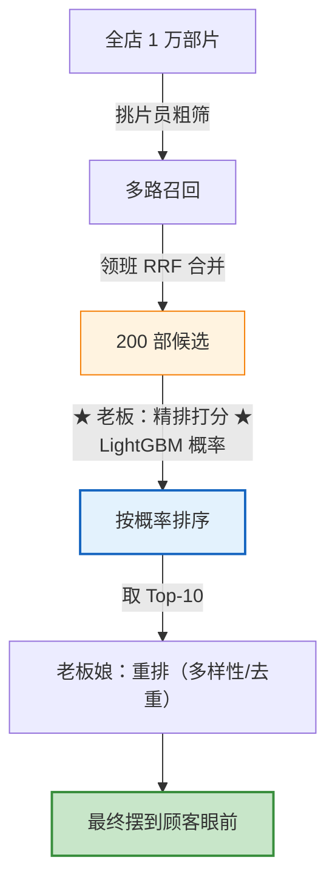

# 08 排序模型（通俗易懂版）

> **本文档定位**：排序（Ranking / 精排）的中文通俗辅读版，延续 `[05-collaborative-filtering_CN.md](05-collaborative-filtering_CN.md)`、`[06-popular-recall_CN.md](06-popular-recall_CN.md)`、`[07-multi-recall_CN.md](07-multi-recall_CN.md)` 的「**录像带出租店**」比喻——前面的挑片员（召回）和领班（多路融合）把 **200 部候选片**送到了柜台，这次的主角是店里的「**老板**」：他要**亲自给每部片打一个「你会喜欢的概率」分**，再挑出最可能命中的 10 部摆到你眼前。
>
> **适合谁读**：
>
> - 已经认识了挑片员（[ItemCF](05-collaborative-filtering_CN.md)）、热门榜小哥（[Popular](06-popular-recall_CN.md)）和领班（[多路融合](07-multi-recall_CN.md)），想知道**候选送上来之后怎么精排**
> - 觉得"排序不就是再训个模型吗"——这篇会告诉你**最反直觉的坑是「负样本得自己造」**
> - 想把 `scripts/04_train_rank.py` 这条训练流水线彻底吃透
>
> **配套代码**：`scripts/04_train_rank.py`（训练主流程）、`src/data/sampler.py`（负采样）、`src/features/builder.py`（特征）、`src/rank/lgb_ranker.py`（模型）、`src/eval/rank_metrics.py`（评估）。
> **正式工程参考**：排序在系统里的整体定位见 `[04-recall_CN.md](04-recall_CN.md)`。本文档不在 git 仓库内（见 `.gitignore` 中 `*_CN.md` 规则），是本地学习材料。

## 目录

- [一句话理解](#一句话理解)
- [Level 1：老板的活儿 — 召回与排序的分工](#level-1老板的活儿--召回与排序的分工)
- [Level 2：最反直觉的难题 — 账本只记了「喜欢」，没记「不喜欢」](#level-2最反直觉的难题--账本只记了喜欢没记不喜欢)
- [Level 3：负采样的讲究 — 怎么「造」出合格的负样本](#level-3负采样的讲究--怎么造出合格的负样本)
  - [规矩一：顾客真租过的，绝不能当负样本](#规矩一顾客真租过的绝不能当负样本)
  - [规矩二：编负样本要"挑大家眼熟的片"，别全挑没人听过的](#规矩二编负样本要挑大家眼熟的片别全挑没人听过的)
  - [规矩三：每个正样本配 `neg_ratio` 个负样本](#规矩三每个正样本配-neg_ratio-个负样本)
  - [一个隐藏的精妙点：两套「用户历史」防泄露](#一个隐藏的精妙点两套用户历史防泄露)
- [Level 4：老板打分的依据 — 特征工程](#level-4老板打分的依据--特征工程)
  - [三类特征一览](#三类特征一览)
  - [最有信息量的一招：交叉特征（口味匹配度）](#最有信息量的一招交叉特征口味匹配度)
  - [最终特征清单](#最终特征清单)
- [Level 5：一条铁律 — 防穿越（数据泄露）](#level-5一条铁律--防穿越数据泄露)
  - [什么是「穿越」？](#什么是穿越)
  - [recsys-mini 怎么防](#recsys-mini-怎么防)
- [Level 6：老板的大脑 — LightGBM 二分类](#level-6老板的大脑--lightgbm-二分类)
  - [它其实是「二分类」，不是真·排序](#它其实是二分类不是真排序)
  - [训练时怎么防"学过头"：用验证集当刹车](#训练时怎么防学过头用验证集当刹车)
- [Level 7：怎么考核老板 — AUC vs GAUC](#level-7怎么考核老板--auc-vs-gauc)
  - [AUC：整体上分得清"喜欢"和"不喜欢"吗](#auc整体上分得清喜欢和不喜欢吗)
  - [GAUC：在每个顾客自己的榜里，排得准吗](#gauc在每个顾客自己的榜里排得准吗)
  - [为什么排序更该看 GAUC？「配对数数」一个例子秒懂](#为什么排序更该看-gauc配对数数一个例子秒懂)
  - [顺带：特征重要性诊断](#顺带特征重要性诊断)
- [Level 8：代码逐段走读 + 存档与上线一致性](#level-8代码逐段走读--存档与上线一致性)
  - [拼接：把 ID 对变成特征宽表](#拼接把-id-对变成特征宽表)
  - [存档：不只存模型，还要存「特征仓库」](#存档不只存模型还要存特征仓库)
  - [一条跑不掉的铁律：SSB（召回一改，排序必重训）](#一条跑不掉的铁律ssb召回一改排序必重训)
  - [在整个系统里的位置](#在整个系统里的位置)
- [TL;DR — 三句话](#tldr--三句话)

> **阅读地图**：想知道"排序是干嘛的"看 [Level 1](#level-1老板的活儿--召回与排序的分工)；想吃透排序最难的「样本怎么来」看 [Level 2–3](#level-2最反直觉的难题--账本只记了喜欢没记不喜欢)；想搞懂特征、防穿越和模型看 [Level 4–6](#level-4老板打分的依据--特征工程)；想读评估和代码看 [Level 7–8](#level-7怎么考核老板--auc-vs-gauc)。赶时间直接跳 [TL;DR](#tldr--三句话)。

---

## 一句话理解

> **排序 = 录像带店的「老板」。**
>
> 挑片员们（ItemCF、热门榜…）和领班（多路融合）忙活半天，把全店 1 万部片**粗筛成 200 部候选**送到柜台。但 200 部还是太多，顾客只想看 10 部。
>
> 于是老板登场：他不再"在不在候选里"这种粗活，而是**给每部候选片打一个精确的分——「这位顾客会喜欢它的概率是多少」**，然后从高到低排，挑出 Top-10 摆出来。
>
> **召回看「召没召回」（粗、快、广），排序看「排第几」（细、准、窄）。老板的本事，全在那个「概率分」打得准不准。** 而 recsys-mini 的老板，大脑是一台 **LightGBM**——它通过复盘历史账本，学会了怎么打这个分。

---

## Level 1：老板的活儿 — 召回与排序的分工

整个推荐系统是一条**漏斗流水线**，老板（排序）卡在召回之后、上桌之前：


召回和排序，本质是**两种完全不同的活儿**：

|      | 召回（挑片员 + 领班）        | 排序（老板）           |
| ---- | ------------------- | ---------------- |
| 处理量  | 全店 1 万 → 200        | 200 → 10         |
| 关心什么 | **在不在**候选集里         | 候选里**排第几**       |
| 速度要求 | 极快（毫秒级扫全库）          | 可以慢一点（只算 200 个）  |
| 精度要求 | 粗（宁滥勿缺，别漏真爱）        | **细（每个候选精确打分）**  |
| 用的特征 | 少而轻（算相似度/热度）        | **多而重（几十个特征精雕）** |
| 评估指标 | Recall@K / Coverage | **AUC / GAUC**   |

> **核心洞察**：召回宁可错放、不可漏放（漏了排序也救不回来）；排序则要在召回给的候选里**精挑细选、分出高下**。两者是接力赛，不是竞争关系。详见 `[04-recall_CN.md](04-recall_CN.md#level-1召回到底在干嘛)`。

`scripts/04_train_rank.py` 干的事，就是**训练出这位老板**——让他学会给任意 `(顾客, 影片)` 对打出"会喜欢的概率"。整条流水线分 6 段：


下面从老板最头疼的一段——**②负采样**——讲起。

---

## Level 2：最反直觉的难题 — 账本只记了「喜欢」，没记「不喜欢」

老板要学会打分，最自然的办法就是**翻历史账本复盘**：把每位顾客**过去真的租过、评过分的片**找出来，告诉大脑"喏，这些都是他喜欢的，照着学"。

这些「真喜欢的记录」就叫**正样本**（标签记成 `1`）。

脚本开头这 4 行注释，其实就是整个训练的"**样本蓝图**"——一张表说清"喂给老板的数据长什么样、从哪来、怎么分":

```10:14:scripts/04_train_rank.py
样本构造逻辑:
  正样本 = train (训练集) + valid (验证集) 中的真实正反馈
  负样本 = 按 item 流行度采样 (避开 user 历史)
  特征   = user/item 画像 + train 集统计 (防穿越)
  切分   = train -> 训练, valid -> 早停, test 留给 05 全链路评估
```

别被这 4 行吓到，一句一句拆开看其实很好懂：

#### 第 1 句：正样本 = 真实的"喜欢"

> `正样本 = train + valid 中的真实正反馈`

**正样本就是"铁证"——顾客真金白银租过、还打了分的片**，这种"我确实喜欢"的记录骗不了人，直接拿来当学习目标。这里把 `train` 和 `valid` 两段历史里的真实反馈**都收进来**当正样本，为的是让老板见过的"喜欢"样本尽量多一些。

> 顺带科普一个数据集的小细节：MovieLens 里的交互**全是"评过分"的**，本项目把它们统统当成正反馈（"看了且愿意打分 = 有兴趣"）。真实工业场景里，正样本的定义会更讲究——比如"点了还不算，得看完 70% 才算正样本"，免得把"手滑点进去又秒退"也当成喜欢。

#### 第 2 句：负样本 = 自己"编"出来的"不喜欢"

> `负样本 = 按 item 流行度采样 (避开 user 历史)`

这一句是本节的重头戏——**账本里没有"不喜欢"的记录，得自己造**。怎么造、为什么按"流行度"造、为什么要"避开用户历史"，正是下面 Level 2 后半段 + Level 3 要展开讲的。先记住一句话：**负样本是"猜"出来的，所以怎么猜大有学问**。

#### 第 3 句：特征 = 打分用的"线索"，且只能用过去

> `特征 = user/item 画像 + train 集统计 (防穿越)`

光有 `(顾客, 影片)` 这对编号，老板没法打分，得配上一堆"线索"（性别、年龄、影片类型、历史热度……）。**关键提醒**：括号里的"防穿越"是条铁律——这些统计线索**只能用 `train` 这段过去的数据算**，绝不能偷看未来。详见 [Level 4](#level-4老板打分的依据--特征工程) 和 [Level 5](#level-5一条铁律--防穿越数据泄露)。

#### 第 4 句：切分 = 三份数据各司其职

> `切分 = train -> 训练, valid -> 早停, test 留给 05 全链路评估`

数据被切成三份，**各干各的、互不串台**，这是保证评估可信的基本功：

| 数据段 | 角色 | 干啥 | 类比 |
|---|---|---|---|
| `train` | 训练集 | 让老板学习打分规律 | 平时刷的练习题 |
| `valid` | 验证集 | 训练中途模考、决定何时"早停" | 模拟考（见 [Level 6](#level-6老板的大脑--lightgbm-二分类)） |
| `test` | 测试集 | **本脚本完全不碰**，留给 `05` 做召回+排序全链路评估 | 压箱底的高考真题，考前绝不能看 |

> 为什么 `test` 在这一步要"雪藏"？因为它要留作最终的"公正裁判"。如果训练时偷看了 `test`，等于考前泄题，评出来的分数再高也是自欺欺人。

---

蓝图看懂了，但回到第 2 句"负样本"时，老板就撞上了一个**绕不过去的坎**：

> 账本只记了顾客**租过哪些片**（喜欢的），**压根没记他不喜欢哪些**。

打个比方：你想教一个小孩认猫，只翻给他看一沓猫的照片，从来不给他看狗、看兔子、看桌子——那他根本学不会"什么不是猫"。下次见到一只狗，他多半也会喊"猫！"

模型也一样：**光看"喜欢的"学不会，必须同时见到"喜欢的"和"不喜欢的"**，才能在两者之间画出一条分界线。

可问题来了——**"不喜欢的"记录，账本里根本没有。**

> **这就是排序里最反直觉的一点**：正样本是白送的（真实日志里现成就有），**"不喜欢的"得我们自己动手「编」出来**。这个"编负样本"的活儿，专业名叫 **负采样（Negative Sampling）**。

那怎么编？最偷懒的想法是：**"顾客没租过的，就算他不喜欢"**。

听着合理，但全店有 1 万部片，一个顾客一辈子也就租过几百部，剩下 9000 多部全算"不喜欢"？这一下就翻车了：

| 偷懒造法的毛病   | 通俗解释                                                         |
| --------- | ------------------------------------------------------------ |
| **数量太悬殊** | 1 条"喜欢"配 9000 条"不喜欢"，模型干脆全猜"不喜欢"——照样有 99.99% 的准确率，等于啥也没学     |
| **题目太简单** | 随便抓的 9000 部，绝大多数是顾客**听都没听过**的冷门片，跟他喜欢的爆款一眼就能分开，模型轻松满分却学不到真本事 |

> 一句话：**负样本不能瞎编，得编得"既不太多、又有点难度"**。具体怎么编得讲究，就是下一节 Level 3 的事。

---

## Level 3：负采样的讲究 — 怎么「造」出合格的负样本

recsys-mini 的负采样逻辑全在 `src/data/sampler.py`，核心就三条规矩：

```1:7:src/data/sampler.py
"""排序模型负采样

策略:
  1. 用户已交互过的 item 不能当负样本
  2. 按 item 流行度的 0.75 次方采样 (word2vec 同款), 避免全是冷门
  3. 每个正样本配 neg_ratio 个负样本
"""
```

### 规矩一：顾客真租过的，绝不能当负样本

这是底线。如果把顾客真心喜欢的片错标成"不喜欢"，等于**教大脑学错的东西**，模型直接被带偏。

```42:52:src/data/sampler.py
        seen = user_history.get(u, set())
        # 过采一些以应对碰撞
        cand = rng.choice(all_items, size=neg_ratio * 3, p=weights, replace=True)
        picked = 0
        for c in cand:
            if c in seen:
                continue
            rows.append((u, int(c), ts, 0))
            picked += 1
            if picked >= neg_ratio:
                break
```

`seen` 是这位顾客的历史集合，采到的候选只要 `c in seen` 就**跳过**。注意 `size=neg_ratio*3` 是**过采样**——多抓 3 倍，因为有些会命中历史被跳掉，留点缓冲保证最终能凑够 `neg_ratio` 个。

### 规矩二：编负样本要"挑大家眼熟的片"，别全挑没人听过的

我们要从顾客没看过的片里，挑一些来当"他大概不喜欢"。怎么挑？这里有个门道。

先看两种极端：

- **随便瞎挑（每部机会均等）**：全店冷门片多如牛毛，随手一抓全是**没人听过的冷门片**。拿这种当负样本，等于给老板出超简单的题——"《这位顾客爱看的爆款》vs《一部谁都没听过的小众片》"，闭着眼都能选对，**学不到真本事**。
- **只挑最火的爆款**：那冷门片永远没机会出现在题里，老板对冷门一无所知，**眼界又太窄**。

所以要折中：**越火的片，越容易被挑来当负样本，但冷门片也得留点机会**。这样出的题"有点难度、又不偏科"。recsys-mini 用的具体公式是「**热度开 0.75 次方**」（word2vec 论文里的同款经验做法）：

```35:37:src/data/sampler.py
    rng = np.random.default_rng(seed)
    weights = np.power(item_pop, 0.75)
    weights = weights / weights.sum()
```

`0.75 次方`你不用记公式，记住它的效果就行——它是个"**给热门片松松绑**"的旋钮：

| 旋钮设置            | 大白话效果              | 毛病              |
| --------------- | ------------------ | --------------- |
| 0 次方（人人均等）      | 谁都一样概率被抽中          | 全是没人听过的冷门片，题太简单 |
| 1 次方（完全照热度）     | 越火越容易被抽中           | 全是爆款，冷门没机会，太偏科  |
| **0.75 次方（折中）** | **热门更容易被抽，但冷门也有份** | **难度刚刚好** ✅     |

> 一句话：`0.75` 就是"偏向热门、但别偏太狠"的那个甜点位置。数值越靠近 0 越平均、越靠近 1 越偏爆款，`0.75` 是被无数实践验证过的好默认值，基本不用动它。

### 规矩三：每个正样本配 `neg_ratio` 个负样本

```62:62:scripts/04_train_rank.py
    neg_ratio = cfg["ranker"]["neg_ratio"]
```

配置里 `neg_ratio: 4`（`conf/config.yaml`），即 **1 正配 4 负**，最终正样本占比约 `1/(1+4) = 20%`。这个比例平衡了"别太失衡"和"别丢太多负样本信息"。

### 一个隐藏的精妙点：两套「用户历史」防泄露

脚本里建了**两份**用户历史，这是个容易忽略但很关键的细节：

```56:60:scripts/04_train_rank.py
    all_items = train["item_id"].unique()
    item_pop = train.groupby("item_id").size().reindex(all_items).fillna(1).values
    user_history_train = build_user_history(train)
    # valid 时刻的用户历史 = train 已交互的 + valid 自身 (后者用于排除自采为负样本)
    user_history_full = build_user_history(pd.concat([train, valid]))
```

| 历史                   | 用在        | 排除范围                     | 为什么                                       |
| -------------------- | --------- | ------------------------ | ----------------------------------------- |
| `user_history_train` | **训练**负采样 | 只排除 train 看过的            | 训练阶段只知道 train                             |
| `user_history_full`  | **验证**负采样 | 排除 train **+ valid** 看过的 | 给 valid 造负样本时，绝不能把顾客在 valid 里真心喜欢的片抓来当负样本 |

```64:81:scripts/04_train_rank.py
    with timer("训练负采样", log):
        train_samples = sample_negatives(
            train[["user_id", "item_id", "ts"]],
            user_history_train,
            all_items,
            item_pop,
            neg_ratio=neg_ratio,
            seed=seed,
        )
    with timer("验证负采样", log):
        valid_samples = sample_negatives(
            valid[["user_id", "item_id", "ts"]],
            user_history_full,
            all_items,
            item_pop,
            neg_ratio=neg_ratio,
            seed=seed + 1,
        )
```

> 注意验证负采样用了 `seed + 1`——和训练换个随机种子，保证两边采的负样本不刻意雷同。

跑完这两步，就得到了带 `label` 的训练表和验证表：

```python
   user_id  item_id   ts          label
0      1       1193   978300760     1     # 真实租过 → 正样本
1      1       2858   978300760     0     # 采样造的 → 负样本
2      1        480   978300760     0
3      1       1210   978300760     0
4      1        260   978300760     0     # 1 正配 4 负
```

---

## Level 4：老板打分的依据 — 特征工程

有了正负样本，老板还得知道**凭什么打分**。

你只甩给他一句"3 号顾客 + 1193 号电影"，他两眼一抹黑——光是两个编号，看不出任何门道。得先把这两个编号"翻译"成一堆**看得懂的线索**：这位顾客是男是女、多大年纪、平时爱看什么类型；这部电影是什么类型、火不火、口碑好不好……这些线索，就叫**特征（feature）**。

这步在 `src/features/builder.py`，线索分三类：

```48:53:scripts/04_train_rank.py
        user_profile = build_user_profile(users)
        item_profile, genre_cols = build_item_profile(movies)
        user_stats = build_user_stats(train)
        item_stats = build_item_stats(train)
        user_genre_pref = build_user_genre_pref(train, item_profile)
```

### 三类特征一览

| 类别         | 函数                      | 具体特征                                 | 比喻                  |
| ---------- | ----------------------- | ------------------------------------ | ------------------- |
| **① 静态画像** | `build_user_profile`    | 性别、年龄、职业                             | 顾客的"身份证"            |
| **① 静态画像** | `build_item_profile`    | 类型 multi-hot（`g_Action`、`g_Comedy`…） | 影片的"标签牌"            |
| **② 行为统计** | `build_user_stats`      | 历史交互数、平均评分                           | 这位顾客"爱不爱看片、平时打分严不严" |
| **② 行为统计** | `build_item_stats`      | 被交互次数（流行度）、平均分、`log` 流行度             | 这部片"多火、口碑如何"        |
| **③ 偏好交叉** | `build_user_genre_pref` | 顾客在各类型上的历史占比                         | 顾客的"口味画像"           |

### 最有信息量的一招：交叉特征（口味匹配度）

光知道"顾客爱看动作片"或者"这部是动作片"，单独看都用处不大。真正一锤定音的，是**两者对不对得上**——顾客爱动作，这片正好是动作，那就是强烈的"会喜欢"信号。

`assemble_samples` 就把"顾客的口味"和"影片的类型"**对着乘一乘**，乘出来越大说明越对味：

```93:100:src/features/builder.py
    # 交叉: user 在该 item 各 genre 上的偏好之和 (近似 user-item 匹配度)
    matches = []
    for g in genre_cols:
        u_col = f"u{g}"
        if u_col in df.columns and g in df.columns:
            df[f"x_{g}"] = df[u_col] * df[g]
            matches.append(f"x_{g}")
    df["x_match_sum"] = df[matches].sum(axis=1) if matches else 0.0
```

举例：顾客历史里 60% 是动作片（`ug_Action=0.6`），而候选片正好是动作片（`g_Action=1`）→ `x_g_Action = 0.6 × 1 = 0.6`，把所有类型加总得 `x_match_sum`——这个"口味匹配度"通常是排序模型里**最强的特征之一**。

### 最终特征清单

```104:111:src/features/builder.py
    feature_cols = (
        ["gender", "age", "occupation"]
        + genre_cols
        + ["u_inter_cnt", "u_avg_rating", "i_inter_cnt", "i_avg_rating", "i_log_pop"]
        + [f"u{c}" for c in genre_cols]
        + matches
        + ["x_match_sum"]
    )
```

最后用 `df.fillna(0.0)` 兜底——valid/test 里出现但 train 没见过的新顾客/新片，统计特征会是 NaN，统一填 0（冷启动处理）。

---

## Level 5：一条铁律 — 防穿越（数据泄露）

这是排序工程里**最容易翻车、后果最严重**的一条铁律，`builder.py` 开头就拿它当警告：

```1:5:src/features/builder.py
"""特征构造

警告: 所有统计特征必须只用 train 数据计算, 否则数据穿越.
对 valid/test 样本, 我们用 train 集统计的特征值.
"""
```

### 什么是「穿越」？

> **穿越（Data Leakage）= 老板复盘时偷看了「未来」的账本。**

想象老板在学"2024 年 1 月这位顾客会不会喜欢《阿凡达》"。如果他算"《阿凡达》的平均分"时，**用了 2024 年全年的数据**——那他其实偷看了未来！上线时哪有未来数据？于是线下评估虚高、线上一塌糊涂。

### recsys-mini 怎么防

看这几个函数的入参——所有**统计类**特征都**只喂 `train`**：

```50:58:src/features/builder.py
def build_item_stats(train_df: pd.DataFrame) -> pd.DataFrame:
    """item 统计: 被交互次数 (流行度), 平均评分"""
    g = train_df.groupby("item_id")
    s = pd.DataFrame({
        "i_inter_cnt": g.size(),
        "i_avg_rating": g["rating"].mean(),
    }).reset_index()
    s["i_log_pop"] = np.log1p(s["i_inter_cnt"])
    return s
```

| 特征                                              | 用谁算                               | 给谁用                        |
| ----------------------------------------------- | --------------------------------- | -------------------------- |
| `user_stats` / `item_stats` / `user_genre_pref` | **只用 `train`**                    | train 和 valid 样本**都用这同一份** |
| 静态画像（性别/类型）                                     | 来自 `users.dat`/`movies.dat`，不随时间变 | 无穿越风险                      |

```51:53:scripts/04_train_rank.py
        user_stats = build_user_stats(train)
        item_stats = build_item_stats(train)
        user_genre_pref = build_user_genre_pref(train, item_profile)
```

> **关键**：给 valid 样本打特征时，**绝不能用 valid 自己的数据算统计**，只能用 train 算好的值。这样才能模拟"上线时只有过去数据"的真实情况。`test` 集更是全程不碰，留给 [`05` 全链路评估]。

---

## Level 6：老板的大脑 — LightGBM 二分类

样本和特征都齐了，终于轮到训练老板的"大脑"。recsys-mini 用 **LightGBM**（一种梯度提升树 GBDT），封装在 `src/rank/lgb_ranker.py`。

```98:105:scripts/04_train_rank.py
    with timer("LightGBM 训练", log):
        ranker = LGBRanker(
            params=cfg["ranker"]["lgb"],
            num_boost_round=cfg["ranker"]["lgb"]["num_boost_round"],
            early_stopping_rounds=cfg["ranker"]["lgb"]["early_stopping_rounds"],
        )
        ranker.fit(train_df, valid_df, feature_cols)
```

### 它其实是「二分类」，不是真·排序

类名虽叫 `LGBRanker`（排序器），但它干的活其实是**判断题**——看配置里的 `objective`：

```48:50:conf/config.yaml
    lgb:
    objective: binary
    metric: auc
```

> **`objective: binary` 的意思是：模型对每部候选片只回答一道判断题——「这位顾客会喜欢它吗？」并给出一个 0~1 的把握分（概率）。** 然后把 200 部按这个把握分从高到低一排，就是排序结果了。
>
> 换句话说，**老板不是直接学"谁排第几"，而是给每部片单独打个"喜欢的概率"，再按概率排队**。这种"先打分、再排队"的套路，是工业界精排**最主流、最省心**的做法（业内叫 CTR 建模）。

### 训练时怎么防"学过头"：用验证集当刹车

模型有个通病叫**过拟合**——书读太死，把训练数据里的偶然噪声也当真理背下来，结果一遇到没见过的新数据就傻眼。好比学生把往年真题答案背得滚瓜烂熟，真考试换套题就抓瞎。

怎么防？给它配一套**模拟考卷（验证集 valid）**，边学边模考，一旦"模考成绩不再涨"就赶紧叫停。

```32:42:src/rank/lgb_ranker.py
        self.model = lgb.train(
            params=self.params,
            train_set=dtrain,
            num_boost_round=self.num_boost_round,
            valid_sets=[dtrain, dvalid],
            valid_names=["train", "valid"],
            callbacks=[
                lgb.early_stopping(self.early_stopping_rounds, verbose=True),
                lgb.log_evaluation(period=50),
            ],
        )
```

- **大脑是一棵棵决策树攒出来的**（最多 `num_boost_round=500` 棵），每多长一棵，就专门纠正前面那些树看走眼的地方，越攒越准。
- **早停（early stopping）**：每长一棵树，就拿模拟考卷（valid）考一次。如果连续 `early_stopping_rounds=30` 棵树成绩都不再提升，说明"再背下去就是死记硬背了"，于是**自动喊停**——这就是模拟考卷的作用：当"刹车"。

其余参数也都是防过拟合的常规配置：

```51:59:conf/config.yaml
    learning_rate: 0.05
    num_leaves: 63
    min_data_in_leaf: 50
    feature_fraction: 0.9
    bagging_fraction: 0.9
    bagging_freq: 5
    num_boost_round: 500
    early_stopping_rounds: 30
```

| 参数                                      | 值    | 作用                     |
| --------------------------------------- | ---- | ---------------------- |
| `learning_rate`                         | 0.05 | 每棵树学一点点，慢工出细活          |
| `num_leaves`                            | 63   | 单棵树复杂度上限               |
| `min_data_in_leaf`                      | 50   | 叶子至少 50 条样本，防止学到噪声     |
| `feature_fraction` / `bagging_fraction` | 0.9  | 每棵树随机用 90% 特征/样本，增加多样性 |

---

## Level 7：怎么考核老板 — AUC vs GAUC

老板训练完，得考核他"打分准不准"。评估在 `src/eval/rank_metrics.py`，输出两个核心指标：

```108:113:scripts/04_train_rank.py
    valid_df["score"] = ranker.predict(valid_df)
    metrics = evaluate_ranker(valid_df)
    log.info("─" * 60)
    log.info("排序器在 valid 上的指标:")
    for k, v in metrics.items():
        log.info(f"  {k}: {v:.4f}" if isinstance(v, float) else f"  {k}: {v}")
```

### AUC：整体上分得清"喜欢"和"不喜欢"吗

**AUC 用大白话说**：随便拎出一部顾客喜欢的片、和一部不喜欢的片，老板**给喜欢的那部打分更高**的概率有多大。

- AUC = 1.0 → 每次都对，神级老板；
- AUC = 0.5 → 跟抛硬币一样，纯瞎猜。

```11:14:src/eval/rank_metrics.py
def auc(y_true: np.ndarray, y_score: np.ndarray) -> float:
    if len(set(y_true)) < 2:
        return float("nan")
    return float(roc_auc_score(y_true, y_score))
```

但 AUC 有个毛病：它把**所有顾客的片一锅烩在一起**比。可推荐根本不是这么用的——我们是**给每个顾客单独排一份榜**，压根不关心"顾客 A 的片得分比不比顾客 B 的高"，只关心"**在 A 自己这份榜里，A 喜欢的有没有排前面**"。

### GAUC：在每个顾客自己的榜里，排得准吗

**GAUC（分组 AUC）的大白话**：不再一锅烩，而是**给每位顾客单独算一次 AUC，再按各人样本多少加权平均**。这样就只看"每个人自己榜内排得好不好"，更贴合推荐的真实场景。

```26:39:src/eval/rank_metrics.py
    for u, g in df.groupby(group_col):
        if g[label_col].nunique() < 2:
            continue
        a = auc(g[label_col].values, g[score_col].values)
        if np.isnan(a):
            continue
        w = len(g) if weight_by == "impressions" else 1.0
        group_aucs.append((a, w))

    if not group_aucs:
        return float("nan")
    aucs = np.array([a for a, _ in group_aucs])
    ws = np.array([w for _, w in group_aucs])
    return float((aucs * ws).sum() / ws.sum())
```

注意 `if g[label_col].nunique() < 2: continue`——一个顾客如果样本全是正（或全是负），他内部没法算 AUC，直接跳过。

### 为什么排序更该看 GAUC？「配对数数」一个例子秒懂

要看懂这个例子，先记住 **AUC 到底在数什么**：

> AUC 是个**配对游戏**——把所有"喜欢的片"和所有"不喜欢的片"**两两配对**，数一数有多少对是"喜欢的那部得分更高"，算对的比例就是 AUC。
>
> 关键：**它会拿任意两部片配对——哪怕这两部属于不同的顾客。**

现在上例子。假设就两位顾客，各有一部喜欢的、一部不喜欢的，老板打分如下：

```
顾客A（资深老客，平时分都打得高）:
    喜欢的片   → 0.9
    不喜欢的片 → 0.8

顾客B（新客，平时分都打得低）:
    喜欢的片   → 0.3
    不喜欢的片 → 0.2
```

**先看每个人自己的榜**（这才是推荐真正要用的）：

- 顾客 A 的榜：喜欢 0.9 > 不喜欢 0.8 ✓ 排对了
- 顾客 B 的榜：喜欢 0.3 > 不喜欢 0.2 ✓ 也排对了

两个人各自的榜**都完美**。因为推荐只会把"A 的候选"排一份给 A 看、"B 的候选"排另一份给 B 看，**两份榜各管各的，从不混在一起**。

**可 AUC 不管"谁的榜"，它把全部 2 部喜欢的 × 2 部不喜欢的，两两配出 4 对来数：**

| # | 喜欢的片 | 不喜欢的片 | 谁分高？ | 算对吗 |
|---|---|---|---|---|
| 1 | A 喜欢 0.9 | A 不喜欢 0.8 | 0.9 > 0.8 | ✓ |
| 2 | A 喜欢 0.9 | B 不喜欢 0.2 | 0.9 > 0.2 | ✓ |
| 3 | **B 喜欢 0.3** | **A 不喜欢 0.8** | 0.3 < 0.8 | ✗ |
| 4 | B 喜欢 0.3 | B 不喜欢 0.2 | 0.3 > 0.2 | ✓ |

4 对里只对了 3 对 → **AUC = 0.75**，被硬生生拉低了！

**罪魁就是第 3 对**：拿"B 喜欢的片（0.3）"去和"A 不喜欢的片（0.8）"比。可这俩**根本不会出现在同一份榜里**——B 喜欢的只会出现在 B 的榜上，A 不喜欢的只会出现在 A 的榜上。这种**跨顾客的配对**在推荐里毫无意义，AUC 却照样算进去，还判老板"错了"。

**而 GAUC 关起门来，只在每个人自己内部配对**——只数第 1 对（A 内部）和第 4 对（B 内部），跨人的第 2、3 对**根本不算**：

- 第 1 对（A 内部）✓ + 第 4 对（B 内部）✓ → **GAUC = 1.0（满分）**，公正！

> 看出来了吧：**B 的分整体偏低，纯粹是因为 B 这个人"打分习惯保守 / 是新客"，跟老板排得准不准毫无关系。** AUC 把不同人混在一起比，就被这种"人和人之间的分数高低差"冤枉了；GAUC 关起门来一个人一个人地看，才没这毛病。
>
> **结论：推荐永远只在一个人自己的候选里排序，跨人的分数高低压根用不上——所以 GAUC（只看人内部）才是排序的"主考官"，AUC（混着比）只能算个参考分。** 这也是 `evaluate_ranker` 把两个都打印出来的原因：

```42:49:src/eval/rank_metrics.py
def evaluate_ranker(df: pd.DataFrame) -> Dict[str, float]:
    return {
        "AUC": auc(df["label"].values, df["score"].values),
        "GAUC": gauc(df),
        "n_samples": len(df),
        "n_users": df["user_id"].nunique(),
        "pos_ratio": float(df["label"].mean()),
    }
```

> 📊 **关于具体数值**：本仓库当前没有固化的实测结果，跑一次 `04_train_rank.py` 即可在日志看到 valid 上的 `AUC` / `GAUC`。作为**参考量级**，这类画像+统计特征的 GBDT 精排，离线 AUC 常落在 **0.75~0.85**、GAUC 略低于 AUC（因为去掉了用户间偏置，是更难的指标）。注意：**负采样比例会显著影响 AUC 的绝对值**，所以这个数字只有"同口径前后对比"才有意义，别拿去跟别的项目硬比。

### 顺带：特征重要性诊断

训练完还会打印 Top-15 gain 特征，用来判断"老板主要靠什么打分"，做特征诊断：

```115:119:scripts/04_train_rank.py
    log.info("Top-15 重要特征 (gain):")
    fi = ranker.feature_importance().head(15)
    for _, row in fi.iterrows():
        log.info(f"  {row['feature']:<25} gain={row['gain']:>12.1f}  split={int(row['split'])}")
```

通常 `x_match_sum`（口味匹配度）、`i_log_pop`（流行度）、`u_avg_rating`（用户打分习惯）会排在前列。

---

## Level 8：代码逐段走读 + 存档与上线一致性

把整条 `main()` 串起来看，6 段一气呵成：

| 段       | 代码位置                                     | 干啥                   |
| ------- | ---------------------------------------- | -------------------- |
| ① 加载数据  | `read_parquet(train/valid/movies/users)` | 读切分好的数据              |
| ② 构建特征  | `build_*` 五连                             | 画像 + train 统计（防穿越）   |
| ③ 负采样   | `sample_negatives` ×2                    | 造训练/验证样本（两套 history） |
| ④ 拼接特征  | `assemble_samples` ×2                    | ID 对 → 特征宽表          |
| ⑤ 训练+评估 | `ranker.fit` → `evaluate_ranker`         | LightGBM + AUC/GAUC  |
| ⑥ 存档    | `save_pickle` ×2                         | 存模型 + 特征仓库           |

### 拼接：把 ID 对变成特征宽表

```86:96:scripts/04_train_rank.py
    with timer("拼接训练特征", log):
        train_df, feature_cols = assemble_samples(
            train_samples, user_profile, item_profile,
            user_stats, item_stats, user_genre_pref, genre_cols,
        )
    with timer("拼接验证特征", log):
        valid_df, _ = assemble_samples(
            valid_samples, user_profile, item_profile,
            user_stats, item_stats, user_genre_pref, genre_cols,
        )
```

> 注意训练和验证用的是**同一批特征表**（同一份 train 统计），保证两边特征口径一致——这正是 Level 5 防穿越的落地。

### 存档：不只存模型，还要存「特征仓库」

最后一步是排序工程里另一个**极易被忽略却致命**的点：

```121:132:scripts/04_train_rank.py
    save_pickle(ranker, art / "ranker_lgb.pkl")
    save_pickle({
        "user_profile": user_profile,
        "item_profile": item_profile,
        "user_stats": user_stats,
        "item_stats": item_stats,
        "user_genre_pref": user_genre_pref,
        "genre_cols": genre_cols,
        "feature_cols": feature_cols,
    }, art / "feature_store.pkl")
```

为什么要把所有特征表**连同模型一起存盘**？

> **因为上线打分时，必须用和训练时一模一样的特征。**

`05` 全链路评估（以及未来真上线）时，召回会产生一批**新候选**，要给它们打分。这时必须用**训练时存下的 `user_stats`、`item_stats`…** 来构造特征——如果上线时临时重算特征，口径稍有偏差，就会出现 **训练-上线不一致（training-serving skew）**，模型打分质量暴跌。

| 存档内容                | 作用                            |
| ------------------- | ----------------------------- |
| `ranker_lgb.pkl`    | 老板的大脑（训练好的 LightGBM）          |
| `feature_store.pkl` | 老板打分用的**全套账本**（所有特征表 + 特征列定义） |

### 一条跑不掉的铁律：SSB（召回一改，排序必重训）

> ⚠️ **每次召回路有任何改动**（新增一路、调权重、换算法），送到老板柜台的**候选分布就变了**。如果老板还用旧候选分布训练出的大脑打分，质量会暴跌——这叫 **SSB（Sample Selection Bias，样本选择偏差）**。

**解法**：召回一改，**排序模型必须重新训练**。这是 recall ↔ ranking 的"耦合契约"，跑不掉。详见 `[04-recall_CN.md](04-recall_CN.md#7-一个隐藏的大坑--ssb)`。

### 在整个系统里的位置



| 角色         | 推荐系统术语          | 干啥                     |
| ---------- | --------------- | ---------------------- |
| 各路挑片员 + 领班 | 多路召回 + 融合       | 粗筛出 200 候选             |
| **老板**     | **排序 / 精排（本文）** | **给每个候选打概率分，挑 Top-10** |
| 老板娘        | 重排（Re-ranking）  | 加多样性、去重、最终拍板           |

---

## TL;DR — 三句话

1. **排序 = 录像带店的老板。**
  领班把 200 部候选送上柜台，老板（LightGBM 二分类）**给每部打一个「会喜欢的概率」分**，挑出 Top-10。召回看"召没召回"，排序看"排第几"。`scripts/04_train_rank.py` 是训练他的完整流水线。
2. **排序最反直觉的坑：账本只记了「喜欢」，负样本得自己造。**
  按 **热度的 0.75 次方** 采负样本（避开用户历史），1 正配 4 负。特征 = 画像 + train 统计 + 口味交叉，**统计只能用 train 算（防穿越）**。模型用 valid 早停防过拟合。
3. **GAUC 才是排序的主考官；存档要连特征一起存。**
  AUC 看整体、GAUC 按用户分组——推荐只在用户内部排序，**GAUC 更贴合**。模型和 `feature_store` 必须一起存盘，保证训练-上线特征一致。切记 **SSB 铁律：召回一改，排序必重训**。

---

> 想了解送到柜台之前的候选怎么来 → 看 `[07-multi-recall_CN.md](07-multi-recall_CN.md)`（多路融合）、`[05-collaborative-filtering_CN.md](05-collaborative-filtering_CN.md)`（ItemCF）、`[06-popular-recall_CN.md](06-popular-recall_CN.md)`（Popular）；想看召回+排序在整个系统里的全景和 SSB 铁律 → 看 `[04-recall_CN.md](04-recall_CN.md)`。
