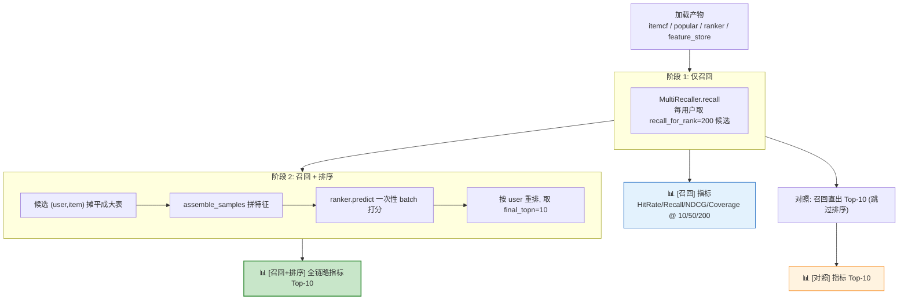
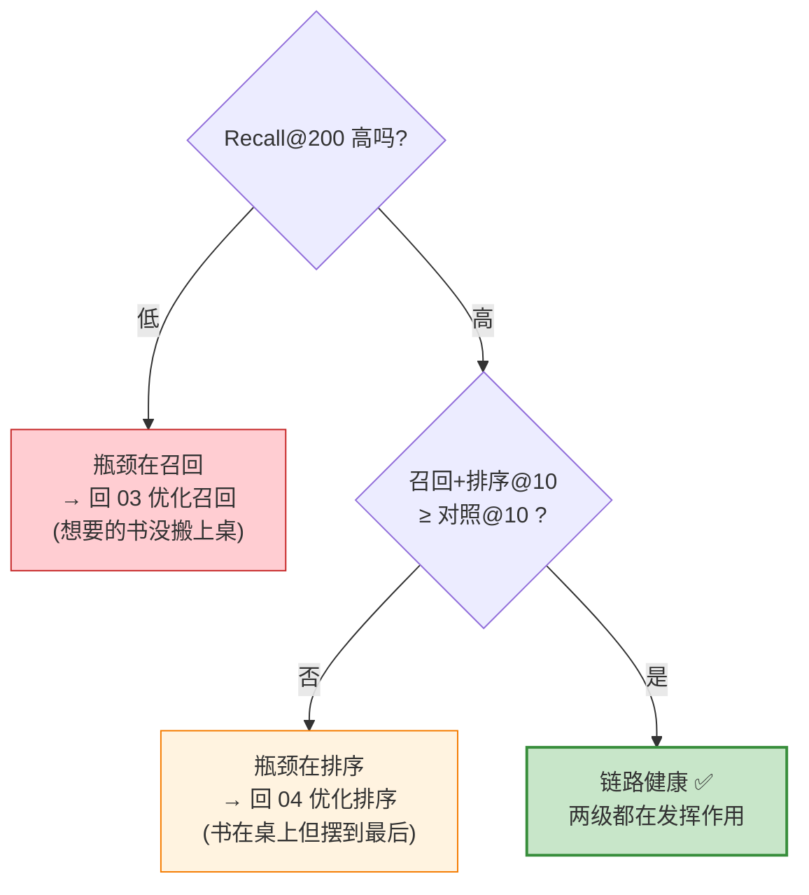
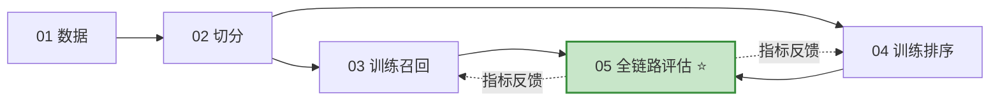

# 全链路离线评估 (End-to-End Offline Eval)

> **一句话**：`05_offline_eval.py` 把训练好的「多路召回 + 排序」整条链路串起来，在 `test` 集上跑一遍，算出**用户真正会看到的 Top-N 列表**的指标。这才是反映系统真实效果的数字。
>
> **为什么重要**：单独看召回的 `HitRate` 或排序的 `AUC`，都会骗你。召回再高，排序把好东西压到第 50 位也白搭；排序 AUC 再漂亮，候选池里压根没有相关 item 也无力回天。**只有全链路指标，才能回答「用户打开 App 看到的前 10 个，到底准不准」**。
>
> **怎么读**：第〇节先用一个生活化比喻建立直觉；第一节讲为什么要全链路评估；第二节是整体流程；第三节讲四个评估指标（带手算示例）；第四节逐段拆解脚本实现（带数据形态示例）；第五节解读三组指标的对照含义；第六节是几个容易踩的坑；第七节讲它在系统里的位置和生产 checklist；第八节是术语表。召回融合见 [`07-multi-recall.md`](07-multi-recall_CN.md)，排序模型见 `src/rank/lgb_ranker.py`，过滤重排见 [`07-filter-rerank.md`](07-filter-rerank.md)。

## 目录

- [〇、先建立直觉:一个比喻](#〇先建立直觉一个比喻)
- [一、为什么需要全链路评估](#一为什么需要全链路评估)
- [二、整体流程](#二整体流程)
- [三、四个评估指标(带手算示例)](#三四个评估指标带手算示例)
- [四、脚本实现逐段拆解](#四脚本实现逐段拆解)
- [五、三组指标的对照解读](#五三组指标的对照解读)
- [六、容易踩的坑](#六容易踩的坑)
- [七、在系统中的位置与生产 checklist](#七在系统中的位置与生产-checklist)
- [八、术语表](#八术语表)
- [TL;DR](#tldr)

---

## 〇、先建立直觉:一个比喻

把推荐系统想象成**一家书店帮你找书**：

| 环节 | 书店比喻 | 推荐系统 |
|---|---|---|
| **召回** | 店员从 10 万本书里，先粗筛出 200 本「你大概会喜欢」的搬到桌上 | 多路召回，从全库捞 200 候选 |
| **排序** | 再把这 200 本按「你最可能买」从高到低摆好 | 排序模型给候选打分排序 |
| **Top-N** | 最后只把最前面的 10 本递到你手上 | 取 Top-10 展示 |
| **评估** | 事后看：你真正想买的那本，**在不在这 10 本里、排第几** | 全链路离线评估 |

`05_offline_eval.py` 就是那个「事后复盘」的角色。它不改进店员、也不改进摆书的人，它只负责**拿真实答案对一对，告诉你这套流程到底准不准**，以及——**如果不准，是粗筛环节的锅，还是摆书环节的锅**。

> 记住这个比喻里的两个「锅」：**召回的锅 = 想要的书根本没被搬上桌；排序的锅 = 书在桌上但被摆到了最后**。脚本的三组对照指标，就是为了分清这两个锅。

---

## 一、为什么需要全链路评估

推荐系统是**多级漏斗**：全库 → 召回 → 排序 → 重排 → 最终展示。每一级单独看指标，都有盲区。

| 只看这个指标 | 它的盲区 | 真实后果 |
|---|---|---|
| 召回 `HitRate@200` | 相关 item 进了候选池，但不知道排第几 | 召回命中了，排序把它压到第 180 位，用户永远翻不到 |
| 排序 `AUC`(脱离候选池) | 衡量的是「给定候选，正负样本排序对不对」，与候选池质量无关 | AUC 0.85 很漂亮，但候选池里根本没有用户想要的 item |
| 排序 `AUC`(样本分布偏差) | 用的是**负采样**得到的样本，分布和线上召回出来的候选**不一样** | 离线 AUC 高，线上 Top-N 却很差（样本选择偏差 SSB） |

> **核心洞察**：**链路的最终效果 ≠ 各级指标的简单叠加**。召回和排序会相互影响——召回改了，排序面对的候选分布就变了。要回答「系统到底好不好」，唯一可信的方式是**把整条链路跑通，在用户真正会看到的 Top-N 上算指标**。

这正是 `05_offline_eval.py` 干的事：它不训练任何东西，只**加载已训练好的产物**，把召回和排序串起来跑一遍，产出三组可对照的指标。

---

## 二、整体流程

脚本的执行分四步：加载产物 → 阶段 1 仅召回 → 阶段 2 召回+排序 → 对照组（召回直出）。



| 步骤 | 做什么 | 关键代码 |
|---|---|---|
| **加载产物** | 读入 4 个 pickle：两路召回器、排序器、特征仓库 | `load_pickle(art / "...")` |
| **构造 ground truth** | `test` 集里每个用户真实交互过的 item 集合 | `test.groupby("user_id")["item_id"].apply(set)` |
| **阶段 1 仅召回** | 每个用户召回 200 候选，算召回阶段指标 | `multi.recall(u, k_each, k_final)` |
| **阶段 2 召回+排序** | 候选拼特征 → 打分 → 重排取 Top-10 | `ranker.predict(scored)` |
| **对照组** | 召回结果直接截断 Top-10，**不经排序** | `items[:final_n]` |

三组指标**用同一个 ground truth、同一批用户**算出来，因此可以直接横向对比——这是脚本设计的精髓。

### 跑完后日志长这样

脚本是纯日志输出（无文件产出），你会在终端看到类似这样的三段（数值为示意）：

```text
[11:50:01] INFO e2e | 测试用户数: 6,038
[11:50:01] INFO e2e | ▶ 仅召回阶段 start
[11:50:12] INFO e2e | ✓ 仅召回阶段 done in 11.30s
[11:50:12] INFO e2e | ────────────────────────────────────────
[11:50:12] INFO e2e | [召回] 阶段指标 (前 200 候选):
[11:50:12] INFO e2e |   HitRate@10: 0.0608
[11:50:12] INFO e2e |   Recall@200: 0.5020
[11:50:12] INFO e2e |   ...
[11:50:12] INFO e2e | ▶ 排序阶段 (一次性 batch 打分) start
[11:50:18] INFO e2e | ✓ 排序阶段 (一次性 batch 打分) done in 6.10s
[11:50:18] INFO e2e | [召回 + 排序] 全链路指标 (Top-10):
[11:50:18] INFO e2e |   NDCG@10: 0.0512   ← 过了排序
[11:50:18] INFO e2e | [对照] 仅召回直出 Top-10 (跳过排序):
[11:50:18] INFO e2e |   NDCG@10: 0.0431   ← 没过排序, 作为 baseline
```

> 看日志的诀窍：把最后两段的 `NDCG@10` 一对比，`0.0512 > 0.0431` 说明**排序确实把命中 item 往前提了**——这就是排序的价值被量化出来的样子。

---

## 三、四个评估指标(带手算示例)

四个指标都由 `src/eval/recall_metrics.py` 的 `evaluate_recall` 计算。设某用户 Top-K 推荐为 `topk`，真实交互集合为 `truth`:

```34:57:src/eval/recall_metrics.py
        for u in eval_users:
            truth = ground_truth[u]
            topk = [item for item, _ in recommendations[u][:k]]
            all_recommended.update(topk)

            hit_set = set(topk) & truth
            if hit_set:
                hits += 1
            recalls.append(len(hit_set) / len(truth))

            # NDCG
            dcg = 0.0
            for rank, item in enumerate(topk, start=1):
                if item in truth:
                    dcg += 1.0 / math.log2(rank + 1)
            ideal_n = min(len(truth), k)
            idcg = sum(1.0 / math.log2(r + 1) for r in range(1, ideal_n + 1))
            ndcgs.append(dcg / idcg if idcg > 0 else 0.0)
```

| 指标 | 公式 | 衡量什么 | 关心顺序吗 |
|---|---|---|---|
| **HitRate@K** | `命中≥1 个的用户数 / 总用户数` | 多少比例的用户「至少猜中一个」 | 否 |
| **Recall@K** | `\|Top-K ∩ truth\| / \|truth\|` 的用户平均 | 用户真实喜欢的 item，被捞回来的比例 | 否 |
| **NDCG@K** | `DCG / IDCG`，命中越靠前得分越高 | 命中 item 的**排序位置**好不好 | **是** |
| **Coverage@K** | `所有被推荐过的 item 去重数 / 全库 item 数` | 推荐**多样性**（系统是否只推头部热门） | — |

### 手算示例

假设某用户真实喜欢 `truth = {C}`(LOO 切分下通常只有 1 个)，两套 Top-5 推荐：

```
推荐 A:  [C, X, X, X, X]     ← 命中的 C 排在第 1 位
推荐 B:  [X, X, X, X, C]     ← 命中的 C 排在第 5 位
```

| 指标 | 推荐 A | 推荐 B | 说明 |
|---|---|---|---|
| **HitRate@5** | 1 | 1 | 两者都命中了 C → 都算「命中」 |
| **Recall@5** | 1/1 = 1.0 | 1/1 = 1.0 | truth 只有 1 个且被捞回 → 都满分 |
| **NDCG@5** | 1/log₂(1+1) ÷ 1 = **1.00** | 1/log₂(5+1) ÷ 1 = **0.43** | **只有它能区分 A 和 B** |

> **关键结论**：`HitRate`/`Recall` 只看「有没有命中」，A 和 B 完全打平；**只有 `NDCG` 看位置**，A(命中排第 1)远高于 B(命中排第 5)。排序阶段做的事正是「把命中的 C 从第 5 位提到第 1 位」，所以**排序的价值几乎全体现在 NDCG 的提升上**。

### Coverage 直觉

`Coverage` 不针对单个用户，而是看**整个推荐系统给所有用户推的 item，去重后覆盖了全库的多大比例**：

```
全库 10000 个 item
所有用户的 Top-K 拼起来去重后 = 6936 个不同 item
Coverage = 6936 / 10000 = 69.36%
```

Coverage 高 = 长尾 item 也有机会被推（多样性好）；Coverage 低 = 系统翻来覆去只推那几百个头部热门（信息茧房风险）。

> ⚠️ 本项目用 **leave-one-out** 切分(见 `conf/config.yaml` 的 `split_strategy: loo`)，即每个用户最后一次正反馈做 test。这种情况下大多数用户 `truth` 只有 1 个 item,`Recall@K` 退化成 0/1，数值上接近 `HitRate@K`(上面的示例就是这种情形)。

---

## 四、脚本实现逐段拆解

### 4.1 加载已训练产物

脚本本身不训练任何模型，只把前序脚本的输出加载进来：

```32:40:scripts/05_offline_eval.py
    itemcf = load_pickle(art / "recall_itemcf.pkl")
    pop = load_pickle(art / "recall_popular.pkl")
    ranker = load_pickle(art / "ranker_lgb.pkl")
    fs = load_pickle(art / "feature_store.pkl")

    multi = MultiRecaller(
        recallers={"itemcf": itemcf, "popular": pop},
        weights=cfg["recall"]["weights"],
    )
```

| 产物 | 来自 | 内容 |
|---|---|---|
| `recall_itemcf.pkl` / `recall_popular.pkl` | `03_train_recall.py` | 两路召回器（ItemCF / 流行度） |
| `ranker_lgb.pkl` | `04_train_rank.py` | LightGBM 排序模型 |
| `feature_store.pkl` | `04_train_rank.py` | 特征仓库：user/item 画像、train 集统计、genre 列名等 |

`feature_store.pkl` 是一个 dict，里面装的就是 `04_train_rank.py` 训练时算好的那套特征素材，评估时**原样复用**（这是防穿越的关键，见 §6）：

```122:130:scripts/04_train_rank.py
    save_pickle({
        "user_profile": user_profile,
        "item_profile": item_profile,
        "user_stats": user_stats,
        "item_stats": item_stats,
        "user_genre_pref": user_genre_pref,
        "genre_cols": genre_cols,
        "feature_cols": feature_cols,
    }, art / "feature_store.pkl")
```

> `MultiRecaller` 的融合权重(`itemcf: 1.0`, `popular: 0.3`)直接从 config 读，与训练时**完全一致**——评估必须复现线上配置，否则指标没有参考意义。

### 4.2 构造 ground truth

```42:48:scripts/05_offline_eval.py
    gt = test.groupby("user_id")["item_id"].apply(set).to_dict()
    eval_users = list(gt.keys())
    log.info(f"测试用户数: {len(eval_users):,}")

    recall_k = cfg["eval"]["recall_for_rank"]
    final_n = cfg["eval"]["final_topn"]
    total_items = train["item_id"].nunique()
```

`gt` 长这样（每个用户 → 他在 test 集里真实交互过的 item 集合，这就是「标准答案」）：

```python
gt = {
    1:   {2858},          # 用户 1 真实喜欢 item 2858 (LOO: 只 1 个)
    2:   {1196},
    3:   {593},
    ...
}
```

| 变量 | 值 | 含义 |
|---|---|---|
| `gt` | `{user_id: {真实交互的 item 集合}}` | 评估的「标准答案」，**来自 test 集** |
| `recall_k` | `200` | 召回给排序的候选数(`recall_for_rank`) |
| `final_n` | `10` | 排序后取 Top-N 算最终指标(`final_topn`) |
| `total_items` | train 中 item 去重数 | 算 `Coverage` 的分母 |

> `total_items` 用 **train** 的 item 数而非全库，因为召回器只可能召回训练时见过的 item，用 train 口径算 coverage 才公平。

### 4.3 阶段 1 — 仅召回

```50:63:scripts/05_offline_eval.py
    # ---------- 阶段 1: 仅召回 ----------
    with timer("仅召回阶段", log):
        recall_only: dict[int, list[tuple[int, float]]] = {}
        for u in tqdm(eval_users, desc="recall"):
            items = multi.recall(u, k_each=recall_k, k_final=recall_k)
            recall_only[u] = [(i, s) for i, s, _ in items]

    log.info("─" * 60)
    log.info(f"[召回] 阶段指标 (前 {recall_k} 候选):")
    metrics = evaluate_recall(recall_only, gt,
                              k_list=cfg["eval"]["topk_list"],
                              total_items=total_items)
```

逐用户调 `MultiRecaller.recall`,`k_each` 和 `k_final` 都设成 200，把每路召回 200、融合后取前 200 的结果存进 `recall_only`。

`multi.recall` 返回的是三元组 `(item_id, 融合分, source_scores)`，这里 `[(i, s) for i, s, _ in items]` 用 `_` **丢掉了第三项**（各路原始分，只用于解释性），评估只需要 `(item, score)`:

```python
# multi.recall(u, ...) 返回:
[(2858, 0.0312, {"itemcf": 1.5}), (1196, 0.0291, {"itemcf": 0.8, "popular": 1.0}), ...]
# 经过列表推导后 recall_only[u] 变成:
[(2858, 0.0312), (1196, 0.0291), ...]
```

这一步在 `topk_list = [10, 50, 200]` 上算指标——**召回一次 200，可以同时切出 @10/@50/@200 三个口径**，这是「召回最大 K」的常见技巧(切片 `[:k]` 而已，无需重复召回)。

### 4.4 阶段 2 — 召回 + 排序

这是脚本的核心。分三小步：摊平候选 → 拼特征打分 → 按用户重排。

```65:80:scripts/05_offline_eval.py
    # ---------- 阶段 2: 召回 + 排序 ----------
    with timer("排序阶段 (一次性 batch 打分)", log):
        rows = []
        for u, items in recall_only.items():
            for item_id, _score in items:
                rows.append((u, item_id))
        cand_df = pd.DataFrame(rows, columns=["user_id", "item_id"])
        cand_df["ts"] = pd.Timestamp("1970-01-01")  # 占位, 当前无时间特征
        cand_df["label"] = 0  # 占位

        scored, _ = assemble_samples(
            cand_df, fs["user_profile"], fs["item_profile"],
            fs["user_stats"], fs["item_stats"], fs["user_genre_pref"],
            fs["genre_cols"],
        )
        scored["score"] = ranker.predict(scored)
```

**为什么要「摊平」？** 因为模型批量打分远快于逐用户循环。`recall_only` 是 `{user: [候选...]}` 的嵌套结构，把它展开成一张扁平的二维表 `cand_df`:

```text
摊平前 (recall_only):              摊平后 (cand_df):
{                                  user_id  item_id  ts          label
  1: [(2858,..),(1196,..),...],      1      2858     1970-01-01    0
  2: [(593,..), (608,..), ...],      1      1196     1970-01-01    0
  ...                                 1      ...      ...           0
}                                     2      593      1970-01-01    0
                                      2      608      1970-01-01    0
                                     ...     ...      ...          ...
                          (共 ≈ 用户数 × 200 行)
```

| 子步骤 | 做什么 | 为什么这样 |
|---|---|---|
| **摊平** | 把 `{user: [候选...]}` 展开成一张 `(user_id, item_id)` 大表 | 为了**一次性 batch 打分**，而不是逐用户调模型 |
| **占位列** | `ts` 填 epoch、`label` 填 0 | `assemble_samples` 接口需要这两列，但本阶段用不到（无时间特征、不算 loss） |
| **拼特征** | 用 `feature_store` 里的画像/统计 merge 出完整特征表 | 特征构造逻辑与训练时**同一个函数**，保证一致 |
| **打分** | `ranker.predict(scored)` 给每个 `(user,item)` 一个 CTR 分 | LightGBM 对整张表向量化打分，极快 |

> **性能要点**：`~测试用户数 × 200` 个候选一次性喂给模型，而不是循环 `predict`。LightGBM 批量打分是向量化的，这能把排序阶段从分钟级压到秒级。timer 名字里特意标了「一次性 batch 打分」。

打完分后，按用户分组重排，取 Top-N:

```82:93:scripts/05_offline_eval.py
    # 按 user 重排, 取 final_n
    reranked: dict[int, list[tuple[int, float]]] = {}
    for u, g in scored.groupby("user_id"):
        g = g.sort_values("score", ascending=False).head(final_n)
        reranked[u] = list(zip(g["item_id"].astype(int).tolist(),
                               g["score"].astype(float).tolist()))

    log.info("─" * 60)
    log.info(f"[召回 + 排序] 全链路指标 (Top-{final_n}):")
    metrics = evaluate_recall(reranked, gt, k_list=[final_n], total_items=total_items)
```

每个用户的 200 候选按模型分降序，取前 10，得到最终推荐列表 `reranked`。在 `k_list=[final_n]=[10]` 上算全链路指标。

> 注意这里发生了**重新排序**：阶段 1 候选是按「召回融合分」排的，阶段 2 则按「排序模型分」重排。同一批 200 候选，两种排法选出的 Top-10 通常不同——差异正是排序模型的作用。

### 4.5 对照组 — 召回直出 Top-N

```95:101:scripts/05_offline_eval.py
    # 对照: 召回直出 Top-N (不经排序)
    recall_topn = {u: items[:final_n] for u, items in recall_only.items()}
    log.info("─" * 60)
    log.info(f"[对照] 仅召回直出 Top-{final_n} (跳过排序):")
    metrics = evaluate_recall(recall_topn, gt, k_list=[final_n], total_items=total_items)
```

直接把**召回的前 10**(按融合分截断，跳过排序)当最终结果。这是一组**至关重要的对照**：它和阶段 2 用的是同一批候选、同一个 K=10，唯一区别是**有没有过排序模型**。两者一对比，就能量化**排序到底贡献了多少**。

```text
同样的 200 候选:
  ┌─ 按「召回融合分」取前 10  → [对照]    NDCG@10 = 0.0431  (baseline)
  └─ 按「排序模型分」取前 10  → [召回+排序] NDCG@10 = 0.0512  (↑ 排序的增量)
```

---

## 五、三组指标的对照解读

脚本最终打印三组指标，正确的读法是**横向对比**：

| 对照项 | 候选数 | 是否过排序 | 主要看 | 回答的问题 |
|---|---|---|---|---|
| **[召回] @200** | 200 | 否 | `Recall@200` | 候选池的**天花板**：相关 item 进池了吗 |
| **[对照] 召回直出 @10** | 200→10 | 否（按召回分截断） | `NDCG@10` | 不排序，直接拿召回分排，效果如何（baseline） |
| **[召回+排序] @10** | 200→10 | **是** | `NDCG@10` / `HitRate@10` | 完整链路的**真实效果** |

**怎么判断系统健康**：

1. **`[召回+排序] @10` 应该 ≥ `[对照] @10`**——尤其是 NDCG。如果排序后反而更差，说明排序模型有问题（特征穿越、训练/推理特征不一致、或负采样分布偏差太大）。
2. **`[召回] @200` 是上限**——全链路 `Recall@10` 永远不可能超过 `Recall@200`。如果 `Recall@200` 本身就低，问题在召回，排序再强也没用，应回去优化召回。
3. **排序的增益主要在 NDCG**——排序不增加候选，所以 `Recall@200` 那个池子的命中数是固定的；排序做的是把命中 item **往前提**，因此 `NDCG@10` 的提升是排序价值最直接的体现。

### 一张决策图



> **决策逻辑**：`Recall@200` 低 → 优化召回；`Recall@200` 高但 `[召回+排序]@10` 没比 `[对照]@10` 好 → 优化排序。这套三组对照，本质是在帮你**定位瓶颈在哪一级**（对应〇节比喻里的两个「锅」）。

---

## 六、容易踩的坑

| 坑 | 说明 | 脚本怎么处理 |
|---|---|---|
| **占位列误用** | `ts`/`label` 是为了凑 `assemble_samples` 接口的占位值，**绝不能进特征** | 当前特征里不含时间；`label=0` 仅占位，评估用 `gt` 而非这个 label |
| **特征穿越** | 评估时若用 test 数据算统计特征，就是作弊 | 特征全部来自 `feature_store`(只用 train 算)，见 `builder.py` 顶部警告 |
| **训练/推理特征不一致** | 训练和评估若用不同的特征构造逻辑，指标失真 | 两处都调**同一个** `assemble_samples` |
| **coverage 分母口径** | 用全库 item 当分母会低估 coverage | 用 `train["item_id"].nunique()` |
| **逐用户 predict** | 几万用户 × 200 候选逐个调模型会非常慢 | 摊平成一张大表，**一次性 batch 打分** |
| **LOO 下指标偏低** | 每用户 truth 只 1 个，Recall 上限就是命中率 | 属正常现象，横向对比仍有效 |

**「特征穿越」为什么是头号大忌？** 它指的是评估/训练时**不小心用到了未来信息**，导致离线指标虚高、上线暴跌。这里的防线是：所有统计特征（用户历史交互数、item 流行度等）都只在 `train` 上算好、存进 `feature_store`，评估时无论面对哪个用户都**原样查表**，绝不碰 `test`。`builder.py` 开头就写着这条警告：

```1:5:src/features/builder.py
"""特征构造

警告: 所有统计特征必须只用 train 数据计算, 否则数据穿越.
对 valid/test 样本, 我们用 train 集统计的特征值.
"""
```

---

## 七、在系统中的位置与生产 checklist

### 在整条链路里的位置



`05_offline_eval.py` 是**离线迭代的总裁判**：它不产出模型，只产出**用于决策的数字**。任何对召回或排序的改动，最终都要回到这里看全链路指标是否真的变好——这是避免「局部指标涨、整体效果跌」的唯一防线。

> ⚠️ **SSB(样本选择偏差)提醒**：排序模型训练用的是**负采样**样本，而评估时面对的是**真实召回**出来的候选，两者分布不同。`[召回+排序]@10` 比训练时的 `AUC` 更接近线上真相——**永远以全链路指标为准做上线决策**。

### 生产 checklist

| 检查点 | 问题 |
|---|---|
| **评估配置一致** | 召回权重、`k` 值是否与线上配置完全一致？ |
| **特征防穿越** | 统计特征是否只用 train、绝不碰 test? |
| **特征逻辑统一** | 训练与评估是否共用同一套特征构造代码？ |
| **三组对照齐全** | 是否同时产出「仅召回 / 召回直出 / 召回+排序」三组，便于定位瓶颈？ |
| **批量打分** | 排序是否一次性 batch 打分，而非逐用户循环？ |
| **ground truth 来源** | 是否用独立的 test 集（LOO 的最后一次正反馈）？ |
| **指标方向** | `[召回+排序]@10` 是否 ≥ `[对照]@10`(尤其 NDCG)? |
| **上限意识** | `Recall@200` 是否被当作全链路的天花板来看待？ |

---

## 八、术语表

| 术语 | 英文 / 缩写 | 一句话解释 |
|---|---|---|
| **召回** | Recall (stage) | 从全库粗筛出几百个候选的环节（注意与指标 Recall@K 区分） |
| **排序** | Ranking | 给候选逐一打分、精排的环节 |
| **全链路** | End-to-End | 召回 + 排序 串起来跑完整流程 |
| **ground truth** | GT | 用户真实交互过的 item，评估的「标准答案」（来自 test） |
| **HitRate@K** | — | 前 K 个里至少命中 1 个的用户比例 |
| **Recall@K** | — | 命中数 / 用户真实喜欢总数（指标，非环节） |
| **NDCG@K** | Normalized DCG | 带位置折扣的命中得分，命中越靠前越高 |
| **Coverage@K** | — | 被推荐 item 的去重数 / 全库 item 数，衡量多样性 |
| **LOO** | Leave-One-Out | 每个用户留最后一次正反馈做 test 的切分方式 |
| **SSB** | Sample Selection Bias | 训练用负采样、推理用真实召回，两者分布不一致带来的偏差 |
| **batch 打分** | batch scoring | 把所有候选拼成一张表一次性喂给模型，向量化加速 |
| **特征穿越** | data leakage | 误用未来信息算特征，导致离线虚高、上线暴跌 |
| **feature_store** | — | 训练阶段算好并存盘的特征素材，评估时原样复用 |

---

## TL;DR

> `05_offline_eval.py` 把训练好的「多路召回 + LightGBM 排序」串成完整链路，在 test 集上跑出**用户真正会看到的 Top-N** 的指标。它不训练任何模型，只**加载产物**（itemcf / popular / ranker / feature_store）并产出**三组可对照的指标**：
>
> 1. **[召回] @10/50/200** —— 候选池天花板，看 `Recall@200`;
> 2. **[对照] 召回直出 @10** —— 跳过排序的 baseline;
> 3. **[召回+排序] @10** —— 全链路真实效果。
>
> 核心做法：`groupby` 构造 test 的 ground truth → 逐用户召回 200 → 候选摊平成大表 → 同一个 `assemble_samples` 拼特征（防穿越，只用 train 统计）→ **一次性 batch 打分** → 按用户重排取 Top-10。
>
> 评估指标里 **`NDCG@10` 最能体现排序价值**（排序不增候选，只把命中 item 往前提）。判断健康的两条铁律：**`Recall@200` 低就回去优化召回（想要的书没搬上桌）；`[召回+排序]@10` 没超过 `[对照]@10` 就回去优化排序（书在桌上但摆到了最后）**。永远以全链路指标（而非单看召回 HitRate 或排序 AUC）作上线决策。
