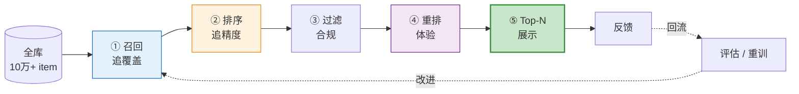
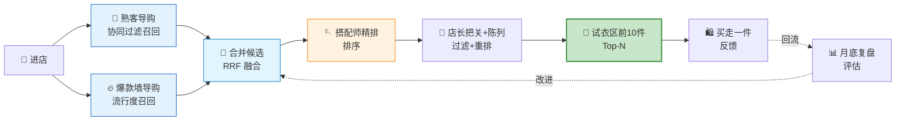
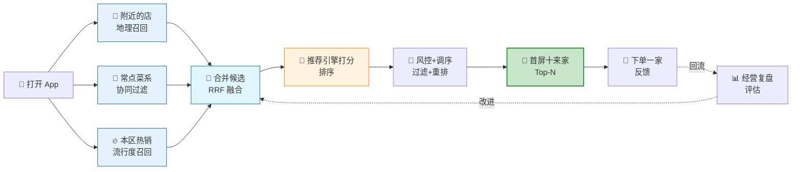
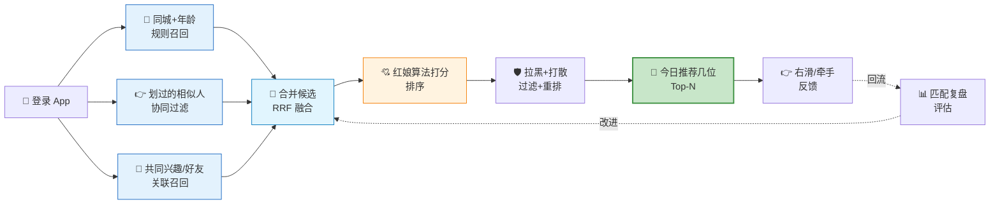
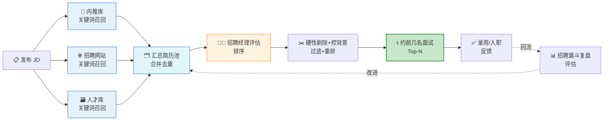
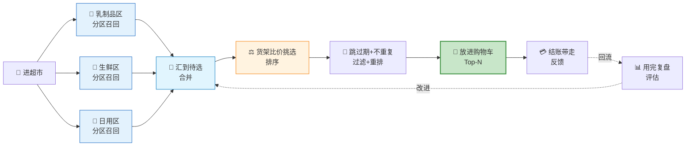

# 用 5 个生活场景理解推荐系统流水线

> **本文档定位**：推荐系统「五段式流水线」的中文类比辅读版。用「逛服装店买衣服」作主线，再加 4 个日常场景（外卖 / 相亲 / 招聘 / 超市），把**召回 → 排序 → 过滤 → 重排 → 评估**讲清楚。面向开发者，概念与 `recsys-mini` 代码、专题文档一一对应。本文档不在 git 仓库内(见 `.gitignore` 的 `*_CN.md` 规则)，是本地学习材料。

## 目录

- [一、先建立心智模型:五段式流水线](#一先建立心智模型五段式流水线)
- [二、主线案例:一次逛店之旅](#二主线案例一次逛店之旅)
- [三、四个生活版本](#三四个生活版本)
  - [3.1 点外卖](#31-点外卖)
  - [3.2 相亲交友 App](#32-相亲交友-app)
  - [3.3 HR 招聘](#33-hr-招聘)
  - [3.4 超市按清单采购](#34-超市按清单采购)
- [四、五场景 × 全流程 总对照表](#四五场景--全流程-总对照表)
- [TL;DR](#tldr)

---

## 一、先建立心智模型:五段式流水线

推荐系统的核心是一条**漏斗式流水线**：从全库海量物品，逐级筛到最终展示给用户的几条。每一级职责单一、目标明确。

### 1.1 五个阶段的职责与代码落点

| 阶段 | 一句话职责 | 追求 | `recsys-mini` 代码 | 专题文档 |
|---|---|---|---|---|
| **① 召回** Recall | 从全库粗筛出几百候选 | **别漏**（覆盖） | `MultiRecaller`·`ItemCFRecaller`·`PopularRecaller` | [04](04-recall_CN.md)·[05](05-collaborative-filtering_CN.md)·[06](06-popular-recall_CN.md)·[07](07-multi-recall_CN.md) |
| **② 排序** Ranking | 给候选逐一精打分、定高下 | **排得准**（精度） | `LGBRanker`·`assemble_samples` | [08](08-ranking_CN.md) |
| **③ 过滤** Filter | 砍掉「不能推」的（硬规则） | 合规 / 安全 | (待实现) | [07f](07-filter-rerank.md) |
| **④ 重排** Rerank | 打散 / 多样性 / 业务强插 | 体验 | (待实现) | [07f](07-filter-rerank.md) |
| **⑤ 评估** Eval | 全链路看 Top-N 真实效果 | 可衡量 | `evaluate_recall` | [09](09-offline-eval_CN.md) |

### 1.2 贯穿全程的横切关注点

下面四个不是「某一级」，而是**贯穿整条流水线**的基础能力：

| 关注点 | 含义 | 代码落点 |
|---|---|---|
| **用户画像** | 「你是谁」：历史行为、属性偏好 | `build_user_profile` |
| **物品理解** | 「它是什么」：结构化标签 / 特征 | `build_item_profile` |
| **冷启动** | 新用户 / 新物品无历史时的兜底 | 流行度召回兜底 |
| **防穿越** | 特征只用历史数据，绝不偷看未来 | 统计特征仅用 `train` |

### 1.3 两条工程铁律

> 1. **漏斗哲学**：先用**便宜**的召回把「万」砍到「百」，再用**昂贵**的排序把「百」精排成「十」。一步到位既慢又贵。
> 2. **SSB(样本选择偏差)**：召回一改（哪怕只调权重），候选分布就变，**排序模型必须重训**，否则按旧分布打分，质量暴跌。

---

## 二、主线案例:一次逛店之旅

> 周六下午走进一家服装店：店里上万件衣服（全库），你只会带走一两件（Top-N）。从进门到拎袋离开，背后就是这条流水线在运转。

1. **进门「你是谁」** —— 老顾客有会员档案(**用户画像** `build_user_profile`)；新顾客没历史，先按爆款 + 问卷兜底(**冷启动**，见 [02](02-cold-start_CN.md))。衣服吊牌（品类 / 颜色 / 风格）就是**物品理解**(`build_item_profile`，见 [03](03-item-understanding_CN.md))。
2. **几位导购各搬一堆** —— **多路召回**(`MultiRecaller`，见 [04](04-recall_CN.md))：熟客导购按你买过的推相似(**协同过滤** `ItemCFRecaller`，见 [05](05-collaborative-filtering_CN.md))，爆款墙推热门(**流行度召回** `PopularRecaller`，见 [06](06-popular-recall_CN.md))。每人搬 200 件，只求「别漏」；几堆按「各自排第几」合并(**RRF 融合**，见 [07](07-multi-recall_CN.md))，不比各自打的分。
3. **搭配师精排成前 10** —— **排序**(`LGBRanker`，见 [08](08-ranking_CN.md))：综合你的画像 + 衣服属性 + 匹配度(**特征** `assemble_samples`)打分，只求「排得准」。铁律：只能用你**过去**的记录，不能偷看你今天买了啥（**防穿越**）。
4. **店长把关 + 陈列** —— **过滤**：撤掉断码 / 已买 / 下架（硬规则做减法）；**重排**：打散同色、强插主推品牌、保证多样性（软调顺序）。见 [07f](07-filter-rerank.md)。
5. **试衣区前 10 件 = Top-N** —— 你买走一件 = **正反馈**，回流成明天的训练数据。
6. **月底复盘 = 评估** —— 成交率 = HitRate，喜欢款捞回比例 = Recall，最爱那件排第几 = NDCG，货品覆盖度 = Coverage(`evaluate_recall`，见 [09](09-offline-eval_CN.md))。

---

## 三、四个生活版本

主线那条流水线在生活里反复出现。下面 4 个场景**沿用同一套格式**（一张流程图 + 六步拆解），每步都把**领域角色 / 动作**对应到**推荐概念**，方便横向对照。

### 3.1 点外卖

1. **画像 / 冷启动** —— 老用户有口味档案：常点川菜、偏辣、人均 30 元；新用户先推本地热销榜 + 让你勾口味。每家店每道菜的菜系 / 辣度 / 价位 / 评分 = **物品理解**。
2. **召回** —— 多入口各捞一批：① 附近的店（地理召回）；② 常点菜系（协同过滤）；③ 本区热销（流行度兜底）。几万家砍到几百家，按排名合并（**RRF 融合**）。
3. **排序** —— 按「你这顿最可能下单」打分：销量、评分、配送时长、距离、口味匹配度（**特征**）。只用历史行为，不偷看今天点了啥（**防穿越**）。
4. **过滤 + 重排** —— **过滤**：打烊、超配送范围、你拉黑过的店撤掉；**重排**：首屏别全堆川菜（多样性），广告 / 合作商家按规则插入。
5. **Top-N + 反馈** —— 首屏十来家；你下单那家 = **正反馈**，回流成训练数据。
6. **评估** —— 下单转化率 = HitRate，你想吃那家排第几 = NDCG，推荐覆盖了多少家店 = Coverage。

### 3.2 相亲交友 App

1. **画像 / 冷启动** —— 老用户有资料 + 爱右滑哪类人；刚注册没划过，先按填写的硬性偏好 + 平台高人气用户兜底。每位候选人的年龄 / 城市 / 身高 / 兴趣 = **物品理解**。
2. **召回** —— 多策略各圈一批：① 同城 + 年龄 + 身高等硬条件（规则召回）；② 和你右滑过的人相似（协同过滤）；③ 共同兴趣 / 好友（关联召回）。几万人砍到几百，合并去重。
3. **排序** —— 按「你俩可能互相看对眼」打分：资料匹配度、共同兴趣、活跃度、对方回复率（**特征**）。只用历史行为（**防穿越**）。
4. **过滤 + 重排** —— **过滤**：已拉黑 / 已匹配 / 已划过的不再出现；**重排**：别连着推同一类型，避免「千人一面」。
5. **Top-N + 反馈** —— 今日推荐几位；你右滑 / 牵手成功 = **正反馈**。
6. **评估** —— 右滑率 = HitRate，互相匹配率 = Recall / NDCG，覆盖了多少不同用户 = Coverage。

### 3.3 HR 招聘

1. **画像 / 物品理解** —— JD 写明本科以上、3 年经验、会 Python、能到岗，这是「岗位画像」，相当于**一次推荐请求的查询条件**；每份简历解析成学历 / 年限 / 技能 / 项目字段 = **物品理解**。
2. **召回** —— ATS 关键词粗筛（「本科 + 3 年 + Python」），上千份砍到几十份；多来源各捞一批：内推库、招聘网站、人才库（**多路召回**），只求「别漏好苗子」。
3. **排序** —— 按「最可能胜任且愿意来」打分：经验匹配度、项目质量、技能契合、稳定性（**特征**）。
4. **过滤 + 重排** —— **过滤**：无法到岗、薪资差太远直接刷掉；**重排**：别全是同一学校 / 背景，保证候选多样性。
5. **Top-N + 反馈** —— 约前几名面试；谁通过、谁入职 = **正反馈**。
6. **评估** —— 面试通过率 = HitRate，真正胜任者被捞回比例 = Recall，优质候选是否靠前 = NDCG；**关键看入职率与留存**（全链路效果，而非只看简历筛得准）。

### 3.4 超市按清单采购

1. **画像 / 冷启动** —— 你的口味、家庭人数、预算 = **用户画像**，购物清单 = 这次「需求」；第一次来不熟布局，先看导购图 / 问店员（**冷启动**）。商品的品类 / 品牌 / 价格 / 保质期 = **物品理解**。
2. **召回** —— 按清单分区直奔（乳制品区、生鲜区、日用区），每区一路（**多路召回**），不逛遍每条货架。几千 SKU 砍到眼前几十种。
3. **排序** —— 同类商品按价格、品牌、新鲜度、促销力度（**特征**）挑出最想要的那一两件。
4. **过滤 + 重排** —— **过滤**：过期、不吃的牌子、买过踩雷的跳过；**重排**：同类不重复拿，购物车品类别太单一。
5. **Top-N + 反馈** —— 放进购物车结账的就是结果；回家复购意愿 = **正反馈**。
6. **评估** —— 清单命中率 = HitRate，想买的有没有买齐 = Recall，会不会复购 = 长期满意度。

> **共同点**：四个场景都先用便宜规则把范围从「万」砍到「几十」（召回，宁多勿漏），再精挑（排序），最后去掉不能要的、调整顺序（过滤 + 重排），给出 Top-N 并用反馈持续改进（评估）。本质都是**召回追覆盖、排序追精度的漏斗**。

---

## 四、五场景 × 全流程 总对照表

| 流水线阶段 | 🛍️ 服装店 | 🍜 点外卖 | 💖 相亲 App | 📋 HR 招聘 | 🛒 超市采购 |
|---|---|---|---|---|---|
| **请求 / 画像** | 进店 + 会员档案 | 打开 App + 口味档案 | 登录 + 偏好资料 | 发布 JD(查询条件) | 进店 + 购物清单 |
| **① 召回** | 熟客导购 / 爆款墙 | 地理 / 协同 / 热销 | 硬条件 / 相似 / 共同好友 | 内推 / 网站 / 人才库 | 按分区直奔 |
| **② 排序** | 搭配师精排 | 推荐引擎打分 | 红娘算法 | 招聘经理评估 | 货架比价 |
| **③④ 过滤 + 重排** | 撤断码 / 打散同色 | 撤打烊 / 首屏多样 | 拉黑 / 类型打散 | 刷硬性 / 控背景 | 跳过期 / 控品类 |
| **⑤ Top-N** | 试衣区前 10 | 首屏十来家 | 今日推荐几位 | 约面试名单 | 购物车 |
| **反馈** | 买走一件 | 下单 | 右滑 / 牵手 | 录用 / 入职 | 结账 / 复购 |
| **评估** | 成交率 / 复购 | 转化率 / 覆盖 | 右滑率 / 匹配率 | 入职率 / 留存 | 命中率 / 复购 |

---

## TL;DR

> 推荐系统是一条**漏斗式流水线**：`召回 → 排序 → 过滤 → 重排 → Top-N → 反馈/评估`。
>
> 用服装店记住它：**导购各搬一堆** = 多路召回（熟客 = 协同过滤，爆款墙 = 流行度，按排名合并 = RRF）；**搭配师精排前 10** = 排序（画像 + 衣服属性 = 特征，不偷看今天买啥 = 防穿越）；**店长撤断码、打散同色** = 过滤 + 重排；**试衣区前 10** = Top-N；**月底复盘** = 全链路评估（HitRate / Recall / NDCG / Coverage）。
>
> 同一条流水线换皮即可套到**外卖、相亲、招聘、超市**——召回都是「按便宜规则把万砍到几十，宁多勿漏」，精挑留给排序。两条工程铁律：① 先便宜召回、再昂贵排序的**漏斗**；② 召回一改，排序必须重训（**SSB**）。
